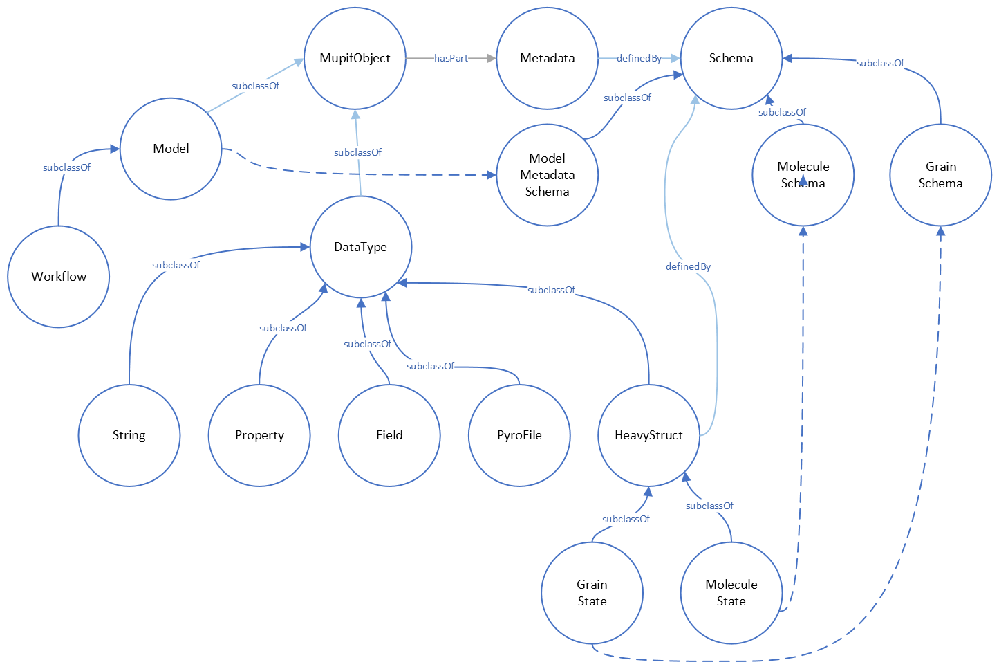

.. _Platform-APIs:

Platform APIs
================
As mentioned above, MuPIF key idea is based on composing simulation workflows from a set of components with standartized interfaces.  
In this chapter are presented the interfaces (APIs) for all relevenat entities. The interfaces, represented as a set of methods, are defined by abstract, top-level parent 
classes representing core component types (such as models or data types). The interfaces are inheritted by derived classes. 
This ensures, that all derived classes and their instances can be managed using the same interface.

One of the key and distinct features of the MuPIF
platform is that such an abstraction (defined by top level classes) is
not only developed for models, but also for the
simulation data. The focus is on services provided by objects
and not on underlying data. The object representation of data
encapsulates the data themselves, related metadata, and related
algorithms. Individual models then do not have to interpret the complex
data themselves; they receive data and algorithms in one consistent
package. This also allows the platform to be independent of particular
data format, without requiring any changes on the model side to work
with new format.

In the rest of this section, the fundamental, core classes and their
interfaces are presented with links to their documentation, generated directly from the source code using PyDoc package. 

.. _fig-abstract-uml:

   MuPIF core classes and their relations

Common API
----------------------------------

The object-oriented approach allows to define hierarchy of classes. This
is also used in designing MuPIF class structure, where all component
classes form a hierarchy, where on top of this hierarchy is
:obj:`~mupif.mupifobject.MupifObject` class. This class introduces a common interface that is
then inherited by all derived classes, thus by all MuPIF components
involving models (Model class), workflows, and high-level data
components, such as properties or spatial fields.

The *MupifObject* class essentially defines methods allowing to get/set
metadata to the component. The metadata are identified by unique ID and
can be of any type. Internally, they are stored in internal dictionary
declared by *MupifObject.*

Metadata and metadata schemas
~~~~~~~~~~~~~~~~~~~~~~~~~~~~~~~~~~~

The metadata and metadata schemas in MuPIF are stored in a form of JSON
representations as a nested (hierarchical) dictionary. JSON stands for
“JavaScript Object Notation”, a simple data interchange format. In its
heart, JSON is built on the following data structures: object, array,
number, string, boolean and null. With these simple data types, all
kinds of structured data can be represented. The metadata structure in MuPIF is defined by the JSON schema, being a
template defining what fields are expected, and how the values are
represented. The advantage is that actual metadata and their structure can be validated against the schema. The JSON
schema itself is written in JSON (or as Pydantic data models, exporting the schema to JSON schema syntax). The JSON schema standard can be found
in [`11 <#2zd1531og9ob>`__].

As already mentioned, a schema in a Python in represented as a python dictionary,
with following keys: *type*, *properties*, and *required*.

-  The *type* defines the type of data. Can be any of the supported JSON
   types (object, array, number, string, boolean or null)

-  The *properties* is a dictionary containing the actual metadata in
   the from of key-value pairs, where values in the schema are
   dictionaries, containing ‘type’ key defining type of property.

-  The required key is an array containing required property keys.

As an example, let us consider an example of a subset of model metadata:

.. code-block:: python

   #Example of model schema (from Model.py)
   ModelSchema = {
     'type': 'object',
     'properties': {
         'Name': {'type': 'string'},
         'ID': {'type': ['string', 'integer']},
         'Description': {'type': 'string'},
         'Material': {'type': 'string'},
         'Physics': { 
           'type': 'object',
           'properties': {
             'Type': {'type': 'string', 'enum': ['Electronic', 'Atomistic', 'Molecular', 'Continuum', 'Other']},
             'Entity': {'type': 'string', 'enum': ['Atom', 'Electron', 'Grains', 'Finite volume', 'Other']}
             },
             'required': ['Type', 'Entity']
         },
     },
     'required': ['Name', 'ID', 'Description', 'Physics']
   }

The following listing shows valid metadata (according to schema defined
above):

.. code-block:: python

   # Example of valid metadata 
   metaData = {
     'Name': 'Stationary thermal problem',
     'ID': 'Thermo-1',
     'Description': 'Stationary heat conduction using finite elements on rectangular domain',
     'Geometry': '2D rectangle',
     'Physics': {
       'Type': 'Continuum',
       'Entity': 'Finite volume',
       'Equation': ['Heat balance'],
       'Equation_quantities': ['Heat flow'],
       'Relation_description': ['Fick\'s first law'],
       'Relation_formulation': ['Flow induced by thermal gradient on isotropic material'],
       'Representation': 'Finite volumes'
     },
   }

As illustrated, metadata can contain nested data structures. It is
possible to access the individual metadata entries by using convenience
methods provided by any *MupifObject* instance. Also, it is possible
to insert a new metadata entry to the structure. These methods allow to
use ‘dot’ notation to access nested entries, as illustrated in the
example below:

.. code-block:: python

   myobj.getMetadata ('Name') # returns 'Stationary thermal problem'
   myobj.getMetadata ('Physics.Type') #returns 'Continuum'
   myobj.setMetadata ('Physics.Representation', 'Finite elements') # change existing entry
   myobj.setMetadata ('Physics.NewNote', 'My note') # add a new entry to metadata

The metadata schemata are defined in corresponding modules. In MuPIF,
the metadata schemata are defined for *Model*, *Workflow*, and some other data
classes. Generated documentation of the JSON schemata for selected components is available in :numref:`sect-schemas-doc`.

Model class
----------------

The abstract :obj:`~mupif.model.Model` class represents a model. Model is a component in general performs some operation on data, it can have input and output parameters. In terms of MODA [9] nomenclature, introduced by EMMC
[10], the instances of *Model* class correspond to MODA models and post-processing tools, but model in MuPIF can also represent an interface to external database, for example. 

The model interface is defined in terms of abstract services for
data exchange and steering. Derived classes represent individual
simulation models. The data exchange services consist of methods for getting and
registering external properties, fields, and functions, which are
represented using corresponding, newly introduced classes. Steering
services allow invoking (execute) solution for a specific solution step,
update solution state, terminate the application, etc.

Workflow class
-------------------

The :obj:`~mupif.workflow.Workflow` class represents a simulation workflow. Workflow can
combine several models into a complex simulation task. The workflow definition combines (1) execution model determining, 
how individual models are executed and (ii) data model determining the data exchange between models and workflow I/O parameters.  
A key feature of *Workflow* class is that it is derived from *Model*
class, so it shares the same API as *Model* Interface.
This essentially allows to treat any *Workflow* as *Model* and allows to
build a hierarchy of nested workflows. 

Property class
-------------------

:obj:`~mupif.property.Property` is a data type representing a quantity, which has no spatial
variation. Property is identified by *PropertyID*, which is an
enumeration determining its physical meaning. It can represent any
quantity of a scalar, vector, or tensorial type. Property keeps its
value, type, associated time and an optional *objectID*, identifying
related component/subdomain.

Property with constant value in time is represented by
:obj:`~mupif.property.ConstantProperty` class derived from :obj:`~mupif.property.Property`.

Field class
----------------

:obj:`~mupif.field.Field` is a data type representing a field, which is a scalar, vector, or tensorial
quantity defined on a spatial domain (represented by the :obj:`mupif.mesh.Mesh` class, for example).
The field provides interpolation services in space, but is assumed to be
fixed in time (the model interface allows to request field at
specific time). 
The field can be evaluated in any spatial point belonging to underlying
domain. Derived classes will implement fields defined on common
discretizations, like fields defined on structured or unstructured FE
meshes, finite difference grids, etc. 

Function class
-------------------

:obj:`~mupif.function.Function` class represents a component transforming given inputs to outputs. It is similar to model, but it is supposed to represent rather simple relation and not complex model.
Typically, function is an object defined by
mathematical expression and can be a function of spatial position, time,
and other variables. Derived classes should implement evaluate service
by providing a corresponding expression. The function arguments are
packed into a dictionary, consisting of pairs (called items) of keys and
their corresponding values.

TimeStep class
-------------------

:obj:`~mupif.timestep.TimeStep` class represents solution time step. The time step manages its number,
target time, and time increment.

.. _fig-timestep:
.. figure:: img/timestep.png

   Concept of time step in MuPIF

Mesh class
---------------

:obj:`~mupif.mesh.Mesh` is an abstract representation of a computational domain and
its spatial discretization. The mesh geometry is described using
computational cells (representing finite elements, finite difference
stencils, etc.) and vertices (defining cell geometry). Derived classes
represent structured, unstructured FE grids, FV grids, etc. Mesh is
assumed to provide a suitable instance of cell and vertex localizers. In
general, the mesh services provide different ways how to access the
underlying interpolation cells and vertices, based on their numbers, or
spatial location.

Cell class
---------------

:obj:`~mupif.cell.Cell` represents a computational cell (finite element, for example). The solution
domain is composed of cells, whose geometry is defined using vertices.
Cells provide interpolation over their associated volume, based on given
vertex values. Derived classes will be implemented to support common
interpolation cells (finite elements, FD stencils, etc.)

Vertex class
------------------

:obj:`~mupif.vertex.Vertex` represents a vertex. In general, a set of vertices defines the geometry
of interpolation cells. A vertex is characterized by its position,
number and label. Vertex number is locally assigned number (by *Mesh*
class), while a label is a unique number defined by application.

BoundingBox
-----------------

:obj:`~mupif.boundingbox.BoundingBox` represents an axis aligned bounding box - a rectangle in 2d and a prism
in 3d. Its geometry is described using two points - lover left and upper
right. The bounding box class provides fast and efficient methods for
testing whether point is inside and whether an intersection with another
bounding box exists.

HeavyStruct
--------------

:obj:`~mupif.heavystruct.HeavyStruct` is self-describing container for complex, hierarchical data with user-defined structure and with remote/local access. 
The data is described using JSON (which can be validated using JSON schema), stored next to the data. 
The backing storage format is HDF5 (which is hidden from the user via API). Provisions are present for ontological metadata so that each item can have ontological meaning.

APIError
--------------

:obj:`~mupif.apierror.APIError` serves as a base class representing  exceptions thrown by the
individual components. Raising an exception is a way to signal that a routine could
not execute normally - for example, when an input argument is invalid
(e.g. value is outside of the domain of a function) or when a resource
is unavailable (like a missing file, a hard disk error, or out-of-memory
errors). A hierarchy of specialized exceptions can be developed, derived
from the *APIError* class.

Exceptions provide a way to react to exceptional circumstances (like
runtime errors) in programs by transferring control to special functions
called handlers. To catch exceptions, a portion of code is placed under
exception inspection. This is done by enclosing that portion of code in
a try-block. When an exceptional circumstance arises within that block,
an exception is thrown that transfers the control to the exception
handler. If no exception is thrown, the code continues normally and all
handlers are ignored.

An exception is thrown by using the throw keyword from inside the
try-block. Exception handlers are declared with the keyword "except",
which must be placed immediately after the try block.

