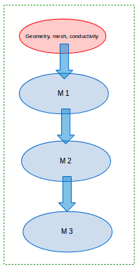
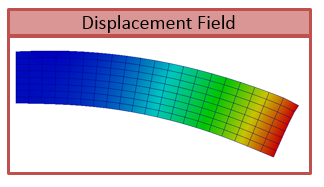
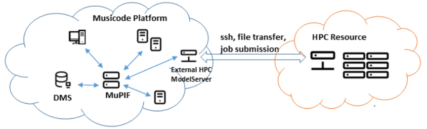

.. _sect-api-dev:

Developing Application Program Interface (API)
=================================================

In order to establish an interface between the platform and external model, a new class derived from base *Model* class has to be created, essentially implementing MuPIF *Model* interface.  
The *Model* class defines a
generic interface in terms of general purpose, problem independent,
methods that are designed to steer and communicate the model.
This table presents an overview of application interface, the full
details with complete specification can be found in :obj:`~mupif.model.Model`.

======================================================= ==========================================================================
Method                                                  Description
\__init__(self, metaData)                               Constructor. Initializes the application.
initialize(self, workdir, metaData, validateMetaData)   Initializes model and sets workdir and metadata.
get(self, objectTypeID, time=None, objectID="")         Returns an output of the model, specified by objectTypeID and objectID.
set(self, obj, objectID="")                             Sets an input of the model, specified by objectID and type of obj.
solveStep(self, tstep)                                  Solves the problem for given time step.
finishStep(self, tstep)                                 Called after a global convergence within a time step.
getCriticalTimeStep()                                   Returns the actual critical time step increment.
getAssemblyTime(tStep)                                  Returns assembly time within a timestep
getApplicationSignature()                               Returns the application identification
terminate()                                             Terminates the application.
======================================================= ==========================================================================

From the perspective of individual simulation tool, the interface
implementation can be achieved
by means of either direct (native) or indirect implementation.

-  **Native implementation** of a *Model* interface requires model written in
   Python, or a model with Python interface. In this case the *Model*
   methods will be implemented directly using direct calls to suitable
   application’s functions and procedures, including necessary internal
   data conversions. In general, each application (in the form of a
   dynamically linked library) can be loaded and called, but care must
   be taken to convert Python data types into target application data
   types. More convenient is to use a wrapping tool (such as Swig [11],
   Boost [12] or PyBind11 [13]) that can generate a Python interface to the application,
   generally taking care of data conversions for the basic types. The
   result of wrapping is a set of Python functions or classes,
   representing their application counterparts. The user calls an
   automatically generated Python function which performs data
   conversion and calls the corresponding native equivalent.

-  **Indirect implementation** of a *Model* interface is based on wrapper class implementing
   Model interface that implements the interface indirectly, using, for
   example, simulation tool scripting or I/O capabilities. In this case
   the application is typically standalone application, executed by the
   wrapper in each solution step. For the typical solution step, the
   wrapper class has to cache all input data internally (by overloading
   corresponding set methods), execute the application from previously
   stored state, passing input data, and parsing its output(s) to
   collect return data (requested using get methods).

The example illustrating the indirect implementation is discussed
further. The basics are the same, one has to define a new class derived from *Model* class, representing the interface to new (external) model. 
The implementation of this class has to provide implementation of all *Model* services, that require to establish communication channel to external model. 
Here we assume that no direct communication is available so we need to communicate with an external model indirectly, typically using files. 
The important fact is that this communication mechanism is only part of specific model class instance and is therefore hidden behing generic *Model* interface. 
Typical procedure consists of three steps. In the first step,
when input parameters of the meodel are being set (using *set* method), the class representing a new model 
has to remember all input parameters. In the second step, when the
application is to be executed (using *solveStep* method), the tepmplate input file (which is assumed to exist) is used to produce the actual input file with substituted values of input parameters. 
After the input file(s) are generated, the
application itself is executed, typically producing output file(s) with results. In the last step, when the actual model output parameters are requested (using the *get* method), 
the cooresponding values are obtained by parsing output files generated.

To ilustrate this concept, we present an example of implementing MuPIF interface to a model 
computing the average value from property (concentration) time history. Suppose now, that we want to use the existing external application, that can compute an average value from given input values
read from a file. The application interface accumulates the input values
of concentrations in a list, this is done is *set*
method. During the solution (*solveStep* method), the accumulated
values of concentrations over the time are written into a file, the
external application is executed, reading the created file as input and
producing an output file containing the computed average. The output
file is parsed when the average value is requested (*get*
method).

.. _fig-indirect-api:
.. figure:: img/MuPIF-Indirect-api.*

   Typical workflow in indirect approach for API implementation

Developing user workflows
============================

Multiscale/multiphysics simulations are natively supported in MuPIF,
allowing easy data passing from one model to another one, synchronizing
and steering all models. Simulation workflow of multiscale/multiphysics
simulations, called also a simulation scenario, need to define (1) execution model (steering of models) and (2) data model (defines how data are passed/exchanged). Natively, the workflow in MuPIF is
represented as Python script combining MuPIF components into workflow. 
 

Workflow templates
--------------------

Sequential
~~~~~~~~~~~~~

   Sequential workflow template

.. code-block:: python

    time = 0*mp.U.s
    timeStepNumber = 0
    targetTime = 10*mp.U.s

    while (abs(time-targetTime).getValue() > 1.e-6):
        dt=min(
            m1.getCriticalTimeStep(),
            m2.getCriticalStep(),
            m3.getCriticalStep()
        )
        time = time+dt
        if (time > targetTime):
            time = targetTime

        timeStepNumber = timeStepNumber + 1
        istep=TimeStep.TimeStep(time, td, targetTime, n=timeStepNumber)
        try:
            m1.solveStep(istep)
            p = m1.get(PID, m2.getAssemblyTime(istep))
            m2.set(p)
            m2.solveStep(istep)
            # ...
            m3.solveStep(istep)
        except APIError.APIError as e:
            print ("API Error occurred:", e)
            break

    m1.terminate()
    m2.terminate()
    m3.terminate()

Loosely coupled
~~~~~~~~~~~~~~~~

.. figure:: img/workflow-loosely-coupled.png

   Loosely coupled workflow template

.. code-block:: python

    time = 0*mp.U.s
    timeStepNumber = 0
    targetTime = 10*mp.U.s

    while (abs(time-targetTime).getValue() > 1.e-6):
        dt = min(
            m1.getCriticalTimeStep(),
            m2.getCriticalStep(),
            m3.getCriticalStep()
        )
        time = time+dt
        if (time > targetTime):
            time = targetTime
        timeStepNumber = timeStepNumber + 1
        istep = TimeStep.TimeStep(time, td, targetTime, n=timestep)

        try:

            convergedFlag = False
            while not convergedFlag:
                m1.solveStep(istep)
                p1 = m1.get(data_id, m2.getAssemblyTime(istep))
                m2.set(p1)
                m2.solveStep(istep)
                p2 = m2.get(data_id2, m1.getAssemblyTime(istep))
                m1.set(p2)

                #check for convergence
                convergedFlag = checkConvergence()

            m3.solveStep()

        except APIError.APIError as e:
            print ("API Error occurred:", e)
            break

    m1.terminate()
    m2.terminate()
    m3.terminate()

Workflow example
---------------------
To ilustrate the concept, a simple example of steady state, sequential, multiphysic, thermo-mechanical workflow in two dimensional domain is presented. 
The full implementation is available under *examples/Example06\**
directory of MuPIF installation.

The workflow combines thermal model, solving energy balance and yielding termal field and mechanical model, solving momentum balance equations, 
yielding primarily displacement field and also strain and stress fields, obtained by postprocessing the displacement field. 

In presented example, we consider a domain representing simple cantilever, clamped on the left hand side and subjected to
thermal loading, see :numref:`fig-cantilever-thermal`. Heat convection is
prescribed on the top edge with ambient temperature 10°C. Left and
bottom edges have prescribed temperature 0°C, the right edge has no
boundary condition. Initial temperature is set to 0°C, heat conductivity
is 1 W/m/K, heat capacity 1.0 J/kg/K, material density 1.0
kg/m³. The material has assigned Young's modulus as 30 GPa,
Poisson's ratio 0.25 and coefficient of linear thermal expansion
12e-6°C⁻¹.

.. _fig-cantilever-thermal:
.. figure:: img/cantilever-thermal.png

   Elastic cantilever subjected to thermal boundary conditions.

The schema of the workflow is depicted in
:numref:`fig-thermo-mech-flow`. 

A workflow can be regardes as a computational receipe and be represented as a plain Python script. But there are many advantages of representing a workflow as a class. 
Generally speaking, any workflow can be considered as a (more complex) model, that has specific inputs and outputs. 
The object oriented design of MuPIF allows to naturally represent this concept, introducing *Workflow* class as a base class for all workflow implementations, derived from *Model* class. 
This essentially allows to build a hierarchy of
workflows, where the top level workflow may utilise existing models and workflows. Another important advantage of having workflow represented as a class is
that the individual workflows can be allocated and executed by a
jobManager on remote resources in a same way as individual applications.

By following the concept of representing a workflow as a class, the workflow has to define its metadata and implement similar methods as model, including *set* and *get* methods to map inpouts and outputs, and *solveStep* method. The *Workflow* class defines additional method *solve*
to generate the time loop over the individual time steps, subsequently solved by
*solveStep* method.

Back to our example. First, the temperature distribution has to be solved in the whole domain
from the given initial and boundary conditions. Here we assume for simplicity, that the thermal problem is defined in model specific template, that is passed to thermal model (using *set method).
The template can be further instanciated using selected input parameters (not done here).
Next, the thermal model is updated/solved (*solveStep* method) and resulting steady state temperature field is requested (*get* method) and 
passed afterwards to the mechanical model (*set* method), which is updated as well (*solveStep*) and finally, the
corresponding displacement field is available. 

.. _fig-thermo-mech-flow:
.. figure:: img/thermo-mech-flow.png

   Thermo-mechanical simulation flow

One of the adantages, originating from representing spatil fields as data Type), is that the discretizations for thermal and mechanical problems can be 
different, as the thermal field takes care of field
interpolation. The mesh for thermal problem consist of 50 linear
elements with linear approximation and 55 nodes. The mesh for mechanical
analysis consist of 168 nodes and 160 elements with linear
approximation. Results for final step are shown in :numref:`fig-thermo-mech-results`.

.. _fig-thermo-mech-results:
.. figure:: img/thermo-mech-results.png

   Results of thermo-mechanical simulation

A code below documents an execution of  thermo-mechanical simulation in *Example06*.
The implementation of thermal and mechanical solvers are provided in *demoapp* module.

.. code-block:: python

    class Example06(mp.Workflow):

        def __init__(self, metadata=None):
            MD = {
                'Name': 'Thermo-mechanical stationary problem',
                'ID': 'Thermo-mechanical-1',
                'Description': 'stationary thermo-mechanical problem using finite elements on rectangular domain',
                # 'Dependencies' are generated automatically
                'Version_date': '1.0.0, Feb 2019',
                'Inputs': [],
                'Outputs': [
                    {'Type': 'mupif.Field', 'Type_ID': 'mupif.DataID.FID_Temperature', 'Name': 'Temperature field',
                     'Description': 'Temperature field on 2D domain', 'Units': 'degC'},
                    {'Type': 'mupif.Field', 'Type_ID': 'mupif.DataID.FID_Displacement', 'Name': 'Displacement field',
                     'Description': 'Displacement field on 2D domain', 'Units': 'm'}
                ],
                'Models': [
                    {
                        'Name': 'thermal',
                        'Module': 'mupif.demo',
                        'Class': 'ThermalModel'
                    },
                    {
                        'Name': 'mechanical',
                        'Module': 'mupif.demo',
                        'Class': 'MechanicalModel'
                    }
                ]
            }
            super().__init__(metadata=MD)
            self.updateMetadata(metadata)

        def initialize(self, workdir='', metadata=None, validateMetaData=True, **kwargs):
            super().initialize(workdir=workdir, metadata=metadata, validateMetaData=validateMetaData, **kwargs)

            thermalInputFile = mp.PyroFile(filename='inputT.in', mode="rb", dataID=mp.DataID.ID_InputFile)
            self.getModel('thermal').set(thermalInputFile)

            mechanicalInputFile = mp.PyroFile(filename='inputM.in', mode="rb", dataID=mp.DataID.ID_InputFile)
            self.getModel('mechanical').set(mechanicalInputFile)

        def solveStep(self, istep, stageID=0, runInBackground=False):
            self.getModel('thermal').solveStep(istep, stageID, runInBackground)
            self.getModel('mechanical').set(self.getModel('thermal').get(DataID.FID_Temperature, istep.getTime()))
            self.getModel('mechanical').solveStep(istep, stageID, runInBackground)

        def get(self, objectTypeID, time=None, objectID=""):
            if objectTypeID == DataID.FID_Temperature:
                return self.getModel('thermal').get(objectTypeID, time, objectID)
            elif objectTypeID == DataID.FID_Displacement:
                return self.getModel('mechanical').get(objectTypeID, time, objectID)
            else:
                raise apierror.APIError('Unknown field ID')

        def getCriticoalTimeStep(self):
            return 1*mp.U.s

        def getApplicationSignature(self):
            return "Example06 workflow 1.0"

        def getAPIVersion(self):
            return "1.0"

    md = {
        'Execution': {
            'ID': '1',
            'Use_case_ID': '1_1',
            'Task_ID': '1'
        }
    }

    demo = Example06()
    demo.initialize(metadata=md)
    demo.set(mp.ConstantProperty(value=1.*mp.U.s, propID=mp.DataID.PID_Time, valueType=mp.ValueType.Scalar, unit=mp.U.s), objectID='targetTime')

    tstep = timestep.TimeStep(time=1*mp.U.s, dt=1*mp.U.s, targetTime=10*mp.U.s)

    demo.solveStep(tstep)

    tf = demo.get(DataID.FID_Temperature, tstep.getTime())
    t_val = tf.evaluate((4.1, 0.9, 0.0))

    mf = demo.get(DataID.FID_Displacement, tstep.getTime())
    m_val = mf.evaluate((4.1, 0.9, 0.0))
    print(t_val.getValue()[0], m_val.getValue()[1])

    demo.printMetadata()
    demo.terminate()

As already mentioned, the thermo-mechanical simulation workflow can run in
various configurations, starting from simplest, local setup to distributed one, where each of the models runs on remote resources.  Table 3 shows available examples of thermo-mechanical
configurations. 

.. |image-therm| image:: img/app-therm.png

.. csv-table:: Examples of thermo-mechanical simulation on local and various distributed configurations.

   ,Steering script,Nameserver,Thermal application |image-therm|,Mechanical application |image-mech|
   Example06 (local),Local,-,Local,Local
   "Example07 (JobMan, VPN, ssh)",Local,Remote,"Remote, JobMan","Remote, JobMan"
   "Example08 (JobMan, VPN, ssh)",Local,Remote,"Remote, JobMan",Local

Workflow generator
--------------------
Workflow structure can be defined in a graphical user interface, which can translate the structure into a Python implementation of MuPIF Workflow class.
The workflow structure must be represented in a JSON format, which follows a schema definition at https://json-schema-viewer.vercel.app/view?url=https://raw.githubusercontent.com/mupif/webWE/master/project_schema.json&expand_buttons=on&show_breadcrumbs=on
Such schema describes components (workflow, models, variables, loops, conditions, ...) as blocks with input and output dataslots. The data flow is defined by datalinks connecting the dataslots.

With project https://github.com/mupif/webWE a workflow JSON representation can be transformed into a Python code with Node.js application with

.. code-block:: console

    node webWE/examples/app_json_to_python.js workflow.json workflow.py class

which produces the workflow.py file.

For example, metadata https://github.com/mupif/webWE/blob/master/examples/example01.json are tranformed into following Python implementation https://github.com/mupif/webWE/blob/master/examples/example01_ref.py

.. _sect-distributed-model:

Distributed Model
====================

Common feature of parallel and distributed environments is a distributed
data structure and concurrent processing on distributed processing
nodes. This brings in an additional level of complexity that needs to be
addressed. To facilitate execution and development of the simulation
workflows, the platform provides the transparent communication mechanism
that will take care of the network communication between the objects. An
important feature is the transparency, which hides the details of remote
communication to the user and allows to work with local and remote
objects in the same way.

The communication layer is built on `Pyro
library <https://pythonhosted.org/Pyro5/>`__ [4], which provides a
transparent distributed object system fully integrated into Python. It
takes care of the network communication between the objects when they
are distributed over different machines on the network. One just calls a
method on a remote object as if it were a local object – the use of
remote objects is (almost) transparent. This is achieved by the
introduction of so-called proxies. A proxy is a special kind of object
that acts as if it were the actual object. Proxies forward the calls to
the remote objects, and pass the results back to the calling code. In
this way, there is no difference between simulation script for local or
distributed case, except for the initialization, where, instead of
creating local object, one has to connect to the remote object.

.. _fig-local-remote-comm:
.. figure:: img/local-remote-comm.*

   Comparison of local vs. remote object communication scenarios

To make an object remotely accessible, it has to be registered with the
daemon, a special object containing server side logic which dispatches
incoming remote method calls to the appropriate objects. To enable
runtime discovery of the registered objects, the name server is
provided, offering a phone book for Pyro objects, allowing to search for
objects based on logical name. The name server provides a mapping
between logical name and exact location of the object in the network, so
called uniform resource identifier (URI). The process of object
registration and of communication with remote objects (compared to local
objects) is illustrated in :numref:`fig-local-remote-comm`.

Distributed aspects of the API
-----------------------------------

One of the important aspect in distributed model is how the data are
exchanged between applications running at different locations. The Pyro5
communication layer allows to exchange data in terms of get and set API
methods in two ways. The communication layer automatically takes care of
any object that is passed around through remote method calls. The
receiving side of a call can receive either a local copy of the remote
data or the representation of the remote data (Proxy).

-  The communication in terms of exchanging local object copies can be
   less efficient than communication with remote objects directly, and
   should be used for objects with low memory footprint. One potential
   advantage is that the receiving side receives the copy of the data,
   so any modification of the local copy will not affect the source,
   remote data. Also multiple method invocation on local objects is much
   more efficient, compared to costly communication with a remote
   object.

-  On the other hand, the data exchange using proxies (references to
   remote data) does not involves the overhead of creating the object
   copies, which could be prohibitively large for complex data
   structures. Also, when references to the remote objects are passed
   around, the communication channel must be established between
   receiving side and remote computer owning the actual object, while
   passing local objects requires only communication between caller and
   receiver.

Both approaches have their pros and cons and their relative efficiency
depends on actual problem, the size of underlying data structures,
frequency of operations on remote data, etc.

Pyro5 will automatically take care of any Pyro5 objects that you pass
around through remote method calls. If the autoproxying is set to on
(AUTOPROXY = True by default), Pyro5 will replace objects by a proxy
automatically, so the receiving side can call methods on it and be sure
to talk to the remote object instead of to a local copy. There is no
need to create a proxy object manually, a user just has to register the
new object with the appropriate daemon. This is a very flexible
mechanism, however, it does not allow explicit control on the type of
passed objects (local versus remote).

Typically, one wants to have explicit control whether objects are passed
as proxies or local copies. The get methods (such as *getProperty*,
*getField*) should not register the returned object at the Pyro5 daemon.
When used, the remote receiving side obtains the local copy of the
object. To obtain the remote proxy, one should use *getFieldURI* API
method, which calls getField method, registers the object at the server
daemon and returns its URI. The receiving side then can obtain a proxy
object from URI. This is illustrated in the following code snippet:

.. code-block:: python

   field_uri = Solver.getFieldURI(DataID.FID_Temperature, 0.0)
   field_proxy = Pyro5.Proxy(uri)

Requirements for distributed computing
-------------------------------------------

To enable the discovery of remote objects a nameserver service is
required, allowing to keep track of individual objects in network. It is
also allows to use readable uniform resource identifiers (URI) instead
of the need to always know the exact object id and its location.

The platform is designed to work on virtually any distributed platform,
including grid and cloud infrastructure. For the purpose of performing
simulations within a project, it is assumed that individual simulations
and therefore the individual simulation packages will be distributed
over the network, running on dedicated servers provided by individual
partners, forming grid-like infrastructure.

The MuPIF also supports integration of HPC recources, providing a support for simple integration of models running on HPC hardware.

Internal platform solution - ModelServer resource allocation
----------------------------------------------------------------

This solution has been developed from a scratch targeting fulfilment of
minimal requirements only while providing simple setup. The resource
allocation is controlled by *ModelServer*. Each computational server
within a platform should run an instance of ModelServer, which provides
services for allocation of application instances based on user request
and monitoring services.

The *ModelServer* is implemented as python object like any other platform
components and is part of platform source code. It is necessary to
create an instance of *ModelServer* on each application server and
register it on the platform nameserver to make it accessible for clients
running simulation scenarios. This allows to access *ModelServer*
services using the same Pyro technology, which makes the resource
allocation to be part of the the simulation scenario. Typically, the
simulation scenario script first establishes connection to the platform
nameserver, which is used to query and create proxies of individual
*ModelServers*. The individual *ModelServers* are subsequently requested
to create the individual application instances (using *allocateJob*
service) and locally represented by corresponding proxy objects.
Finally, the communication with remote application instances can be
established using proxies created in the previous step, see :numref:`fig-jobmanager-control-flow`
illustrating typical work flow in the distributed case.

The model server has only limited capability to control allocated
resources. In the present implementation, the server administrator can
impose the limit on number of allocated applications. The configuration
of the jobmanager requires only simple editing of configuration file.
The individual applications are spawned under new process to enable true
concurrency of running processes and avoid limitations of Python related
to concurrent thread processing.

.. _fig-jobmanager-control-flow:
.. figure:: img/jobmanager-control-flow.*

   Typical control flow with resource allocation using ModelServer.

The status of individual model servers can be monitored with the
jobManStatus.py script, located in tools subdirectory of the platform
distribution. This script displays the status of individual jobs
currently running, including their run time and user information. The
information displayed is continuously refreshed, see :numref:`fig-jobman-monitor`.

.. _fig-jobman-monitor:
.. figure:: img/jobman-monitor.png

   Screenshot of model server monitoring tool

The internal jobManager does not provide any user authentication service
at the moment. The user access is assumed to be controlled externally,
using ssh authorization. For example, to establish the authorized
connection to a remote server and platform services (jobManager) using a
ssh tunnel, a valid user credentials for the server are required. The
secured, authenticated connection is realized using setting up ssh
tunnel establishing a secure and trusted connection to a server. The ssh
connections can be authorized by traditional user/passwords or by
accepting public ssh keys generated by individual clients and send to
server administrators. More details are given in a Section on SSH
tunneling.

The status of individual computational servers can be monitored online
using the provided monitoring tool. A simple ping test can be executed,
verifying the connection to the particular server and/or allocated
application instance.

Setting up a Model Server
~~~~~~~~~~~~~~~~~~~~~~~~~~~~~~~

The skeleton for application server is distributed with the platform and
is located in *examples/Example04-JobMan-distrib*.

The ``sever.py`` script runs the model server itself; it will become available for incoming connection (at an arbitrary port number, which is reachable from all clients in the VPN; see :numref:`sect-platform-installation` for details) and registers itself in the name server. Model will be then instantiated and executed upon request. (the :obj:`~mupif.ModelServer.runServer` is responsible for executing these steps).

Model server configuration options are :obj:`documented in the reference manual <mupif.ModelServer>`; of particular importance are the following parameters:

- ``ns``: name server is found via :obj:`mupif.pyroutil.connectNameserver` (the logic of using ``MUPIF_NS`` environemnt variable or configuration file is described in :numref:`sect-nameserver`);
- ``appClass``: model class;
- ``appName``: name under which the model will be registered in the name server;
- :obj:`~mupif.ModelServerBase.maxJobs` limiting the number of concurrent instances running;

:numref:`fig-thermo-mech-vpn` shows the distributed model running atop the VPN.

.. _fig-thermo-mech-vpn:
.. figure:: img/thermo-mech-vpn.*

   *Example16* thermo-mechanical analysis displaying ports in a distributed setup using VPN.

To start an application server run (*Example04-JobMan-distrib*)::

   $ python3 server.py

The command logs on screen and also in the ``server.log`` logfile the individual requests (as configured within ``setup.py``).

The status of the all model servers can be shown on-line from any computer by running (provided ``MUPIF_NS`` is set correctly)::

   $ python3 -m mupif.cli servers

.. code-block:: json

   [
       {
           "ns": {"name": "CVUT.demo01", "uri": "PYRO:obj_aca860f9d7834f2e8f8c81097f4981e2@172.24.1.1:38605", "metadata": {"type:jobmanager"}},
           "numJobs": {"max": 4, "curr": 0, "total": 4303},
           "jobs": [],
           "status": true,
           "signature": "Mupif.JobManager.ModelServer"
       }
   ]

.. _HPC:

HPC integration
--------------------------------------
The massively parallel simulations on HPC are typically run in scheduled execution mode, which ensures optimal allocation and use of resources. 
In this model, the user creates a job description file, describing what are the inputs, outputs, what to execute and specify resource allocation requirements (number of nodes, memory, required runtime).
The job is subsequently submitted and later executed by the HPC scheduling system when resources are available. 
In addition, there is typically no possibility of running permanent services on HPC side. 
This mode of operation has certain implications on how the HPC model interface is to be implemented.  

The efficient use of HPC resources requires that all needed pre and post processing should be done outside HPC, and only actual model execution be performed using HPC. 
Individual ModelServers responsible for interacting with simulation workflows must ensure, that resource allocation, preprocessing inputs and postprocessing outputs for 
or from actual model execution is done without using HPC resources, i.e., must be done before or after submitting the job and only the model execution phase should utilize HPC. 
This implies the need for running the model APIs on dedicated server (external resource to HPC), which interacts with HPC batch system to schedule the actual model execution.  

Additional considerations should be taken when the model is executed from workflow within time loop involving the data exchange with other models. 
The efficient utilization of HPC resources generally implies that in such a case, the model API should schedule the execution for individual time step 
updates of the model, and this may require the model API to support restart capability from saved state, to prevent model utilizing costly HPC resources when 
waiting for potentially other models involved in the time loop.  

There are different HPC integration levels possible with different requirements. 
Here we follow the less intrusive (from the HPC perspective) integration, illustrated on :numref:`fig-hpc-integration`. The requirements are following: 

- A dedicated platform user account needs to be set up on HPC side, allowing to perform file transfer and job submission. 
  On HPC, standardized job scheduling subsystem is required ​(SLURM Workload manager, 2021)​,​ (Wikipedia article on Portable Batch System, 2021)​. 

- External MuPIF node running ModelServer service for models to be executed on HPC (with MuPIF installation). 
  The node will also run individual model APIs, responsible for input collection, preparation of job scripts and their scheduling on HPCs, monitoring execution and result collection. 
  The node must have network connectivity to HPC infrastructure allowing to perform file transfer and job submission using HPC credentials.  
  
 
.. _fig-hpc-integration:

   Schema of 3rd party HPC integration 

 

The MuPIF platform has been extended to provide dedicated HPC integration layer, that abstracts the various aspects of HPC integration: secure data transfer, 
job submission and monitoring. Both mainstream job submission systems (PBS, SLURM) are supported. 

