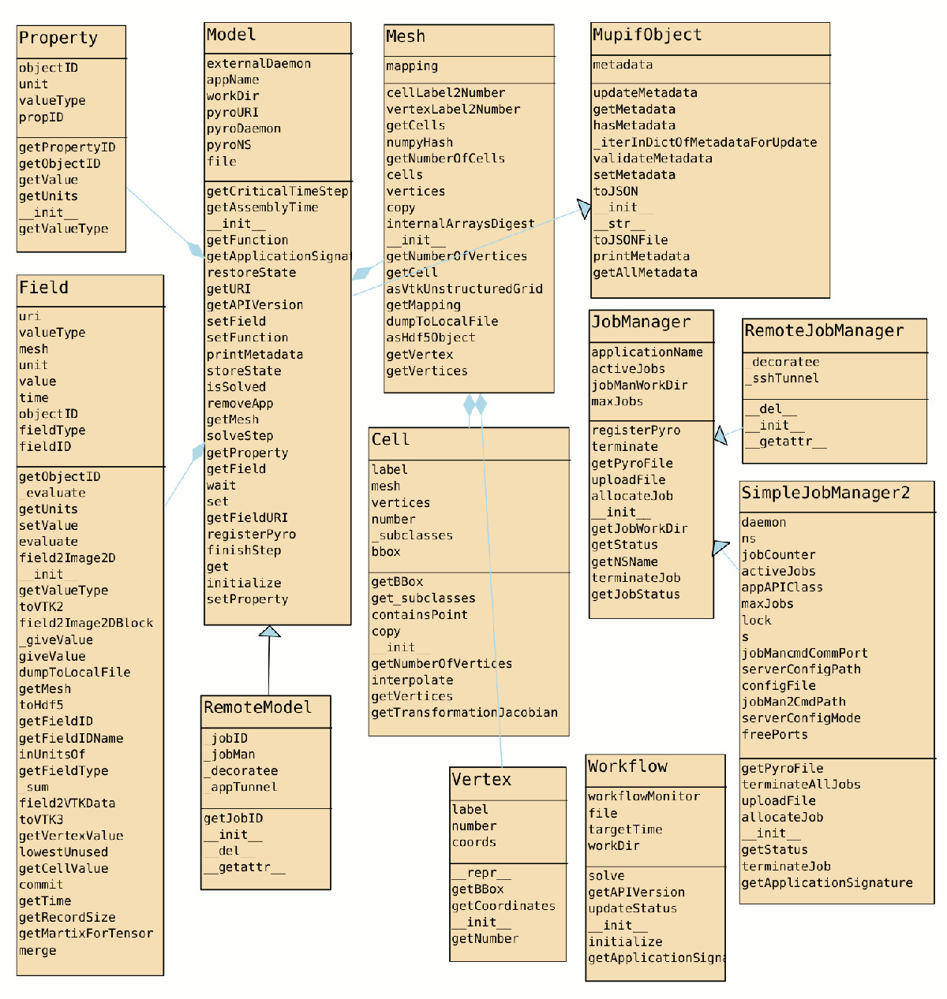
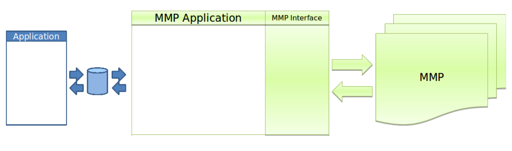
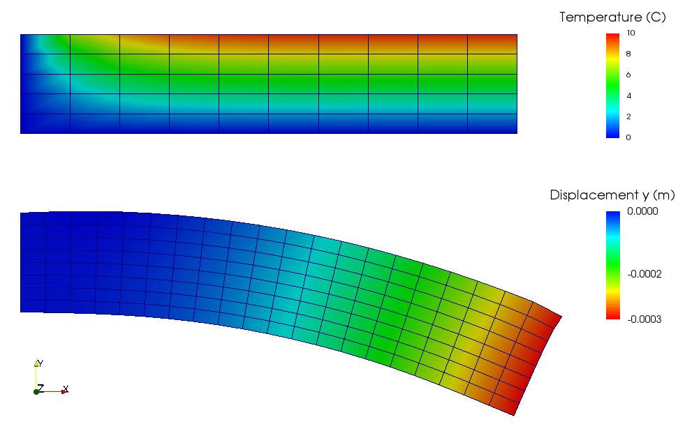

User manual
###############

.. _sect-platform-installation:

Platform installation
========================

Prerequisites
------------------

MuPIF installatoin requires:

* Python ≥ 3.8

  * Windows: we suggest to install `Anaconda scientific python package <https://store.continuum.io/cshop/anaconda/>`__, which includes Python ≥ 3.8;
  * Linux: use system-installed Python (if ≥ 3.8) or install a separate interpreter via Anaconda;

* Wireguard (VPN software): see `Wireguard Installation <https://www.wireguard.com/install>`__.

* git version control system, as MuPIF itself it pulled from its git repository directly (Linux: install package `git`; Windows: `Git Downloads for Windows <https://git-scm.com/download/win>`__)

Local installation
----------------------

Full source
~~~~~~~~~~~~~

This is the recommended installation method. One can run examples and tests and the complete source code is stored on your computer. 
First clone the remote repository to your computer with (replace ``BRANCH_NAME`` with project-specific branch such as ``Musicode`` or ``Deema``; see `MuPIF branches at GitHub <https://github.com/mupif/mupif/branches>`__)::

   git clone --branch BRANCH_NAME https://github.com/mupif/mupif.git

and then run inside the repository::

   pip install -e .

You can run ``git pull`` in the cloned repository to update your installation.

Modules only
~~~~~~~~~~~~~

Run the following command (it can be re-run later for pulling the latest revision)::

   pip install --upgrade git+https://github.com/mupif/mupif.git@BRANCH_NAME

Other recommended packages/softwares
~~~~~~~~~~~~~~~~~~~~~~~~~~~~~~~~~~~~~~~~~~~

-  Paraview (tested >=5.0), visualization application for vtu data
   files, `http://www.paraview.org/`.

-  Windows: Notepad++ (tested 6.6.9),
   `http://notepad-plus-plus.org/`

-  Windows: conEmu, windows terminal emulator,
   `https://code.google.com/p/conemu-maximus5/`.

Test and examples
-------------------

Unit tests
~~~~~~~~~~~

MuPIF platform comes with unit tests. To run unit tests, you need the pytest module::

   pip install pytest

Then from the top-level MuPIF repository directory, execute::

   pytest-3

You should see output something like this::

   $ pytest-3 
   ============================================================= test session starts ==============================================================
   platform linux -- Python 3.10.2, pytest-6.2.5, py-1.10.0, pluggy-0.13.0
   rootdir: /home/eudoxos/build/mupif
   plugins: cov-3.0.0
   collected 144 items                                                                                                                            

   mupif/tests/test_BBox.py ......                                                                                                          [  4%]
   mupif/tests/test_Cell.py ..................................                                                                              [ 27%]
   mupif/tests/test_Field.py ...............                                                                                                [ 38%]
   mupif/tests/test_IntegrationRule.py ..                                                                                                   [ 39%]
   mupif/tests/test_Mesh.py ............                                                                                                    [ 47%]
   mupif/tests/test_Metadata.py ....                                                                                                        [ 50%]
   mupif/tests/test_Particle.py ..........                                                                                                  [ 57%]
   mupif/tests/test_ModelServer.py .......                                                                                             [ 62%]
   mupif/tests/test_TimeStep.py ....                                                                                                        [ 65%]
   mupif/tests/test_Vertex.py ....                                                                                                          [ 68%]
   mupif/tests/test_VtkReader2.py s                                                                                                         [ 68%]
   mupif/tests/test_app.py .                                                                                                                [ 69%]
   mupif/tests/test_heavydata.py ..........................                                                                                 [ 87%]
   mupif/tests/test_multipiecelinfunction.py .                                                                                              [ 88%]
   mupif/tests/test_property.py ......                                                                                                      [ 92%]
   mupif/tests/test_pyro.py ......                                                                                                          [ 96%]
   mupif/tests/test_saveload.py s...                                                                                                        [ 99%]
   mupif/tests/test_units.py .                                                                                                              [100%]

   ======================================================= 142 passed, 2 skipped in 10.34s ========================================================

Indicating that *pytest* found and ran listed tests successfully.

Running examples
~~~~~~~~~~~~~~~~~~~

In addition, the platform installation comes with many examples, that
can be used to verify the successful installation as well, but they primarily 
serve as an educational examples illustrating the use of the platform. The exmaples are located in examples subdirectory of your MuPIF installation and also are accessible directly from GitHub `https://github.com/mupif/mupif/tree/master/examples`.

To run the examples, go the the examples directory and use the ``runex.py`` script to do the set-up and run the example::

  cd examples
  python3 runex.py       # run all examples
  python3 runex.py 1 4 5 # run some examples

MuPIF Basic Infrastructure
---------------------------

MuPIF can be run on a single workstation serving the infrastructure locally. However, to take a full profit from its distributed design, a supporting infrastructure has to be set up.
This typically includes setting up of VPN network to isolate and secure comminication and data exchange. 
There are additional services, including nameserver for service discovery and scheduler for job scheduling. They are described in subsequent chapters.
The following chapters describe these resources from user perspective. The administrative prespective, including set up instrauctions is described in `sect-distributed-model`_.

Wireguard VPN
~~~~~~~~~~~~~~
Integrating the local computer into the already set-up VPN requires a configuration file (to be received over a secure channel) for Wireguard.

* Windows: the configuration file can be imported straght into the Wireguard client.
* Linux:

  * (less user-friendly) the config file is copied into ``/etc/wireguard/somename.conf`` (the name is arbitrary) and the VPN is started with `sudo wg-quick somename`.
  * (user-friendly) the config file is imported into NetworkManager via ``sudo nmcli connection import type wireguard file configfile.conf`` and subsequently the connection is saved persistently in NetworkManager and can be activated as other network connections. (You will need the wireguard module for NetworkManager installed for this to work)

To confirm that the VPN works, look into the config file for your VPN IP address (e.g. ``Address = 172.22.2.13/24``); replace the last number by ``1`` and test ping onto the machine: ``ping 172.22.2.1``. If the IP address is IPv6 (e.g. ``Address = fd4e:6fb7:b3af:0000::12/32``), also replace the last number by ``1``: ``ping fd4e:6fb7:b3af:0000::1``. If the ping responds, your VPN connection is working.

Nameserver
~~~~~~~~~~~~~~

In order to let MuPIF know which existing connected infractructure to use, the nameserver connection details are needed. They consist of nameserver IP address and port. By default, the VPN IP adress of nameserver is `172.22.2.1` and port is 10000. You should receive details from platform admin.
The nameserver IP address and port determine so called address:port string, so for example, it corresponds to ``172.22.2.1:10000``; for IPv6, additionally enclose the address in braces, e.g. ``[fd4e:6fb7:b3af:0000::1]:10000``.

The address:port string should be then stored either in the environment variable ``MUPIF_NS`` or in the file ``MUPIF_NS`` in user-config directory (``~/.config/MUPIF_NS`` in Linux, ``C:\Users\<User>\AppData\Local\MUPIF_NS`` in Windows (probably)).
This will ensure that your MuPIF installation will talk to the correct nameserver when it runs.

You can re-run the examples once ``MUPIF_NS`` is set and you should see MuPIF running the examples using the VPNs nameserver.

Platform operations
======================

The complex simulation pipeline developed in MuPIF-platform consists of
top-level script in Python language (called scenario) enriched by newly
introduced classes. These classes represent fundamental entities in the
model space (such as simulation tools, properties, fields, solution
steps, interpolation cells, units, etc). The top level classes are
defined for these entities, defining a common interface allowing to
manipulate individual representations using a single common interface.
The top level classes and their interface is described in platform
Interface Specification document [1].

In this document, we present a simple, minimum working example,
illustrating the basic concept. The example presented in this section is
assumed to be executed locally. How to extend these examples into
distributed version is discussed in :numref:`sect-distributed-model`.

The following example illustrates the so-called
weak-coupling, where for each solution step, the first application
(Application1) evaluates the value of concentration that is passed to
the second application (Application2) which, based on provided
concentration values (DataID.PID_Concentration), evaluates the
average cumulative concentration
(DataID.PID_CumulativeConcentration). This is repeated for each
solution step. The example also illustrates, how solution steps can be
generated in order to satisfy time step stability requirements of
individual applications.

.. _list-simple-ex:
.. code-block:: python

   # Simple example illustrating simulation scenario

    import mupif as mp
    import model1
    import model2

    time = 0*mp.U.s
    timestepnumber = 0
    targetTime = 1.0*mp.U.s

    m1 = model1.Model1()  # create an instance of model #1
    m2 = model2.Model2()  # create an instance of model #2

    m1.initialize()
    m2.initialize()

    # loop over time steps
    while abs(time.inUnitsOf(mp.U.s).getValue() - targetTime.inUnitsOf(mp.U.s).getValue()) > 1.e-6:
        #determine critical time step
        dt2 = m2.getCriticalTimeStep()
        dt = min(m1.getCriticalTimeStep(), dt2)
        # update time
        time = time+dt
        if (time > targetTime):
            # make sure we reach targetTime at the end
            time = targetTime
        timestepnumber = timestepnumber + 1

        # create a time step
        istep = mp.TimeStep.TimeStep(time, dt, timestepnumber)
   
        try:
            #solve problem 1
            m1.solveStep(istep)
            #request temperature field from m1
            c = m1.get(mp.DataID.PID_Concentration, istep)
            # register temperature field in m2
            m2.set(c)
            # solve second sub-problem
            m2.solveStep(istep)
            prop = m2.get(mp.DataID.PID_CumulativeConcentration, istep)
            print ("Time: %5.2f concentraion %5.2f, running average %5.2f" % (istep.getTime(), c.getValue(), prop.getValue()))

        except APIError.APIError as e:
            logger.error("Following API error occurred: %s" % e )
            break

    # terminate the models
    m1.terminate();
    m2.terminate();

The full listing of this example can be found in
`examples/Example01 <https://github.com/mupif/mupif/tree/master/mupif/examples>`__.
The output is illustrated in :numref:`fig-ex1-out`.

.. _fig-ex1-out:
.. figure:: img/ex1-out.png

   Output from Example01.py

The platform installation comes with many examples, located in
*examples* subdirectory of platform installation and also accessible
`online <https://github.com/mupif/mupif/tree/master/mupif/examples>`__
in the platform repository. They illustrate various aspects, including
field mapping, vtk output, etc.

Platform APIs
================

In this chapter are presented the abstract interfaces (APIs) of abstract
classes that have been designed to represent basic building blocks of
the complex multi-physics simulations, including individual simulation
packages, but also the high level complex data (such as spatial fields
and properties). The abstract base classes are defined for all relevant
entities, see :numref:`fig-abstract-uml`. Their primary role is to define abstract
interfaces (APIs), which allow manipulating individual objects using
generic interface without being concerned by internal details of
individual instances. One of the key and distinct features of the MuPIF
platform is that such an abstraction (defined by top level classes) is
not only developed for individual models, but also defined for the
simulation data themselves. The focus is on services provided by objects
and not on underlying data. The object representation of data
encapsulates the data themselves, related metadata, and related
algorithms. Individual models then do not have to interpret the complex
data themselves; they receive data and algorithms in one consistent
package. This also allows the platform to be independent of particular
data format, without requiring any changes on the model side to work
with new format.

In the rest of this section, the individual abstract classes and their
interfaces are described in detail. For each class a table is provided,
where on the left column the individual services and their arguments are
presented, following the Pydoc [7] syntax. In the right column, the
description of individual service is given, input arguments are
described (denoted by ARGS) including their type (in parenthesis). The
return values are described in a similar way (denoted by Returns). More
extensive documentation of MuPIF abstract classes exists in MuPIF
documentation [8].

.. _fig-abstract-uml:

   UML diagram of important abstract classes with only selected relations are displayed (Using Pynsource package for UML diagram)

Common API for all components
----------------------------------

The object-oriented approach allows to define hierarchy of classes. This
is also used in designing MuPIF class structure, where all component
classes form a hierarchy, where on top of this hierarchy is
:obj:`~mupif.mupifobject.MupifObject` class. This class introduces a common interface that is
then inherited by all derived classes, thus by all MuPIF components
involving models (Model class), workflows, and high-level data
components, such as properties or spatial fields.

The *MupifObject* class essentially defines methods allowing to get/set
metadata to the component. The metadata are identified by unique ID and
can be of any type. Internally, they are stored in internal dictionary
declared by *MupifObject.*

Metadata and metadata schemas
~~~~~~~~~~~~~~~~~~~~~~~~~~~~~~~~~~~

The metadata and metadata schemas in MuPIF are stored in a form of JSON
representations as a nested (hierarchical) dictionary. JSON stands for
“JavaScript Object Notation”, a simple data interchange format. In its
heart, JSON is built on the following data structures: object, array,
number, string, boolean and null. With these simple data types, all
kinds of structured data can be represented. The JSON schema is a
template defining what fields are expected, and how the values are
represented. The metadata can be validated against schema. The JSON
schema itself is written in JSON (or as Pydantic data models, exporting the schema to JSON schema syntax). The JSON schema standard can be found
in [`11 <#2zd1531og9ob>`__].

Generated documentation of the JSON schemas is in :numref:`sect-schemas-doc`.

In short, a schema in a Python in represented as a python dictionary,
with following keys: *type*, *properties*, and *required*.

-  The *type* defines the type of data. Can be any of the supported JSON
   types (object, array, number, string, boolean or null)

-  The *properties* is a dictionary containing the actual metadata in
   the from of key-value pairs, where values in the schema are
   dictionaries, containing ‘type’ key defining type of property.

-  The required key is an array containing required property keys.

.. code-block:: python

   #Example of model schema (from Model.py)
   ModelSchema = {
     'type': 'object',
     'properties': {
         'Name': {'type': 'string'},
         'ID': {'type': ['string', 'integer']},
         'Description': {'type': 'string'},
         'Material': {'type': 'string'},
         'Physics': { 
           'type': 'object',
           'properties': {
             'Type': {'type': 'string', 'enum': ['Electronic', 'Atomistic', 'Molecular', 'Continuum', 'Other']},
             'Entity': {'type': 'string', 'enum': ['Atom', 'Electron', 'Grains', 'Finite volume', 'Other']}
             },
             'required': ['Type', 'Entity']
         },
     },
     'required': ['Name', 'ID', 'Description', 'Physics']
   }

The following listing shows valid metadata (according to schema defined
above):

.. code-block:: python

   # Example of valid metadata 
   metaData = {
     'Name': 'Stationary thermal problem',
     'ID': 'Thermo-1',
     'Description': 'Stationary heat conduction using finite elements on rectangular domain',
     'Geometry': '2D rectangle',
     'Physics': {
       'Type': 'Continuum',
       'Entity': 'Finite volume',
       'Equation': ['Heat balance'],
       'Equation_quantities': ['Heat flow'],
       'Relation_description': ['Fick\'s first law'],
       'Relation_formulation': ['Flow induced by thermal gradient on isotropic material'],
       'Representation': 'Finite volumes'
     },
   }

As illustrated, metadata can contain nested data structures. It is
possible to access the individual metadata entries by using convenience
methods provided by any *MupifObject* instance. Also, it is possible
to insert a new metadata entry to the structure. These methods allow to
use ‘dot’ notation to access nested entries, as illustrated in the
example below:

.. code-block:: python

   myobj.getMetadata ('Name') # returns 'Stationary thermal problem'
   myobj.getMetadata ('Physics.Type') #returns 'Continuum'
   myobj.setMetadata ('Physics.Representation', 'Finite elements') # change existing entry
   myobj.setMetadata ('Physics.NewNote', 'My note') # add a new entry to metadata

The metadata schemata are defined in corresponding modules. In MuPIF,
the metadata schema is defined for *Model*, *Workflow*, and all data
classes (in dataID.py).

Model class
----------------

The abstract :obj:`~mupif.model.Model` class represents an external model and defines its
interface. The interface is defined in terms of abstract services for
data exchange and steering. Derived classes represent individual
simulation models. In terms of MODA [9] nomenclature, introduced by EMMC
[10], the instances of *Model* class correspond to MODA models and
post-processing tools. The *Application* class is a synonym for *Model*
class, but is deprecated.

The data exchange services consist of methods for getting and
registering external properties, fields, and functions, which are
represented using corresponding, newly introduced classes. Steering
services allow invoking (execute) solution for a specific solution step,
update solution state, terminate the application, etc.

Workflow class
-------------------

The :obj:`~mupif.workflow.Workflow` abstract class represents a simulation workflow. Workflow can
combine several applications into a complex simulation task. A key
feature of *Workflow* class is that it is derived from *Model*
(*Application*) class, so it shares the same API as *Model* Interface.
This essentially allows to treat any *Workflow* as *Model* and allows to
build a hierarchy of nested workflows. In addition, the following
services are declared:

Property class
-------------------

:obj:`~mupif.property.Property` is a characteristic value of a problem, which has no spatial
variation. Property is identified by *PropertyID*, which is an
enumeration determining its physical meaning. It can represent any
quantity of a scalar, vector, or tensorial type. Property keeps its
value, type, associated time and an optional *objectID*, identifying
related component/subdomain.

Property with constant value in time is represented by
:obj:`~mupif.property.ConstantProperty` class derived from :obj:`~mupif.property.Property`.

Field class
----------------

:obj:`~mupif.field.Field` representats a field. It is a scalar, vector, or tensorial
quantity defined on a spatial domain (represented by the :obj:`mupif.mesh.Mesh` class).
The field provides interpolation services in space, but is assumed to be
fixed in time (the application interface allows to request field at
specific time). The fields are usually created by the individual
applications (sources) and being passed to target applications. The
field can be evaluated in any spatial point belonging to underlying
domain. Derived classes will implement fields defined on common
discretizations, like fields defined on structured or unstructured FE
meshes, finite difference grids, etc. Basic services provided by the
field class include a method for evaluating the field at any spatial
position and a method to support graphical export (creation of VTK
dataset).

Function class
-------------------

:obj:`~mupif.function.Function` represents a user defined function. Function is an object defined by
mathematical expression and can be a function of spatial position, time,
and other variables. Derived classes should implement evaluate service
by providing a corresponding expression. The function arguments are
packed into a dictionary, consisting of pairs (called items) of keys and
their corresponding values.

TimeStep class
-------------------

:obj:`~mupif.timestep.TimeStep` represents solution time step. The time step manages its number,
target time, and time increment.

.. _fig-timestep:
.. figure:: img/timestep.png

   Concept of time step in MuPIF

Mesh class
---------------

:obj:`~mupif.mesh.Mesh` is an abstract representation of a computational domain and
its spatial discretization. The mesh geometry is described using
computational cells (representing finite elements, finite difference
stencils, etc.) and vertices (defining cell geometry). Derived classes
represent structured, unstructured FE grids, FV grids, etc. Mesh is
assumed to provide a suitable instance of cell and vertex localizers. In
general, the mesh services provide different ways how to access the
underlying interpolation cells and vertices, based on their numbers, or
spatial location.

Cell class
---------------

:obj:`~mupif.cell.Cell` represents a computational cell (finite element). The solution
domain is composed of cells, whose geometry is defined using vertices.
Cells provide interpolation over their associated volume, based on given
vertex values. Derived classes will be implemented to support common
interpolation cells (finite elements, FD stencils, etc.)

Vertex class
------------------

:obj:`~mupif.vertex.Vertex` represents a vertex. In general, a set of vertices defines the geometry
of interpolation cells. A vertex is characterized by its position,
number and label. Vertex number is locally assigned number (by *Mesh*
class), while a label is a unique number defined by application.

BoundingBox
-----------------

:obj:`~mupif.boundingbox.BoundingBox` represents an axis aligned bounding box - a rectangle in 2d and a prism
in 3d. Its geometry is described using two points - lover left and upper
right. The bounding box class provides fast and efficient methods for
testing whether point is inside and whether an intersection with another
bounding box exists.

HeavyStruct
--------------

:obj:`~mupif.heavystruct.HeavyStruct` is self-describing container for hierarchical data, with both remote/local access. The data is described using JSON (which can be validated using JSON schema), stored next to the data. The backing storage format is HDF5 (which is hidden from the user via API). Provisions are present for ontological metadata so that each item can have ontological meaning.

APIError
--------------

:obj:`~mupif.apierror.APIError` serves as a base class for exceptions thrown by the
framework. Raising an exception is a way to signal that a routine could
not execute normally - for example, when an input argument is invalid
(e.g. value is outside of the domain of a function) or when a resource
is unavailable (like a missing file, a hard disk error, or out-of-memory
errors). A hierarchy of specialized exceptions can be developed, derived
from the *APIError* class.

Exceptions provide a way to react to exceptional circumstances (like
runtime errors) in programs by transferring control to special functions
called handlers. To catch exceptions, a portion of code is placed under
exception inspection. This is done by enclosing that portion of code in
a try-block. When an exceptional circumstance arises within that block,
an exception is thrown that transfers the control to the exception
handler. If no exception is thrown, the code continues normally and all
handlers are ignored.

An exception is thrown by using the throw keyword from inside the
try-block. Exception handlers are declared with the keyword "except",
which must be placed immediately after the try block.

Developing Application Program Interface (API)
=================================================

In order to establish an interface between the platform and external
application, one has to implement a *Model* class. This class defines a
generic interface in terms of general purpose, problem independent,
methods that are designed to steer and communicate with the application.
This table presents an overview of application interface, the full
details with complete specification can be found in :obj:`~mupif.model.Model`.

======================================================= ==========================================================================
Method                                                  Description
\__init__(self, metaData)                               Constructor. Initializes the application.
initialize(self, workdir, metaData, validateMetaData)   Initializes model and sets workdir and metadata.
get(self, objectTypeID, time=None, objectID="")         Returns an output of the model, specified by objectTypeID and objectID.
set(self, obj, objectID="")                             Sets an input of the model, specified by objectID and type of obj.
solveStep(self, tstep)                                  Solves the problem for given time step.
finishStep(self, tstep)                                 Called after a global convergence within a time step.
getCriticalTimeStep()                                   Returns the actual critical time step increment.
getAssemblyTime(tStep)                                  Returns assembly time within a timestep
getApplicationSignature()                               Returns the application identification
terminate()                                             Terminates the application.
======================================================= ==========================================================================

From the perspective of individual simulation tool, the interface
implementation can be achieved

by means of either direct (native) or indirect implementation.

-  **Native implementation** requires a simulation tool written in
   Python, or a tool with Python interface. In this case the Model
   services will be implemented directly using direct calls to suitable
   application’s functions and procedures, including necessary internal
   data conversions. In general, each application (in the form of a
   dynamically linked library) can be loaded and called, but care must
   be taken to convert Python data types into target application data
   types. More convenient is to use a wrapping tool (such as Swig [5] or
   Boost [6]) that can generate a Python interface to the application,
   generally taking care of data conversions for the basic types. The
   result of wrapping is a set of Python functions or classes,
   representing their application counterparts. The user calls an
   automatically generated Python function which performs data
   conversion and calls the corresponding native equivalent.

-  **Indirect implementation** is based on wrapper class implementing
   Model interface that implements the interface indirectly, using, for
   example, simulation tool scripting or I/O capabilities. In this case
   the application is typically standalone application, executed by the
   wrapper in each solution step. For the typical solution step, the
   wrapper class has to cache all input data internally (by overloading
   corresponding set methods), execute the application from previously
   stored state, passing input data, and parsing its output(s) to
   collect return data (requested using get methods).

.. _fig-indirect:

   Illustration of indirect approach

The example illustrating the indirect implementation is discussed
further. Typically, this is a three-phase procedure. In the first step,
when external properties and fields are being set, the application
interface has to remember all these values. In the second step, when the
application is to be executed, the input file is to be modified to
include the mapped values. After the input file(s) are generated, the
application itself is executed. In the last, third step, the computed
properties/fields are requested. They are typically obtained by parsing
application output and returned.

In this example, the application should compute the average value from
mapped values of concentrations over the time. The external application
is available, that can compute an average value from the input values
given in a file. The application interface accumulates the mapped values
of concentrations in a list data structure, this is done is setProperty
method. During the solution step in a solveStep method, the accumulated
values of concentrations over the time are written into a file, the
external application is invoked taking the created file as input and
producing an output file containing the computed average. The output
file is parsed when the average value is requested using getProperty
method.

.. _fig-indirect-api:
.. figure:: img/indirect-api.*

   Typical workflow in indirect approach for API implementation

Developing user workflows
============================

Multiscale/multiphysics simulations are natively supported in MuPIF,
allowing easy data passing from one model to another one, synchronizing
and steering all models. Simulation workflow of multiscale/multiphysics
simulations, called also a simulation scenario, defines data flow among
various models and their steering. Natively, the workflow in MuPIF is
represented as Python script combining MuPIF components into workflow.
However, a many benefits can be further gained by implementing a
workflow as class derived from abstract *Workflow* class. The benefits
and example are discussed in :numref:`sect-workflow-as-a-class`.

Workflow templates
--------------------

Sequential
~~~~~~~~~~~~~

.. figure:: img/workflow-sequential.png

   Sequential workflow template

.. code-block:: python

    time = 0*mp.U.s
    timeStepNumber = 0
    targetTime = 10*mp.U.s

    while (abs(time-targetTime).getValue() > 1.e-6):
        dt=min(
            m1.getCriticalTimeStep(),
            m2.getCriticalStep(),
            m3.getCriticalStep()
        )
        time = time+dt
        if (time > targetTime):
            time = targetTime

        timeStepNumber = timeStepNumber + 1
        istep=TimeStep.TimeStep(time, td, targetTime, n=timeStepNumber)
        try:
            m1.solveStep(istep)
            p = m1.get(PID, m2.getAssemblyTime(istep))
            m2.set(p)
            m2.solveStep(istep)
            # ...
            m3.solveStep(istep)
        except APIError.APIError as e:
            print ("API Error occurred:", e)
            break

    m1.terminate()
    m2.terminate()
    m3.terminate()

Loosely coupled
~~~~~~~~~~~~~~~~

.. figure:: img/workflow-loosely-coupled.png

   Loosely coupled workflow template

.. code-block:: python

    time = 0*mp.U.s
    timeStepNumber = 0
    targetTime = 10*mp.U.s

    while (abs(time-targetTime).getValue() > 1.e-6):
        dt = min(
            m1.getCriticalTimeStep(),
            m2.getCriticalStep(),
            m3.getCriticalStep()
        )
        time = time+dt
        if (time > targetTime):
            time = targetTime
        timeStepNumber = timeStepNumber + 1
        istep = TimeStep.TimeStep(time, td, targetTime, n=timestep)

        try:

            convergedFlag = False
            while not convergedFlag:
                m1.solveStep(istep)
                p1 = m1.get(data_id, m2.getAssemblyTime(istep))
                m2.set(p1)
                m2.solveStep(istep)
                p2 = m2.get(data_id2, m1.getAssemblyTime(istep))
                m1.set(p2)

                #check for convergence
                convergedFlag = checkConvergence()

            m3.solveStep()

        except APIError.APIError as e:
            print ("API Error occurred:", e)
            break

    m1.terminate()
    m2.terminate()
    m3.terminate()

Workflow example
---------------------

A thermo-mechanical, multiphysical example *Example06.py* explains
linking and steering in greater detail. The example presents a local
(non-distributed) version and can be found under *examples/Example06\**
directory of MuPIF installation.

A cantilever, clamped on the left hand side edge, is subjected to
stationary temperature loading, see :numref:`fig-cantilever-thermal`. Heat convection is
prescribed on the top edge with ambient temperature 10°C. Left and
bottom edges have prescribed temperature 0°C, the right edge has no
boundary condition. Initial temperature is set to 0°C, heat conductivity
is 1 W/m/K, heat capacity 1.0 J/kg/K, material density 1.0
kg/m³. The material has assigned Young's modulus as 30 GPa,
Poisson's ratio 0.25 and coefficient of linear thermal expansion
12e-6°C⁻¹.

.. _fig-cantilever-thermal:
.. figure:: img/cantilever-thermal.png

   Elastic cantilever subjected to thermal boundary conditions.

First, the temperature distribution has to be solved in the whole domain
from the given initial and boundary conditions. The temperature field is
passed afterwards to the mechanical analysis, which evaluates the
corresponding displacement field. Such simulation flow is depicted in
:numref:`fig-thermo-mech-flow`, linking two models in one time step. The thermal model
implements *getField(T)* and *solveStep(istep)* methods. In addition,
the mechanical model needs to set up an initial thermal field
*setField(T)* prior to execution in the time step.

.. _fig-thermo-mech-flow:
.. figure:: img/thermo-mech-flow.png

   Thermo-mechanical simulation flow

The discretizations for thermal and mechanical problems are in this
particular case different and the platform takes care of field
interpolation. The mesh for thermal problem consist of 50 linear
elements with linear approximation and 55 nodes. The mesh for mechanical
analysis consist of 168 nodes and 160 elements with linear
approximation. Results for final step are shown in :numref:`fig-thermo-mech-results`.

.. _fig-thermo-mech-results:

   Results of thermo-mechanical simulation

A code below shows a thermo-mechanical simulation in *Example06*.
Thermal and mechanical solvers are implemented as *demoapp* module and
loaded.

.. code-block:: python

    class Example06(mp.Workflow):

        def __init__(self, metadata=None):
            MD = {
                'Name': 'Thermo-mechanical stationary problem',
                'ID': 'Thermo-mechanical-1',
                'Description': 'stationary thermo-mechanical problem using finite elements on rectangular domain',
                # 'Dependencies' are generated automatically
                'Version_date': '1.0.0, Feb 2019',
                'Inputs': [],
                'Outputs': [
                    {'Type': 'mupif.Field', 'Type_ID': 'mupif.DataID.FID_Temperature', 'Name': 'Temperature field',
                     'Description': 'Temperature field on 2D domain', 'Units': 'degC'},
                    {'Type': 'mupif.Field', 'Type_ID': 'mupif.DataID.FID_Displacement', 'Name': 'Displacement field',
                     'Description': 'Displacement field on 2D domain', 'Units': 'm'}
                ],
                'Models': [
                    {
                        'Name': 'thermal',
                        'Module': 'mupif.demo',
                        'Class': 'ThermalModel'
                    },
                    {
                        'Name': 'mechanical',
                        'Module': 'mupif.demo',
                        'Class': 'MechanicalModel'
                    }
                ]
            }
            super().__init__(metadata=MD)
            self.updateMetadata(metadata)

        def initialize(self, workdir='', metadata=None, validateMetaData=True, **kwargs):
            super().initialize(workdir=workdir, metadata=metadata, validateMetaData=validateMetaData, **kwargs)

            thermalInputFile = mp.PyroFile(filename='inputT.in', mode="rb", dataID=mp.DataID.ID_InputFile)
            self.getModel('thermal').set(thermalInputFile)

            mechanicalInputFile = mp.PyroFile(filename='inputM.in', mode="rb", dataID=mp.DataID.ID_InputFile)
            self.getModel('mechanical').set(mechanicalInputFile)

        def solveStep(self, istep, stageID=0, runInBackground=False):
            self.getModel('thermal').solveStep(istep, stageID, runInBackground)
            self.getModel('mechanical').set(self.getModel('thermal').get(DataID.FID_Temperature, istep.getTime()))
            self.getModel('mechanical').solveStep(istep, stageID, runInBackground)

        def get(self, objectTypeID, time=None, objectID=""):
            if objectTypeID == DataID.FID_Temperature:
                return self.getModel('thermal').get(objectTypeID, time, objectID)
            elif objectTypeID == DataID.FID_Displacement:
                return self.getModel('mechanical').get(objectTypeID, time, objectID)
            else:
                raise apierror.APIError('Unknown field ID')

        def getCriticoalTimeStep(self):
            return 1*mp.U.s

        def getApplicationSignature(self):
            return "Example06 workflow 1.0"

        def getAPIVersion(self):
            return "1.0"

    md = {
        'Execution': {
            'ID': '1',
            'Use_case_ID': '1_1',
            'Task_ID': '1'
        }
    }

    demo = Example06()
    demo.initialize(metadata=md)
    demo.set(mp.ConstantProperty(value=1.*mp.U.s, propID=mp.DataID.PID_Time, valueType=mp.ValueType.Scalar, unit=mp.U.s), objectID='targetTime')

    tstep = timestep.TimeStep(time=1*mp.U.s, dt=1*mp.U.s, targetTime=10*mp.U.s)

    demo.solveStep(tstep)

    tf = demo.get(DataID.FID_Temperature, tstep.getTime())
    t_val = tf.evaluate((4.1, 0.9, 0.0))

    mf = demo.get(DataID.FID_Displacement, tstep.getTime())
    m_val = mf.evaluate((4.1, 0.9, 0.0))
    print(t_val.getValue()[0], m_val.getValue()[1])

    demo.printMetadata()
    demo.terminate()

As already mentioned, the thermo-mechanical simulation chain can run in
various configurations, composed of a steering script, nameserver,
thermal and mechanical applications, using ssh or VPN network
connection. Table 3 shows MuPIF examples of thermo-mechanical
configuration. In principle, each component can run on different
computer, except a steering script.

.. |image-therm| image:: img/app-therm.png
.. |image-mech| image:: img/app-mech.png

.. csv-table:: Examples of thermo-mechanical simulation on local and various distributed configurations.

   ,Steering script,Nameserver,Thermal application |image-therm|,Mechanical application |image-mech|
   Example06 (local),Local,-,Local,Local
   "Example07 (JobMan, VPN, ssh)",Local,Remote,"Remote, JobMan","Remote, JobMan"
   "Example08 (JobMan, VPN, ssh)",Local,Remote,"Remote, JobMan",Local

.. _sect-workflow-as-a-class:

Workflow as a class
------------------------

The object oriented design of MuPIF allows to build a hierarchy of
workflows, where the top level workflow may utilise the components,
which may be again workflows. From this point of view, any workflow can
be regarded as an application, composed from individual components,
implementing itself an application interface. The application interface,
as introduced in Chapter on Platform APIs, allows to perform any data
and steering operation, i.e. to get and set any data, update response
for the given solution step, etc.

Another important advantage of having workflow represented as a class is
that the individual workflows can be allocated and executed by a
jobManager on remote resources in a same way as individual applications.

MuPIF comes with abstract *Workflow* class, derived from *Model* class,
supposed to be a parent class for any workflow represented as a class.
It extends the *Model* interface by defining *solve* method, which
implements a time loop over the individual time steps, solved by
*solveStep* method defined already in *Model* interface.

The default implementation of *Workflow’s* solve method is shown in a
listing below. It generates a sequence of time steps satisfying the
stability requirements till reaching the target time. If the default
implementation does not fit, the method can be overloaded.

.. code-block:: python

    class Workflow(Model.Model):
        def solve(self, runInBackground=False):
            self.setMetadata('Status', 'Running')
            self.setMetadata('Progress', 0.)

            time = 0.*U.s
            timeStepNumber = 0
            while abs(time.inUnitsOf(U.s).getValue()-self._exec_targetTime.inUnitsOf(U.s).getValue()) > 1.e-6:
                time_prev = time
                if self._exec_dt is not None:
                    dt = min(self.getCriticalTimeStep(), self._exec_dt)
                else:
                    dt = self.getCriticalTimeStep()
                time = time+dt
                if time > self._exec_targetTime:
                    time = self._exec_targetTime
                    dt = time - time_prev
                timeStepNumber = timeStepNumber+1
                istep = timestep.TimeStep(time=time, dt=dt, targetTime=self._exec_targetTime, number=timeStepNumber)

                log.debug("Step %g: t=%g dt=%g" % (timeStepNumber, time.inUnitsOf(U.s).getValue(), dt.inUnitsOf(U.s).getValue()))
                print("Step %g: t=%g dt=%g" % (timeStepNumber, time.inUnitsOf(U.s).getValue(), dt.inUnitsOf(U.s).getValue()))

                # Estimate progress
                self.setMetadata('Progress', 100*time.inUnitsOf(U.s).getValue()/self._exec_targetTime.inUnitsOf(U.s).getValue())

                self.solveStep(istep)
                self.finishStep(istep)

            self.setMetadata('Status', 'Finished')
            self.setMetadata('Date_time_end', timeTime.strftime("%Y-%m-%d %H:%M:%S", timeTime.gmtime()))

.. _sect-distributed-model:

Distributed Model
====================

Common feature of parallel and distributed environments is a distributed
data structure and concurrent processing on distributed processing
nodes. This brings in an additional level of complexity that needs to be
addressed. To facilitate execution and development of the simulation
workflows, the platform provides the transparent communication mechanism
that will take care of the network communication between the objects. An
important feature is the transparency, which hides the details of remote
communication to the user and allows to work with local and remote
objects in the same way.

The communication layer is built on `Pyro
library <https://pythonhosted.org/Pyro5/>`__ [4], which provides a
transparent distributed object system fully integrated into Python. It
takes care of the network communication between the objects when they
are distributed over different machines on the network. One just calls a
method on a remote object as if it were a local object – the use of
remote objects is (almost) transparent. This is achieved by the
introduction of so-called proxies. A proxy is a special kind of object
that acts as if it were the actual object. Proxies forward the calls to
the remote objects, and pass the results back to the calling code. In
this way, there is no difference between simulation script for local or
distributed case, except for the initialization, where, instead of
creating local object, one has to connect to the remote object.

.. _fig-local-remote-comm:
.. figure:: img/local-remote-comm.*

   Comparison of local vs. remote object communication scenarios

To make an object remotely accessible, it has to be registered with the
daemon, a special object containing server side logic which dispatches
incoming remote method calls to the appropriate objects. To enable
runtime discovery of the registered objects, the name server is
provided, offering a phone book for Pyro objects, allowing to search for
objects based on logical name. The name server provides a mapping
between logical name and exact location of the object in the network, so
called uniform resource identifier (URI). The process of object
registration and of communication with remote objects (compared to local
objects) is illustrated in :numref:`fig-local-remote-comm`.

Distributed aspects of the API
-----------------------------------

One of the important aspect in distributed model is how the data are
exchanged between applications running at different locations. The Pyro4
communication layer allows to exchange data in terms of get and set API
methods in two ways. The communication layer automatically takes care of
any object that is passed around through remote method calls. The
receiving side of a call can receive either a local copy of the remote
data or the representation of the remote data (Proxy).

-  The communication in terms of exchanging local object copies can be
   less efficient than communication with remote objects directly, and
   should be used for objects with low memory footprint. One potential
   advantage is that the receiving side receives the copy of the data,
   so any modification of the local copy will not affect the source,
   remote data. Also multiple method invocation on local objects is much
   more efficient, compared to costly communication with a remote
   object.

-  On the other hand, the data exchange using proxies (references to
   remote data) does not involves the overhead of creating the object
   copies, which could be prohibitively large for complex data
   structures. Also, when references to the remote objects are passed
   around, the communication channel must be established between
   receiving side and remote computer owning the actual object, while
   passing local objects requires only communication between caller and
   receiver.

Both approaches have their pros and cons and their relative efficiency
depends on actual problem, the size of underlying data structures,
frequency of operations on remote data, etc.

Pyro4 will automatically take care of any Pyro4 objects that you pass
around through remote method calls. If the autoproxying is set to on
(AUTOPROXY = True by default), Pyro4 will replace objects by a proxy
automatically, so the receiving side can call methods on it and be sure
to talk to the remote object instead of to a local copy. There is no
need to create a proxy object manually, a user just has to register the
new object with the appropriate daemon. This is a very flexible
mechanism, however, it does not allow explicit control on the type of
passed objects (local versus remote).

Typically, one wants to have explicit control whether objects are passed
as proxies or local copies. The get methods (such as *getProperty*,
*getField*) should not register the returned object at the Pyro4 daemon.
When used, the remote receiving side obtains the local copy of the
object. To obtain the remote proxy, one should use *getFieldURI* API
method, which calls getField method, registers the object at the server
daemon and returns its URI. The receiving side then can obtain a proxy
object from URI. This is illustrated in the following code snippet:

.. code-block:: python

   field_uri = Solver.getFieldURI(DataID.FID_Temperature, 0.0)
   field_proxy = Pyro4.Proxy(uri)

Requirements for distributed computing
-------------------------------------------

To enable the discovery of remote objects a nameserver service is
required, allowing to keep track of individual objects in network. It is
also allows to use readable uniform resource identifiers (URI) instead
of the need to always know the exact object id and its location.

The platform is designed to work on virtually any distributed platform,
including grid and cloud infrastructure. For the purpose of performing
simulations within a project, it is assumed that individual simulations
and therefore the individual simulation packages will be distributed
over the network, running on dedicated servers provided by individual
partners, forming grid-like infrastructure.

According to requirements specified in D1.2 Software Requirements
Specification Document for Cloud Computing [2], different functional
requirements have been defined, with different levels of priorities.
Typical requirements include services for resource allocation, access
and license control, etc. In the project, we decided to follow two
different strategies, how to fulfill these defined requirements. The
first one is based on developing custom solution for resource allocation
combined with access control based on standardized SSH technology based
on public key cryptography for both connection and authentication. It
uses platform distributed object technology and this allows its full
integration in the platform. This solution is intended to satisfy only
the minimum requirements, but its setup and operation is easy. It setup
does not requires administrative rights and can be set up and run using
user credentials. The second approach is based on established condor
middleware. This solution provides more finer control over all aspects.
On the other hand, its setup is more demanding. The vision is to allow
the combination of both approaches. Both approaches and their
requirements are described in following sections.

Internal platform solution - ModelServer resource allocation
----------------------------------------------------------------

This solution has been developed from a scratch targeting fulfilment of
minimal requirements only while providing simple setup. The resource
allocation is controlled by *ModelServer*. Each computational server
within a platform should run an instance of ModelServer, which provides
services for allocation of application instances based on user request
and monitoring services.

The *ModelServer* is implemented as python object like any other platform
components and is part of platform source code. It is necessary to
create an instance of *ModelServer* on each application server and
register it on the platform nameserver to make it accessible for clients
running simulation scenarios. This allows to access *ModelServer*
services using the same Pyro technology, which makes the resource
allocation to be part of the the simulation scenario. Typically, the
simulation scenario script first establishes connection to the platform
nameserver, which is used to query and create proxies of individual
*ModelServers*. The individual *ModelServers* are subsequently requested
to create the individual application instances (using *allocateJob*
service) and locally represented by corresponding proxy objects.
Finally, the communication with remote application instances can be
established using proxies created in the previous step, see :numref:`fig-jobmanager-control-flow`
illustrating typical work flow in the distributed case.

The job manager has only limited capability to control allocated
resources. In the present implementation, the server administrator can
impose the limit on number of allocated applications. The configuration
of the jobmanager requires only simple editing of configuration file.
The individual applications are spawned under new process to enable true
concurrency of running processes and avoid limitations of Python related
to concurrent thread processing.

.. _fig-jobmanager-control-flow:
.. figure:: img/jobmanager-control-flow.*

   Typical control flow with resource allocation using ModelServer.

The status of individual job managers can be monitored with the
jobManStatus.py script, located in tools subdirectory of the platform
distribution. This script displays the status of individual jobs
currently running, including their run time and user information. The
information displayed is continuously refreshed, see :numref:`fig-jobman-monitor`.

.. _fig-jobman-monitor:
.. figure:: img/jobman-monitor.png

   Screenshot of Job Manager monitoring tool

The internal jobManager does not provide any user authentication service
at the moment. The user access is assumed to be controlled externally,
using ssh authorization. For example, to establish the authorized
connection to a remote server and platform services (jobManager) using a
ssh tunnel, a valid user credentials for the server are required. The
secured, authenticated connection is realized using setting up ssh
tunnel establishing a secure and trusted connection to a server. The ssh
connections can be authorized by traditional user/passwords or by
accepting public ssh keys generated by individual clients and send to
server administrators. More details are given in a Section on SSH
tunneling.

The status of individual computational servers can be monitored online
using the provided monitoring tool. A simple ping test can be executed,
verifying the connection to the particular server and/or allocated
application instance.

Setting up a Model Server
~~~~~~~~~~~~~~~~~~~~~~~~~~~~~~~

The skeleton for application server is distributed with the platform and
is located in *examples/Example04-JobMan-distrib*. The following files
are provided:

-  server.py: The implementation of application server. It starts
   ModelServer instance and corresponding daemon. Most likely, no changes
   are required.

-  serverConfig.py: configuration file for the server. The individual
   entries have to be customized for particular server. Follow the
   comments in the configuration file. In the example, the server is
   configured to run on Unix-based system.

-  JobMan2cmd.py: python script that is started in a new process to
   start the application instance and corresponding daemon. Its
   behaviour can be customized by Config.py.

-  test.py: Python script to verify the jobManager functionality.

-  clientConfig.py: configuration file for client code (simulation
   scenarios). The client can run on both Unix / Windows systems,
   configuring correctly ssh client.

The setup requires to install the platform, as described in :numref:`sect-platform-installation`, including the VPN.
Also, the functional application API
class is needed.

The recommended procedure to set up job manager for your server is to
create a separate directory, where you will copy the `server.py` file
from *examples/Example04-JobMan-distrib* directory and customize settings.

:numref:`fig-thermo-mech-vpn` shows the distributed model running atop the VPN.

.. _fig-thermo-mech-vpn:
.. figure:: img/thermo-mech-vpn.*

   *Example16* thermo-mechanical analysis displaying ports in a distributed setup using VPN.

Configuration
~~~~~~~~~~~~~~~~~~~~

.. todo:: UPDATE for last MuPIF release (most settings are no longer applicable).

The configuration of the job manager consists of editing the
configuration file (thermalServerConfig.py). The following variables can
be used to customize the server settings:

============================ ============================================================================================================================================================================================================================================================================================================================================================
Variable                     Description
server                       hostname or IP address of the application server, i.e.
                            
                             server='147.32.130.137'. serverPort where the server listens to. Nats needs to be defined in ssh mode only.
serverUserName               user name to establish ssh connection to server, i.e. serverUserName='mmp'
serverPort                   Server port where job manager daemon listens, i.e., serverPort=44361.
serverNathost, serverNatport Port reported by nameserver used to establish tunnel to destination ModelServer port (jobManPort), i.e. serverNatpo=5555
jobManName                   Name used to register jobManager at nameserver, i.e, jobManName='Mupif.ModelServer@micress'
                            
|                           
portsForJobs                 List of dedicated ports to be assigned to application processes (recommended to provide more ports than maximum number of application instances, as the ports are not relesead immediately by operating system, see jobManMaxJobs)
                            
                             Example: portsForJobs=( 9091, 9092, 9093, 9094)
maxJobs                      Maximum number of jobs that can be running at the same time, e.g. maxJobs = 20
jobManWorkDir                Path to ModelServer working directory. In this directory, the subdirectories for individual jobs will be created and these will become working directories for individual applications. Users can upload/download files into these job working directories. Note: the user running job manager should have corresponding I/O (read/write/create) permissions.
applicationClass             Class name of the application API class. The instance of this class will be created when new application instance is allocated by job manager. The corresponding python file with application API definition need to be imported.
applicationInitialFile       Initial file read by an application.
============================ ============================================================================================================================================================================================================================================================================================================================================================

The individual ports can be selected by the server administrator, the
ports from range 1024-49152 can be used by users / see IANA (Internet
Assigned Numbers Authority).

To start an application server run (*Example04-JobMan-distrib*)::

   $ python3 server.py

The command logs on screen and also in the server.log logfile the
individual requests.

The status of the application server can be monitored on-line from any
computer using
tools/jobManStatus.py monitor. To start monitoring, run e.g. the
following command::

   $ python3 jobManStatus.py -j Mupif.ModelServer@Example -n 127.0.0.1*

The -j option specifies the jobmanager name (as registered in pyro
nameserver), -h determines the hostname where jobmanager runs, -p
determines the port where jobmanager is listening, -n is hostname of the
nameserver, see :numref:`fig-screen-jobman-test`.

.. _fig-screen-jobman-test:
.. figure:: img/screen-jobman-test.png

   Testing job manager in a simple setup

There is also a simple test script (tools/jobManTest.py), that can be
used to verify that the installation procedure was successful. It
contact the application server and asks for new application instance.

.. _VPN:

Using Virtual Private Network (VPN)
--------------------------------------

Generalities
~~~~~~~~~~~~~~~~~~~

Virtual Private Networks (VPN) provide encryption and
authorization services. The VPNs work on a lower level of communication
(OSI Layer 2/3) by establishing “virtual” (existing on the top of other
networks) network, where all nodes have the illusion of direct
communication with other nodes through TCP or UDP, which have IP
addresses assigned in the virtual network space, see :numref:`fig-vpn-arch`. The VPN
itself communicates through existing underlying networks, but this
aspect is not visible to the nodes; it includes data encryption,
compression, routing, but also authentication of clients which may
connect to the VPN. `Wireguard <https://wireguard.org/>`__ is a major
implementation of VPN, and is supported on many platforms, including
Linux, Windows, Android and others.

Using VPN with MuPIF, the infrastructure must be set up beforhand, but clients
can communicate in a secure manner without any additional provisions -
it is thus safe to pass unencrypted data over the VPN, as authentication
has been done already.

Note that all traffic exchanged between VPN clients will go through the
VPN server instance; the connection of this computer should be fast
enough to accommodate all communication between clients combined.

.. _fig-vpn-arch:
.. figure:: img/vpn-arch.*

   VPN architecture

Setup
~~~~~~~~~~~~

.. todo:: Update to Wireguard instead of OpenVPN

Setting up the VPN comprises the following:

-  Communication ports reachable by all clients must be set up as a part
   of the infrastructure (usually on a static & public IP address); this
   involves opening ports in firewalls, and most network administrators
   are not very keen to do that. While these are configurable, the
   default is UDP 1194 for client access; often TCP 443 is also (ab)used
   (it is commonly and by standard used for HTTPS).

-  Running the OpenVPN daemon on the server; server configuration is not
   overly complicated, there are in fact many good tutorials available.

-  Distributing OpenVPN configuration files (usually ending .ovpn) to
   the clients.

-  Clients have to connect to the VPN whenever they want to communicate
   with the network - this can be done from the command-line or using
   graphical interfaces.

Whenever a client connects to the OpenVPN server, the following happens:

#. The client is authenticated, either via username/password or
   certificate.

#. The client is handed an IP address from the VPN range, as specified
   by ifconfig-pool configuration option, or assigned a fixed IP based
   on the client configuration (client-config-dir), see `OpenVPN
   Addressing <https://community.openvpn.net/openvpn/wiki/Concepts-Addressing>`__.

#. The client’s OS assigns the IP address to a virtual network adapter
   (tun0, tun1 etc in Linux) and sets IP routing accordingly. Depending
   on server configuration, all non-local traffic (such as to public
   internet hosts) may be routed through the VPN, or only traffic for
   VPN will go through the VPN. At this moment, other clients of the VPN
   become visible to the new client, and vice versa (it is client’s
   responsibility to firewall the VPN interface, if desired).

There are example scripts to generate OpenVPN configuration for MuPIF in
*tools/vpn*. The script generates certificate authority and keys used
for authentication of server and clients, and also for traffic
encryption; those files must be slightly hand-adjusted for real use
afterwards. The recommended configuration for MuPIF is the following
(non-exhaustive; the `tutorial from digitalocean <https://www.digitalocean.com/community/tutorials/how-to-set-up-an-openvpn-server-on-ubuntu-16-04>`__ explains most of the procedure).

#. Use the usual “subnet” network topology.

#. IP addresses within the VPN may be assigned from the address pool,
   but at least some machines should have fixed IP - this can be done
   using the client-config-dir option. In particular, the Pyro
   nameserver should have a well-known and stable IP address so that the
   client configuration does not have to change; the best is to run the
   OpenVPN server on the same computer where Pyro runs, then the IP
   address will be stable.

#. Only in-VPN traffic should be routed through the VPN (thus the
   redirect-gateway option should not be used); communication of clients
   with Internet will go through the usual ISP route of each client.

#. Firewall facing internet should allow UDP traffic on port 1194.
   Optionally, other port can be used (even non-OpenVPN port, like
   TCP/443, which is normally used for HTTPS). All traffic on the tun0
   (or other number) interfaces should be allowed; one can use the “-i
   tun+” option of iptables to apply a rule to any interface of which
   name starts with tun.

#. Keepalive option can be used to increase network reliability
   (functions as both heart-beat & keep-alive).

#. Authentication can be done using username & password, but key-based
   authentication (client keys must be distributed to clients) is
   recommended.

#. The server is started either as a daemon (through init.d or systemd)
   or from the commandline, in which case “Initialization Sequence
   Completed” will be shown when ready to serve clients.

Client configuration:

#. If the configuration is distributed as .ovpn file with embedded keys,
   the VPN can be activated from command-line by issuing sudo openvpn
   --config client.ovpn. The client will say Initialization Sequence
   Completed after successful connection to the VPN. Use Ctrl-C to
   terminate the client and disconnect from the VPN.

#. The GUI of NetworkManager can import the configuration and use it,
   but not in all cases (embedded keys seem to be the problem), in which
   case the .ovpn file can only contain filenames where the keys/certs
   are stored, or the configuration can be created by hand through the
   NetworkManager GUI.

#. Connection to the VPN can be verified by issuing “ip addr show” which
   should show the tun0 (or similar) interface with an IP assigned from
   the OpenVPN server pool.

Example of simulation scenario using VPN
~~~~~~~~~~~~~~~~~~~~~~~~~~~~~~~~~~~~~~~~~~~~~~~

The process of allocating a new instance of remote application is
illustrated on adapted version of the local thermo-mechanical scenario,
already presented in `7. Developing user workflows <#_8g4hbmxvvsu4>`__.
VPN mode can be enforced by issuing commands with *-m 2* at the end.
Refer to *examples/Example07-stacTM-JobMan-distrib*.

Online Monitoring tool
~~~~~~~~~~~~~~~~~~~~~~~~~~~~~

To monitor the status of VPN network as well as status of the MuPIF
infrastructure, an online monitoring tool has been developed. It is
based on OpenVPN-monitor tool, which monitors the status of VPN server
and connected VPN clients. It has been extended to display stats about
status of MuPIF infrastructure. It shows the status of the nameserver,
the list of registered jobManagers, their connection information and
number of running tasks. The monitoring tool is accessible from any web
browser running on a computer connected to the VPN network.

.. figure:: img/screen-vpn.png

   Screenshot of VPN and platform monitoring tool

References
==============

#. D1.1 Application Interface Specification, MMP Project, 2014.

#. D1.2 Software Requirements Specification Document for Cloud
   Computing, MMP Project, 2015.

#. Python Software Foundation. Python Language Reference, version 3.5.
   Available at `http://www.python.org <http://www.python.org/>`__

#. Pyro - Python Remote Objects,
   ` <http://pythonhosted.org/Pyro4>`__\ http://pythonhosted.org/Pyro

#. B. Patzák, D. Rypl, and J. Kruis. MuPIF – a distributed multi-physics
   integration tool. Advances in Engineering Software, 60–61(0):89 – 97,
   2013
   (http://www.sciencedirect.com/science/article/pii/S0965997812001329).

#. B. Patzak, V. Smilauer, and G. Pacquaut, accepted presentation &
   paper “\ *Design of a Multiscale Modelling Platform*\ ” at the
   conference Green Challenges in Automotive, Railways, Aeronautics and
   Maritime Engineering, 25\ :sup:`th` - 27\ :sup:`th` of May 2015,
   Jyväskylä, Finland.

#. B. Patzak, V. Smilauer, and G. Pacquaut, presentation & paper
   “\ *Design of a Multiscale Modelling Platform*\ ” at the 15 :sup:`th`
   International Conference on Civil, Structural, and Environmental
   Engineering Computing, 1\ :sup:`st` - 4\ :sup:`th` of September 2015,
   Prague, Czech Republic.

#. B. Patzak, V. Smilauer: MuPIF reference manual 1.0.0, 2016. Available
   at `www.mupif.org <http://www.mupif.org/>`__

#. `Directorate-General for Research and Innovation (European
   Commission) <https://publications.europa.eu/en/publication-detail?p_p_id=portal2012documentDetail_WAR_portal2012portlet&p_p_lifecycle=1&p_p_state=normal&p_p_mode=view&p_p_col_id=maincontentarea&p_p_col_count=3&_portal2012documentDetail_WAR_portal2012portlet_javax.portlet.action=author&facet.author=RTD&language=en>`__,
   `What makes a material function? Let me compute the ways : modelling
   in H2020 LEIT-NMBP programme materials and nanotechnology projects -
   Study <https://bookshop.europa.eu/en/what-makes-a-material-function--pbKI0417104/>`__,
   ISBN: 978-92-79-63185-6 DOI: 10.2777/417118, 2017.

#. The European Materials Modelling Council, https://emmc.info/, 2017.

#. 
