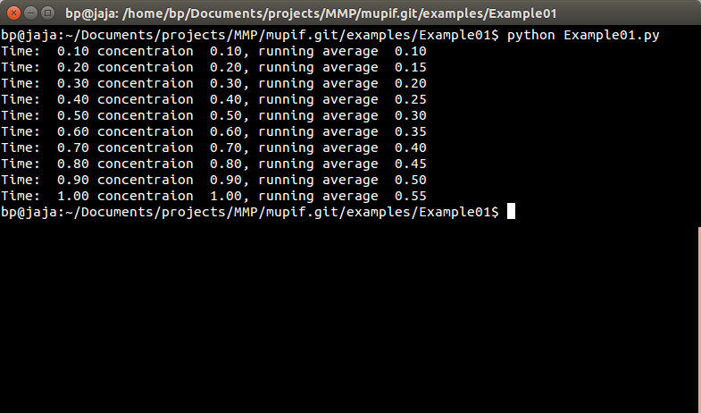
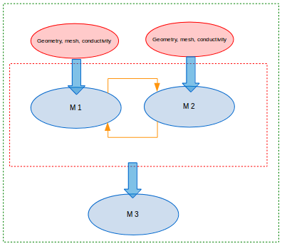
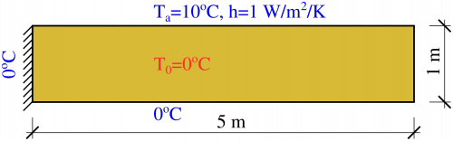
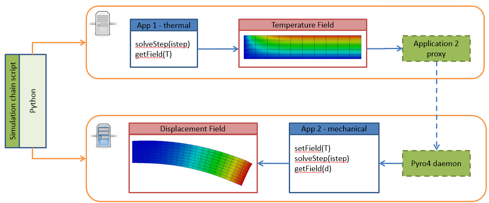
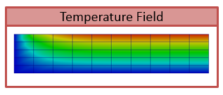
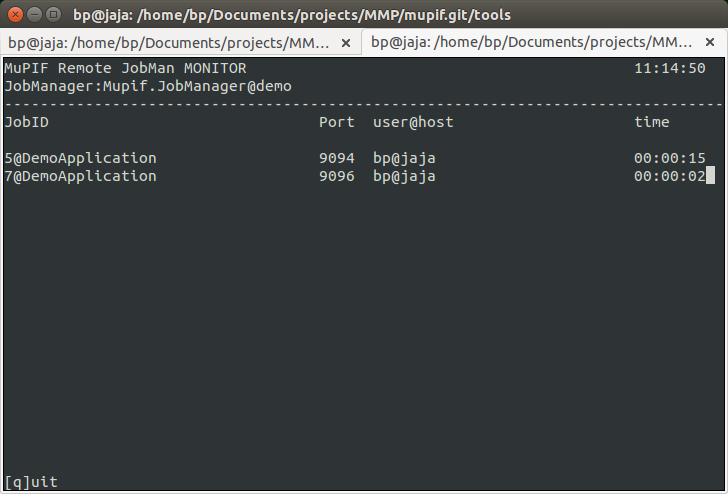
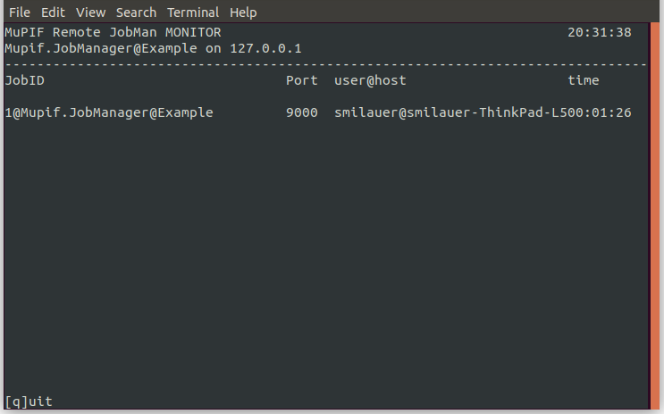
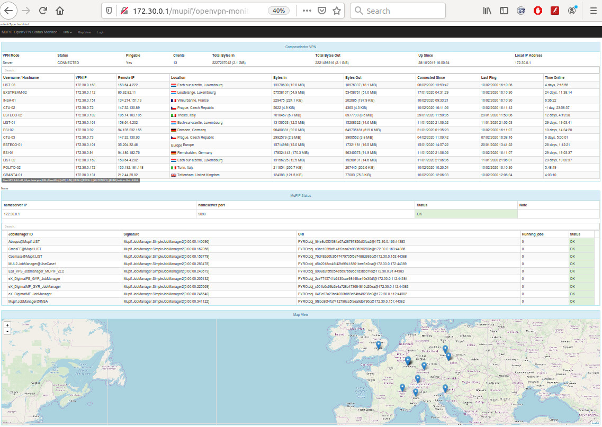

Platform installation
========================

Prerequisites
------------------

Windows platforms
~~~~~~~~~~~~~~~~~~~~~~~~

-  We suggest to install `Anaconda scientific python package <https://store.continuum.io/cshop/anaconda/>`__, which
   includes Python ≥3.4,

-  For secure communication either VPN client/server or SSH
   client/server is needed (recommended client: `putty.exe
   <http://www.putty.org/>`__, ssh server: `FreeSSHd
   <http://www.freesshd.com/>`__).

Linux / Unix (\*nix) platforms
~~~~~~~~~~~~~~~~~~~~~~~~~~~~~~~~~~~~

-  The Python (Python ≥3.4) installation is required.

-  You can `download the python installation package <https://www.python.org/downloads/>`__.
   Just pick up the latest version in
   the 3.x series (tested version 3.5.2).

-  We recommend to install *pip3* - a tool for installing and managing
   Python3 packages. If not already installed as a part of your python
   distribution, see `installation instructions  <http://pip.readthedocs.org/en/latest/installing.html>`__.

-  For secure communication either VPN client/server (`openVPN <https://openvpn.net/index.php/open-source/downloads.html>`__ recommended) or SSH client/server is needed (usually included in standard distribution).

General requirements
~~~~~~~~~~~~~~~~~~~~~~~~~~~

-  MuPIF platform depends/requires, besides others, Pyro4 and numpy
   modules. They can be installed separately for a particular system or
   using *pip3*. If you install the whole MuPIF package, it takes care
   automatically for all dependencies. However, using *git* repository
   requires those Python modules to installed separately. For example,
   to install Pyro4 version 4.75::

    pip3 install Pyro4==4.75*

-  MuPIF platform requires pyvtk (tested 0.4.85) python module. To
   install this module using *pip*::

    pip3 install pyvtk

-  MuPIF requires enum34 module, which can be installed also using
   *pip*::

    pip3 install enum34

Other recommended packages/softwares
~~~~~~~~~~~~~~~~~~~~~~~~~~~~~~~~~~~~~~~~~~~

-  Paraview (tested 4.2.0), visualization application for vtu data
   files, `http://www.paraview.org/`.

-  Windows: Notepad++ (tested 6.6.9),
   `http://notepad-plus-plus.org/`

-  Windows: conEmu, windows terminal emulator,
   `https://code.google.com/p/conemu-maximus5/`.
   
Installing the MuPIF platform
----------------------------------

The recommended procedure is to install platform as a python module
using *pip3*::

   pip3 install mupif

This type of installation automatically satisfies all the dependencies.

Alternatively, the development version of the platform can be installed
from *git* repository:

-  We recommend to install git, a open source revision control tool. You
   can install git using your package management tool or download
   installation package directly from
   `http://git-scm.com/downloads`.

-  Once you have git installed, just clone the MuPIF platform repository
   into a directory "mupif-code"::

    git clone https://github.com/mupif/mupif.git mupif

.. _section-4:

Verifying platform installation
------------------------------------

Running unit tests
~~~~~~~~~~~~~~~~~~~~~~~~~

MuPIF platform comes with unit tests. To run unit tests we recommend to
install *nose* python module, which facilitates automatic discovery and
execution of individual tests. To install node module using pip::

   pip3 install nose

This will install the nose libraries, as well as the
`nosetests <http://nose.readthedocs.io/en/latest/usage.html>`__ script,
which can be used to execute the unit tests. From top level MuPIF
installation directory enter::

   cd tests
   nosetests -v

You should see output something like this::

   test_containsPoint (mupif.tests.test_BBox.BBox_TestCase) ... ok
   test_intersects (mupif.tests.test_BBox.BBox_TestCase) ... ok
   test_merge (mupif.tests.test_BBox.BBox_TestCase) ... ok
   test_containsPoint (mupif.tests.test_Cell.Triangle_2d_lin_TestCase) ... ok
   test_geometryType (mupif.tests.test_Cell.Triangle_2d_lin_TestCase) ... ok
   test_glob2loc (mupif.tests.test_Cell.Triangle_2d_lin_TestCase) ... ok
   test_interpolate (mupif.tests.test_Cell.Triangle_2d_lin_TestCase) ... ok
   …..
   testOctreeNotPickled (mupif.tests.test_saveload.TestSaveLoad) ... ok

   ----------------------------------------------------------------------

   Ran 82 tests in 2.166s

   OK

Indicating that *nose* found and ran listed tests successfully.

Running examples
~~~~~~~~~~~~~~~~~~~~~~~

In addition, the platform installation comes with many examples, that
can be used to verify the successful installation as well, but they also
serve as an educational examples illustrating how to use the platform.
The examples are located in examples subfolder. For example, to run
Example01::

   cd examples/Example01
   python3 Example01.py

Platform operations
======================

The complex simulation pipeline developed in MuPIF-platform consists of
top-level script in Python language (called scenario) enriched by newly
introduced classes. These classes represent fundamental entities in the
model space (such as simulation tools, properties, fields, solution
steps, interpolation cells, units, etc). The top level classes are
defined for these entities, defining a common interface allowing to
manipulate individual representations using a single common interface.
The top level classes and their interface is described in platform
Interface Specification document [1].

In this document, we present a simple, minimum working example,
illustrating the basic concept. The example presented in this section is
assumed to be executed locally. How to extend these examples into
distributed version is discussed in :numref:`sect-distributed-model`.

The following example illustrates the so-called
weak-coupling, where for each solution step, the first application
(Application1) evaluates the value of concentration that is passed to
the second application (Application2) which, based on provided
concentration values (PropertyID.PID_Concentration), evaluates the
average cumulative concentration
(PropertyID.PID_CumulativeConcentration). This is repeated for each
solution step. The example also illustrates, how solution steps can be
generated in order to satisfy time step stability requirements of
individual applications.

.. _list-simple-ex:
.. code-block:: python

   # Simple example illustrating simulation scenario

   from mupif import *
   import application1
   import application2

   time = 0
   timestepnumber=0
   targetTime = 1.0

   app1 = application1.application1(None) # create an instance of application #1
   app2 = application2.application2(None) # create an instance of application #2
   app1.initialize() #initialize app1
   app2.initialize() #initialize app2

   # loop over time steps
   while (abs(time -targetTime) > 1.e-6):
      #determine critical time step
      dt2 = app2.getCriticalTimeStep()
      dt = min(app1.getCriticalTimeStep(), dt2)
      #update time
      time = time+dt
      if (time > targetTime):
         #make sure we reach targetTime at the end
         time = targetTime
      timestepnumber = timestepnumber+1

      # create a time step
      istep = TimeStep.TimeStep(time, dt, timestepnumber)
   
      try:
         #solve problem 1
         app1.solveStep(istep)
         #request temperature field from app1
         c = app1.getProperty(PropertyID.PID_Concentration, istep)
         # register temperature field in app2
         app2.setProperty (c)
         # solve second sub-problem
         app2.solveStep(istep)
         prop = app2.getProperty(PropertyID.PID_CumulativeConcentration, istep)
         print ("Time: %5.2f concentraion %5.2f, running average %5.2f" % (istep.getTime(), c.getValue(), prop.getValue()))

      except APIError.APIError as e:
         logger.error("Following API error occurred: %s" % e )
         break

   # terminate
   app1.terminate();
   app2.terminate();

The full listing of this example can be found in
`examples/Example01 <https://github.com/mupif/mupif/tree/master/mupif/examples>`__.
The output is illustrated in :numref:`fig-ex1-out`.

.. _fig-ex1-out:

   Output from Example01.py

The platform installation comes with many examples, located in
*examples* subdirectory of platform installation and also accessible
`online <https://github.com/mupif/mupif/tree/master/mupif/examples>`__
in the platform repository. They illustrate various aspects, including
field mapping, vtk output, etc.

Platform APIs
================

In this chapter are presented the abstract interfaces (APIs) of abstract
classes that have been designed to represent basic building blocks of
the complex multi-physics simulations, including individual simulation
packages, but also the high level complex data (such as spatial fields
and properties). The abstract base classes are defined for all relevant
entities, see :numref:`fig-abstract-uml`. Their primary role is to define abstract
interfaces (APIs), which allow manipulating individual objects using
generic interface without being concerned by internal details of
individual instances. One of the key and distinct features of the MuPIF
platform is that such an abstraction (defined by top level classes) is
not only developed for individual models, but also defined for the
simulation data themselves. The focus is on services provided by objects
and not on underlying data. The object representation of data
encapsulates the data themselves, related metadata, and related
algorithms. Individual models then do not have to interpret the complex
data themselves; they receive data and algorithms in one consistent
package. This also allows the platform to be independent of particular
data format, without requiring any changes on the model side to work
with new format.

In the rest of this section, the individual abstract classes and their
interfaces are described in detail. For each class a table is provided,
where on the left column the individual services and their arguments are
presented, following the Pydoc [7] syntax. In the right column, the
description of individual service is given, input arguments are
described (denoted by ARGS) including their type (in parenthesis). The
return values are described in a similar way (denoted by Returns). More
extensive documentation of MuPIF abstract classes exists in MuPIF
documentation [8].

.. _fig-abstract-uml:
.. figure:: img/abstract-uml.png

   UML diagram of important abstract classes with only selected relations are displayed (Using Pynsource package for UML diagram)

Common API for all components
----------------------------------

The object-oriented approach allows to define hierarchy of classes. This
is also used in designing MuPIF class structure, where all component
classes form a hierarchy, where on top of this hierarchy is
*MupifObject* class. This class introduces a common interface that is
then inherited by all derived classes, thus by all MuPIF components
involving models (Model class), workflows, and high-level data
components, such as properties or spatial fields.

The *MupifObject* class essentially defines methods allowing to get/set
metadata to the component. The metadata are identified by unique ID and
can be of any type. Internally, they are stored in internal dictionary
declared by *MupifObject.*

=================================== ==================================================================
**Service**                         **Description**
\__init_\_ (self, jsonFileName='')  Constructor. Initializes the *MupifObject*.
                                   
                                    **ARGS:**
                                   
                                    -  jsonFileName: Optionally JSON filename to instantiate from
                                   
                                    None.
getMetadata (self, key)             Returns metadata associated to given key
                                   
                                    **ARGS**:
                                   
                                    -  Key: unique metadataID identifying metadata
                                   
                                    **Returns**: metadata associated to key
                                   
                                    Throws *TypeError* if key does not exist
hasMetadata(self, key)              Tests whether metadata with given key exist
                                   
                                    **Returns:** true if metadata entry exist, false otherwise
setMetadata(self, key, val)         Sets metadata associated to key
                                   
                                    **ARGS:**
                                   
                                    -  Key: unique metadataID identifying metadata
                                   
                                    -  val(any_type): metadata
getAllMetadata(self):               Gets all metadata of receiver
                                   
                                    **Returns**: dict with receiver metadata
printMetadata(self, nonEmpty=False) Prints receiver metadata
                                   
                                    **ARGS**:
                                   
                                    -  nonEmpty: if true only keys with nonempty value will be printed
updateMetadata(self, dictionary)    Updates receiver metadata with given metadata
                                   
                                    **ARGS**:
                                   
                                    -  Dictionary: dict containing metadata to update.
validateMetadata(self, template)    Validates the receiver metadata to given template
                                   
                                    **ARGS**:
                                   
                                    -  Template: dict with JSON schema template
toJson(self)                        Returns JSON string representation of receiver
                                   
                                    **Returns**: JSON representation (string)
=================================== ==================================================================

5.1.1 Metadata and metadata schemas
~~~~~~~~~~~~~~~~~~~~~~~~~~~~~~~~~~~

The metadata and metadata schemas in MuPIF are stored in a form of JSON
representations as a nested (hierarchical) dictionary. JSON stands for
“JavaScript Object Notation”, a simple data interchange format. In its
heart, JSON is built on the following data structures: object, array,
number, string, boolean and null. With these simple data types, all
kinds of structured data can be represented. The JSON schema is a
template defining what fields are expected, and how the values are
represented. The metadata can be validated against schema. The JSON
schema itself is written in JSON. The JSON schema standard can be found
in [`11 <#2zd1531og9ob>`__].

In short, a schema in a Python in represented as a python dictionary,
with following keys: *type*, *properties*, and *required*.

-  The *type* defines the type of data. Can be any of the supported JSON
   types (object, array, number, string, boolean or null)

-  The *properties* is a dictionary containing the actual metadata in
   the from of key-value pairs, where values in the schema are
   dictionaries, containing ‘type’ key defining type of property.

-  The required key is an array containing required property keys.

.. code-block:: python

   #Example of model schema (from Model.py)
   ModelSchema = {
     'type': 'object',
     'properties': {
         'Name': {'type': 'string'},
         'ID': {'type': ['string', 'integer']},
         'Description': {'type': 'string'},
         'Material': {'type': 'string'},
         'Physics': { 
           'type': 'object',
           'properties': {
             'Type': {'type': 'string', 'enum': ['Electronic', 'Atomistic', 'Molecular', 'Continuum', 'Other']},
             'Entity': {'type': 'string', 'enum': ['Atom', 'Electron', 'Grains', 'Finite volume', 'Other']}
             },
             'required': ['Type', 'Entity']
         },
     },
     'required': ['Name', 'ID', 'Description', 'Physics']
   }

The following listing shows valid metadata (according to schema defined
above):

.. code-block:: python

   # Example of valid metadata 
   metaData = {
     'Name': 'Stationary thermal problem',
     'ID': 'Thermo-1',
     'Description': 'Stationary heat conduction using finite elements on rectangular domain',
     'Geometry': '2D rectangle',
     'Physics': {
       'Type': 'Continuum',
       'Entity': 'Finite volume',
       'Equation': ['Heat balance'],
       'Equation_quantities': ['Heat flow'],
       'Relation_description': ['Fick\'s first law'],
       'Relation_formulation': ['Flow induced by thermal gradient on isotropic material'],
       'Representation': 'Finite volumes'
     },
   }

As illustrated, metadata can contain nested data structures. It is
possible to access the individual metadata entries by using convenience
methods provided by any *MupifObject* instance. Also, it is possible
to insert a new metadata entry to the structure. These methods allow to
use ‘dot’ notation to access nested entries, as illustrated in the
example below:

.. code-block:: python

   myobj.getMetadata ('Name') # returns 'Stationary thermal problem'
   myobj.getMetadata ('Physics.Type') #returns 'Continuum'
   myobj.setMetadata ('Physics.Representation', 'Finite elements') # change existing entry
   myobj.setMetadata ('Physics.NewNote', 'My note') # add a new entry to metadata

The metadata schemata are defined in corresponding modules. In MuPIF,
the metadata schema is defined for *Model*, *Workflow*, and all data
classes (in dataID.py).

.. _sect-model-class:

Model class
----------------

This abstract class represents an external model and defines its
interface. The interface is defined in terms of abstract services for
data exchange and steering. Derived classes represent individual
simulation models. In terms of MODA [9] nomenclature, introduced by EMMC
[10], the instances of *Model* class correspond to MODA models and
post-processing tools. The *Application* class is a synonym for *Model*
class, but is deprecated.

The data exchange services consist of methods for getting and
registering external properties, fields, and functions, which are
represented using corresponding, newly introduced classes. Steering
services allow invoking (execute) solution for a specific solution step,
update solution state, terminate the application, etc.

==================================================================================== ===========================================================================================================================================================================================================================================================================================================================================================================
**Service**                                                                          **Description**
\__init_\_(self, metaData={})                                                        Constructor. Initializes the application. Should define problem independ part of model metadata.
                                                                                    
                                                                                     **ARGS**:
                                                                                    
                                                                                     -  metaData (dict): metadata to merge with receiver metadata
initialize(self, file='', workdir='', metaData={}, validateMetaData=True,\*\*kwargs) Initializes application, i.e. should perform all steps after constructor and before run.
                                                                                    
                                                                                     **ARGS**\ :
                                                                                    
                                                                                     -  file (str): optional path to input file
                                                                                    
                                                                                     -  workfir (str): optional path to working directory
                                                                                    
                                                                                     -  metadata (dict): metadata to merge with receiver metadata
                                                                                    
                                                                                     -  validateMetaData (bool): if true, receiver metadata will be validated against class metadata template
                                                                                    
                                                                                     -  Kwargs: any optional arguments
registerPyro (self, pyroDaemon, pyroNS, pyroURI, appName=None, externalDaemon=False) Register the Pyro daemon and nameserver. Required by several services
                                                                                    
                                                                                     **ARGS:**
                                                                                    
                                                                                     -  pyroDaemon(Pyro4.Daemon): Optional pyro daemon
                                                                                    
                                                                                     -  pyroNS(Pyro4.naming.Nameserver): Optional nameserver
                                                                                    
                                                                                     -  PyroURI (str): Optional URI of receiver
                                                                                    
                                                                                     -  appName (str): Optional application name. Used for removing from pyroNS
                                                                                    
                                                                                     -  externalDaemon (bool): Optional parameter when daemon was allocated externally.
get(self, objectTypeID, time=None, objectID=0)                                       Returns the requested data object at given time. Object is identified by id.
                                                                                    
                                                                                     ARGS:
                                                                                    
                                                                                     -  objectTypeID (PropertyID or FieldID or FunctionID): Identifier of the object
                                                                                    
                                                                                     -  time (Physics.PhysicalQuantity): target time
                                                                                    
                                                                                     -  objectID (int): Identifies object with objectID (optional, default 0)
                                                                                    
                                                                                     Returns:
                                                                                    
                                                                                     Returns instance of requested data object.
set(self, obj, objectID=0)                                                           Registers the given (remote) data object in model (application).
                                                                                    
                                                                                     ARGS:
                                                                                    
                                                                                     -  obj (Property.Property or Field.Field or Function.Function): data object to register
                                                                                    
                                                                                     -  objectID (int): Identifies object with objectID (optional, default 0)
getField(self, fieldID, time)                                                        Returns the requested field at given time. Field is identified by fieldID. Deprecated, use get method instead.
                                                                                    
                                                                                     **ARGS**:
                                                                                    
                                                                                     -  fieldID (FieldID): identifier
                                                                                    
                                                                                     -  time (PhysicalQuantity): target time
                                                                                    
                                                                                     **Returns**:
                                                                                    
                                                                                     Returns requested field (Field).
getFieldURI(self, fieldID, time)                                                     Returns the uri of requested field at given time. Field is identified by fieldID.
                                                                                    
                                                                                     **ARGS**:
                                                                                    
                                                                                     -  fieldID (FieldID): identifier
                                                                                    
                                                                                     -  time (PhysicalQuantity): target time
                                                                                    
                                                                                     **Returns**:
                                                                                    
                                                                                     Returns requested field (Field).
setField(self, field)                                                                Registers the given (remote) field in application. Deprecated, use set method instead.
                                                                                    
                                                                                     **ARGS**:
                                                                                    
                                                                                     -  field (Field): remote field to be registered by the application
                                                                                    
                                                                                     **Returns**:
                                                                                    
                                                                                     None
getProperty(self, propID, time, objectID=0)                                          Returns property identified by its ID evaluated at given time. Deprecated, use get() method instead.
                                                                                    
                                                                                     **ARGS**:
                                                                                    
                                                                                     -  propID (PropertyID): property ID
                                                                                    
                                                                                     -  time (PhysicalQuantity): time when property to be evaluated
                                                                                    
                                                                                     -  objectID (int): identifies object/submesh on which property is evaluated (optional)
                                                                                    
                                                                                     **Returns**:
                                                                                    
                                                                                     Returns representation of requested property
                                                                                    
                                                                                     (Property).
setProperty(self, property, objectID=0)                                              Register given property in the application. Deprecated, use set method instead.
                                                                                    
                                                                                     **ARGS**:
                                                                                    
                                                                                     -  property (Property): the property class
                                                                                    
                                                                                     -  objectID (int): identifies object/submesh on which property is evaluated (optional)
                                                                                    
                                                                                     **Returns**:
                                                                                    
                                                                                     None
getFunction(self, funcID, objectID=0)                                                Returns function identified by its ID. Deprecated, use get method instead.
                                                                                    
                                                                                     **ARGS**:
                                                                                    
                                                                                     -  funcID (FunctionID): function ID
                                                                                    
                                                                                     -  objectID (int): identifies optional object/submesh
                                                                                    
                                                                                     **Returns**:
                                                                                    
                                                                                     Returns requested function(Function)
setFunction(self, func, objectID=0)                                                  Register given function in the application. Deprecated use set method instead.
                                                                                    
                                                                                     **ARGS**:
                                                                                    
                                                                                     -  Func (Function): function to register
                                                                                    
                                                                                     -  objectID (int): identifies optional object/submesh
getMesh (self, tstep)                                                                Returns the computational mesh for given solution step.
                                                                                    
                                                                                     **ARGS**:
                                                                                    
                                                                                     -  tstep (TimeStep): solution step
                                                                                    
                                                                                     **Returns**:
                                                                                    
                                                                                     Returns the representation of mesh (Mesh)
solveStep(self, tstep, stageID=0, runInBackground=False)                             Solves the problem for a given time step. Proceeds the solution from actual state to given time. The actual state should not be updated at the end, as this method could be called multiple times for the same solution step until the global convergence is reached. When global convergence is reached, finishStep is called and then the actual state has to be updated.
                                                                                    
                                                                                     Solution can be split into individual stages identified by optional stageID parameter. In between the stages the additional data exchange can be performed. See also wait and isSolved services.
                                                                                    
                                                                                     **ARGS**:
                                                                                    
                                                                                     -  tstep(TimeStep): solution step
                                                                                    
                                                                                     -  stageID(int): optional argument identifying solution stage
                                                                                    
                                                                                     -  runInBackground(bool): if set to True, the solution will run in background (in separate thread), if supported.
                                                                                    
                                                                                     **Returns**: None
wait(self)                                                                           Wait until solve is completed when executed in background.
                                                                                    
                                                                                     **Returns**: None
isSolved(self)                                                                       Returns true or false depending whether solve has completed when executed in background.
                                                                                    
                                                                                     **Returns**: (Boolean)
finishStep(self, tstep)                                                              Called after a global convergence within a time step.
                                                                                    
                                                                                     **ARGS**:
                                                                                    
                                                                                     -  tstep(TimeStep): solution step
                                                                                    
                                                                                     **Returns**: None
getCriticalTimeStep(self)                                                            Returns the actual (related to the current state) critical time step increment.
                                                                                    
                                                                                     **Returns**:
                                                                                    
                                                                                     critical time step (PhysicalQuantity)
getAssemblyTime(self, tstep)                                                         Returns the assembly time related to a given time step. The registered fields (inputs) should be evaluated in this time.
                                                                                    
                                                                                     **ARGS**:
                                                                                    
                                                                                     -  tstep (TimeStep): solution step
                                                                                    
                                                                                     **Returns**:
                                                                                    
                                                                                     assembly time (PhysicalQuantity)
storeState(self, tstep)                                                              Store the solution state of an application.
                                                                                    
                                                                                     **ARGS**:
                                                                                    
                                                                                     -  tstep(TimeStep): solution step
                                                                                    
                                                                                     **Returns**: None
restoreState(self, tstep)                                                            Restore the saved state of an application.
                                                                                    
                                                                                     **ARGS**:
                                                                                    
                                                                                     -  tstep(TimeStep): solution step
                                                                                    
                                                                                     **Returns**: None
getAPIVersion(self)                                                                  Returns the supported API version.
                                                                                    
                                                                                     **Returns:** API version (str, int)
getApplicationSignature(self)                                                        Get application signature.
                                                                                    
                                                                                     **Returns:** Returns the application identification (str)
removeApp(self, nameServer=None, appName=None):                                      Removes (unregisters) application from the name server.
                                                                                    
                                                                                     **ARGS**:
                                                                                    
                                                                                     -  nameServer (Pyro4.naming.Nameserver): Optional instance of a nameServer
                                                                                    
                                                                                     -  appName (str): Optional name of the application to be removed
                                                                                    
                                                                                     **Returns:** None
terminate(self)                                                                      Terminates the application. Shutdowns daemons if created internally.
                                                                                    
                                                                                     **Returns**: None
getURI(self)                                                                         **Returns**: Returns the application URI or None if application not registered in Pyro (str)
==================================================================================== ===========================================================================================================================================================================================================================================================================================================================================================================

Workflow class
-------------------

This abstract class represents a simulation workflow. Workflow can
combine several applications into a complex simulation task. A key
feature of *Workflow* class is that it is derived from *Model*
(*Application*) class, so it shares the same API as *Model* Interface.
This essentially allows to treat any *Workflow* as *Model* and allows to
build a hierarchy of nested workflows. In addition, the following
services are declared:

.. _section-5:

========================================================================================================================== ===========================================================================================================================================
**Service**                                                                                                                **Description**
\__init_\_(self, metaData={})                                                                                              Constructor. Initializes the workflow. Should define problem independent part of metadata.
                                                                                                                          
|                                                                                                                          **ARGS**:
                                                                                                                          
                                                                                                                           -  metaData (dict): optional pass metadata to merge
initialize(self, file='', workdir='',targetTime=PQ.PhysicalQuantity(0.,'s'),metaData={}, validateMetaData=True, \**kwargs) Initializes the workflow.
                                                                                                                          
                                                                                                                           **ARGS**:
                                                                                                                          
                                                                                                                           -  file (str): path to application initialization file.
                                                                                                                          
                                                                                                                           -  workdir (str): Optional parameter for working directory
                                                                                                                          
                                                                                                                           -  targetTime (Physics.PhysicalQuantity): Optional parameter for target time
                                                                                                                          
                                                                                                                           -  metaData (dict): optional metadata to merge
                                                                                                                          
                                                                                                                           -  validateMetaData (bool): if true, receiver metadata will be validated against class metadata template
solve(self, runInBackground=False):                                                                                        Solves the workflow.
                                                                                                                          
                                                                                                                           The default implementation solves the problem in series of time steps using solveStep method (inherited) until the final time is reached.
                                                                                                                          
                                                                                                                           **ARGS**:
                                                                                                                          
                                                                                                                           -  runInBackground (bool): optional argument, default False. If True, the solution will run in background (in separate thread or remotely).
                                                                                                                          
                                                                                                                           **Returns**: None
getAPIVersion(self)                                                                                                        Returns the supported API version.
                                                                                                                          
                                                                                                                           **Returns**: API version (str, int)
getApplicationSignature(self)                                                                                              Get application signature.
                                                                                                                          
                                                                                                                           **Returns**: Returns the application identification (str)
updateStatus(self, status, progress=0)                                                                                     Updates the workflow status. The status is submitted to workflow monitor, if registered on nameserver.
                                                                                                                          
                                                                                                                           ARGS:
                                                                                                                          
                                                                                                                           -  status (str): string describing the workflow status (initialized, running, failed, finished)
                                                                                                                          
                                                                                                                           -  progress (int): integer number indicating execution progress (in percent)
========================================================================================================================== ===========================================================================================================================================

Property class
-------------------

Property is a characteristic value of a problem, which has no spatial
variation. Property is identified by *PropertyID*, which is an
enumeration determining its physical meaning. It can represent any
quantity of a scalar, vector, or tensorial type. Property keeps its
value, type, associated time and an optional *objectID*, identifying
related component/subdomain.

================================================================= ===============================================================================================================================================================================================================================================================================================================================================================================================================================================================================================
**Service**                                                       **Description**
\__init__(self,propID,                                            Constructor, initializes the property.
                                                                 
valueType,units, time=None,objectID=0)                            **ARGS**:
                                                                 
                                                                  -  value (tuple): value of a property. Scalar value is represented as array of size 1. Vector is represented as values packed in a tuple. Tensor is represented as 3D tensor stored in a tuple, column by column.
                                                                 
                                                                  -  propId (PropertyID): property ID
                                                                 
                                                                  -  valueType (ValueType): type of property value
                                                                 
                                                                  -  time (Physics.PhysicalQuantity): time
                                                                 
                                                                  -  units (Physics.PhysicalUnits, None): property units or None for time independent property
                                                                 
                                                                  -  objectID (int): optional ID of problem object / subdomain to which property is related.
loadFromLocalFile(cls,fileName)                                   Alternative constructor from a Pickle module.
                                                                 
                                                                  **ARGS**:
                                                                 
                                                                  -  filename (str): File name
                                                                 
                                                                  **Returns:**
                                                                 
                                                                  Property instance (Property)
getValue(self, time=None, \*kwargs)                               Returns the value of property in a tuple.
                                                                 
                                                                  **ARGS**:
                                                                 
                                                                  -  time (Physics.PhysicalQuantity): time to evaluate receiver at.
                                                                 
                                                                  -  \**kwargs: Arbitrary keyword arguments, see documentation of derived classes
                                                                 
                                                                  **Returns**:
                                                                 
                                                                  Property value as array (Physics.PhysicalQuantity)
getValueType(self)                                                Returns the value type of property.
                                                                 
                                                                  **Returns**:
                                                                 
                                                                  Property value type (mupif.PropertyID)
getPropertID(self)                                                Returns type of property.
                                                                 
                                                                  **Returns**:
                                                                 
                                                                  Receiver property ID (PropertyID)
getObjectID(self)                                                 Returns property objectID.
                                                                 
                                                                  **Returns**:
                                                                 
                                                                  ID of related object (int)
getUnits(self)                                                    Returns representation of property units.
                                                                 
                                                                  **Returns**:
                                                                 
                                                                  Returns receiver's units (Physics.PhysicalUnits)
dumpToLocalFile(self, fileName, protocol=pickle.HIGHEST_PROTOCOL) Dump Property to a file using Pickle module
                                                                 
                                                                  **ARGS**:
                                                                 
                                                                  -  filename (str): File name
                                                                 
                                                                  -  protocol (int): Used protocol - 0=ASCII, 1=old binary, 2=new binary
inUnitsOf(self, \*units)                                          Express the quantity in different units. If one unit is specified, a new PhysicalQuantity object is returned that expresses the quantity in that unit. If several units are specified, the return value is a tuple of PhysicalObject instances with with one element per unit such that the sum of all quantities in the tuple equals the original quantity and all the values except for the last one are integers. This is used to convert to irregular unit systems like hour/minute/second.
                                                                 
                                                                  **ARGS**:
                                                                 
                                                                  -  Units (C{str}): one units
                                                                 
                                                                  **Returns:**
                                                                 
                                                                  One physical quantity (L{PhysicalQuantity} or C{tuple})
                                                                 
                                                                  **Raises:**
                                                                 
                                                                  TypeError: if any of the specified units are not compatible with the original unit
================================================================= ===============================================================================================================================================================================================================================================================================================================================================================================================================================================================================================

Property with constant value in time is represented by
*ConstantProperty* class derived from *Property* class. In the
following, we just mention the modifications in interface from
*Property* class.

======================================================================= =================================================================================================================================================================================================================
**Service**                                                             **Description**
\__init__(self, value, propID, valueType, units, time=None, objectID=0) Constructor, initializes the property.
                                                                       
                                                                        **ARGS**:
                                                                       
                                                                        -  value (tuple): value of a property. Scalar value is represented as array of size 1. Vector is represented as values packed in a tuple. Tensor is represented as 3D tensor stored in a tuple, column by column.
                                                                       
                                                                        -  propId (PropertyID): property ID
                                                                       
                                                                        -  valueType (ValueType): type of property value
                                                                       
                                                                        -  time (Physics.PhysicalQuantity): time; None for constant property in time
                                                                       
                                                                        -  units (Physics.PhysicalUnits, string): property units or string
                                                                       
                                                                        -  objectID (int): optional ID of problem object / subdomain to which property is related.
getTime(self)                                                           Returns time associated with this property.
                                                                       
                                                                        **Returns**:
                                                                       
                                                                        Time (Physics.PhysicalQuantity)
======================================================================= =================================================================================================================================================================================================================

Field class
----------------

Representation of field. *Field* is a scalar, vector, or tensorial
quantity defined on a spatial domain (represented by the *Mesh* class).
The field provides interpolation services in space, but is assumed to be
fixed in time (the application interface allows to request field at
specific time). The fields are usually created by the individual
applications (sources) and being passed to target applications. The
field can be evaluated in any spatial point belonging to underlying
domain. Derived classes will implement fields defined on common
discretizations, like fields defined on structured or unstructured FE
meshes, finite difference grids, etc. Basic services provided by the
field class include a method for evaluating the field at any spatial
position and a method to support graphical export (creation of VTK
dataset).

============================================================================================================================================================================================================================================================================================================= ====================================================================================================================================================================================================================================================================================================================================================================
**Service**                                                                                                                                                                                                                                                                                                   **Description**
\__init__(self, mesh, fieldID, valueType, units, time, values=None, fieldType=FieldType.FT_vertexBased, objectID=0, metaData={})                                                                                                                                                                              Constructor. Initializes the field instance.
                                                                                                                                                                                                                                                                                                             
                                                                                                                                                                                                                                                                                                              **ARGS**:
                                                                                                                                                                                                                                                                                                             
                                                                                                                                                                                                                                                                                                              -  mesh (Mesh): Instance of Mesh class representing underlying discretization.
                                                                                                                                                                                                                                                                                                             
                                                                                                                                                                                                                                                                                                              -  fieldID (FieldID): field type
                                                                                                                                                                                                                                                                                                             
                                                                                                                                                                                                                                                                                                              -  valueType (ValueType): type of field values
                                                                                                                                                                                                                                                                                                             
                                                                                                                                                                                                                                                                                                              -  units (Physics.PhysicalUnits): Field value units
                                                                                                                                                                                                                                                                                                             
                                                                                                                                                                                                                                                                                                              -  time (double): time
                                                                                                                                                                                                                                                                                                             
                                                                                                                                                                                                                                                                                                              -  values (tuple): field values, usually at mesh vertices (format dependent of particular field type)
                                                                                                                                                                                                                                                                                                             
                                                                                                                                                                                                                                                                                                              -  fieldType (FieldType): Optional, determines field type (values specified as vertex or cell values), default is FT_vertexBased
                                                                                                                                                                                                                                                                                                             
                                                                                                                                                                                                                                                                                                              -  objectID (int): Optional ID of problem object/subdomain to which field is related
                                                                                                                                                                                                                                                                                                             
                                                                                                                                                                                                                                                                                                              -  metaData (dict): Optionally pass metadata to merge
loadFromLocalFile(cls,fileName)                                                                                                                                                                                                                                                                               Alternative constructor from a Pickle module.
                                                                                                                                                                                                                                                                                                             
                                                                                                                                                                                                                                                                                                              **ARGS**:
                                                                                                                                                                                                                                                                                                             
                                                                                                                                                                                                                                                                                                              -  filename (str): File name
                                                                                                                                                                                                                                                                                                             
                                                                                                                                                                                                                                                                                                              **Returns:**
                                                                                                                                                                                                                                                                                                             
                                                                                                                                                                                                                                                                                                              Field instance (Field)
getRecordSize(self)                                                                                                                                                                                                                                                                                           Return the number of scalars per value, depending on :obj:`valueType` passed when constructing the instance.
                                                                                                                                                                                                                                                                                                             
                                                                                                                                                                                                                                                                                                              **Returns:**
                                                                                                                                                                                                                                                                                                             
                                                                                                                                                                                                                                                                                                              number of scalars (1,3,9 respectively for scalar, vector, tensor) (int)
getMesh(self)                                                                                                                                                                                                                                                                                                 Returns representation of underlying discretization.
                                                                                                                                                                                                                                                                                                             
                                                                                                                                                                                                                                                                                                              **Returns**:
                                                                                                                                                                                                                                                                                                             
                                                                                                                                                                                                                                                                                                              Reference to associated mesh (Mesh)
getValueType(self)                                                                                                                                                                                                                                                                                            Returns type of field values (ValueType) of the receiver.
                                                                                                                                                                                                                                                                                                             
                                                                                                                                                                                                                                                                                                              **Returns**:
                                                                                                                                                                                                                                                                                                             
                                                                                                                                                                                                                                                                                                              (ValueType)
getFieldID(self)                                                                                                                                                                                                                                                                                              Returns FieldID, e.g. FID_Displacement, FID_Temperature.
                                                                                                                                                                                                                                                                                                             
                                                                                                                                                                                                                                                                                                              **Returns:**
                                                                                                                                                                                                                                                                                                             
                                                                                                                                                                                                                                                                                                              Returns fieldID (FieldID)
getFieldIDName(self)                                                                                                                                                                                                                                                                                          Returns name of the field.
                                                                                                                                                                                                                                                                                                             
                                                                                                                                                                                                                                                                                                              **Returns:**
                                                                                                                                                                                                                                                                                                             
                                                                                                                                                                                                                                                                                                              Returns fieldID name (str)
getFieldType(self)                                                                                                                                                                                                                                                                                            Returns receiver field type (values specified as vertex or cell values)
                                                                                                                                                                                                                                                                                                             
                                                                                                                                                                                                                                                                                                              **Returns:**
                                                                                                                                                                                                                                                                                                             
                                                                                                                                                                                                                                                                                                              Returns fieldTypeID (FieldType)
getTime(self)                                                                                                                                                                                                                                                                                                 Alternative constructor from a Pickle module.
                                                                                                                                                                                                                                                                                                             
                                                                                                                                                                                                                                                                                                              **ARGS**:
                                                                                                                                                                                                                                                                                                             
                                                                                                                                                                                                                                                                                                              **Returns:**
                                                                                                                                                                                                                                                                                                             
                                                                                                                                                                                                                                                                                                              Field time (Physics.PhysicalQuantity)
evaluate(self, position, eps=0.001)                                                                                                                                                                                                                                                                           Evaluates the receiver at given spatial position.
                                                                                                                                                                                                                                                                                                             
                                                                                                                                                                                                                                                                                                              **ARGS**:
                                                                                                                                                                                                                                                                                                             
                                                                                                                                                                                                                                                                                                              -  position (tuple, list of tuples): 3D position vector or list of position vectors
                                                                                                                                                                                                                                                                                                             
                                                                                                                                                                                                                                                                                                              -  eps(double): Optional tolerance
                                                                                                                                                                                                                                                                                                             
                                                                                                                                                                                                                                                                                                              **Returns**:
                                                                                                                                                                                                                                                                                                             
                                                                                                                                                                                                                                                                                                              Receiver value or list of values evaluated at given position(s) (Physics.PhysicalQuantity).
getVertexValue(self, componentID)                                                                                                                                                                                                                                                                             Returns the value associated with a given vertex component
                                                                                                                                                                                                                                                                                                             
                                                                                                                                                                                                                                                                                                              **ARGS**:
                                                                                                                                                                                                                                                                                                             
                                                                                                                                                                                                                                                                                                              -  componentID (tuple): A tuple identifying a component: vertex (vertexID,) or integration point (CellID, IPID)
                                                                                                                                                                                                                                                                                                             
                                                                                                                                                                                                                                                                                                              **Returns**:
                                                                                                                                                                                                                                                                                                             
                                                                                                                                                                                                                                                                                                              component value as (Physics.PhysicalQuantity)
getCellValue(self, componentID)                                                                                                                                                                                                                                                                               Returns the value associated with a given integration point on a cell.
                                                                                                                                                                                                                                                                                                             
                                                                                                                                                                                                                                                                                                              **ARGS**:
                                                                                                                                                                                                                                                                                                             
                                                                                                                                                                                                                                                                                                              -  componentID (tuple): A tuple identifying a component: vertex (vertexID,) or integration point (CellID, IPID)
                                                                                                                                                                                                                                                                                                             
                                                                                                                                                                                                                                                                                                              **Returns**:
                                                                                                                                                                                                                                                                                                             
                                                                                                                                                                                                                                                                                                              component value as (Physics.PhysicalQuantity)
setValue(self, componentID, value)                                                                                                                                                                                                                                                                            Sets the value associated to given component (vertex or cell IP). Note, that the field values are updated after a commit method is invoked.
                                                                                                                                                                                                                                                                                                             
                                                                                                                                                                                                                                                                                                              **ARGS**:
                                                                                                                                                                                                                                                                                                             
                                                                                                                                                                                                                                                                                                              -  componentID (tuple): The componentID is a tuple: (vertexID) or (CellID, IPID)
                                                                                                                                                                                                                                                                                                             
                                                                                                                                                                                                                                                                                                              -  value(tuple): Component value
                                                                                                                                                                                                                                                                                                             
                                                                                                                                                                                                                                                                                                              **Returns**:
                                                                                                                                                                                                                                                                                                             
                                                                                                                                                                                                                                                                                                              None
giveValue(self, componentID):                                                                                                                                                                                                                                                                                 Returns the value associated with a given component (vertex or integration point on a cell).
                                                                                                                                                                                                                                                                                                             
                                                                                                                                                                                                                                                                                                              **ARGS**:
                                                                                                                                                                                                                                                                                                             
                                                                                                                                                                                                                                                                                                              -  componentID (tuple): A tuple identifying a component: vertex (vertexID,) or integration point (CellID, IPID)
                                                                                                                                                                                                                                                                                                             
                                                                                                                                                                                                                                                                                                              **Returns:**
                                                                                                                                                                                                                                                                                                             
                                                                                                                                                                                                                                                                                                              Tuple of values (tuple)
setValue(self, componentID, value):                                                                                                                                                                                                                                                                           Sets the value associated with a given component (vertex or integration point on a cell).
                                                                                                                                                                                                                                                                                                             
                                                                                                                                                                                                                                                                                                              **ARGS**:
                                                                                                                                                                                                                                                                                                             
                                                                                                                                                                                                                                                                                                              -  componentID (tuple): A tuple identifying a component: vertex (vertexID,) or integration point (CellID, IPID)
                                                                                                                                                                                                                                                                                                             
                                                                                                                                                                                                                                                                                                              -  value (tuple): Value to be set for a given component, should have the same units as receiver
commit(self)                                                                                                                                                                                                                                                                                                  Commits the recorded changes (via setValue method).
                                                                                                                                                                                                                                                                                                             
                                                                                                                                                                                                                                                                                                              **Returns**: None
getUnits(self)                                                                                                                                                                                                                                                                                                **Returns**:
                                                                                                                                                                                                                                                                                                             
                                                                                                                                                                                                                                                                                                              Returns units of the receiver (Physics.PhysicalUnits)
merge(self, field)                                                                                                                                                                                                                                                                                            Merges the receiver with a given field together.
                                                                                                                                                                                                                                                                                                             
                                                                                                                                                                                                                                                                                                              Both fields should be on different parts of the domain (can also overlap), but should be of the same type and refer to the same underlying discretization.
                                                                                                                                                                                                                                                                                                             
                                                                                                                                                                                                                                                                                                              **ARGS**:
                                                                                                                                                                                                                                                                                                             
                                                                                                                                                                                                                                                                                                              -  field (Field): field to merge
                                                                                                                                                                                                                                                                                                             
                                                                                                                                                                                                                                                                                                              **Returns**: None
field2VTKData (self name=None,lookupTable=None)                                                                                                                                                                                                                                                               Returns VTK representation of the receiver.
                                                                                                                                                                                                                                                                                                             
                                                                                                                                                                                                                                                                                                              **ARGS**:
                                                                                                                                                                                                                                                                                                             
                                                                                                                                                                                                                                                                                                              -  Name (str): human-readable name of the field
                                                                                                                                                                                                                                                                                                             
                                                                                                                                                                                                                                                                                                              -  lookupTable (pyvtk.LookupTable): color lookup table
                                                                                                                                                                                                                                                                                                             
                                                                                                                                                                                                                                                                                                              **Returns**:
                                                                                                                                                                                                                                                                                                             
                                                                                                                                                                                                                                                                                                              VTK dataset (pyvtk)
getMartixForTensor(self,values)                                                                                                                                                                                                                                                                               Reshape values to a list with 3x3 arrays. Usable for VTK export.
                                                                                                                                                                                                                                                                                                             
                                                                                                                                                                                                                                                                                                              **ARGS**:
                                                                                                                                                                                                                                                                                                             
                                                                                                                                                                                                                                                                                                              -  Values (list): List containing tuples of 9 values, e.g. [(1,2,3,4,5,6,7,8,9), (1,2,3,4,5,6,7,8,9), ...]
                                                                                                                                                                                                                                                                                                             
                                                                                                                                                                                                                                                                                                              **Returns**:
                                                                                                                                                                                                                                                                                                             
                                                                                                                                                                                                                                                                                                              List containing 3x3 matrices for each tensor (list)
dumpToLocalFile(self, fileName, protocol=pickle.HIGHEST_PROTOCOL)                                                                                                                                                                                                                                             Dump Field to a file using a Pickle serialization module.
                                                                                                                                                                                                                                                                                                             
                                                                                                                                                                                                                                                                                                              **ARGS**:
                                                                                                                                                                                                                                                                                                             
                                                                                                                                                                                                                                                                                                              -  filename (str): File name
                                                                                                                                                                                                                                                                                                             
                                                                                                                                                                                                                                                                                                              -  protocol (int): Used protocol - 0=ASCII, 1=old binary, 2=new binary
field2Image2D(self, plane='xy', elevation = (-1.e-6, 1.e-6), numX=10, numY=20, interp='linear', fieldComponent=0, vertex=True, colorBar='horizontal', colorBarLegend='', barRange=(None,None), barFormatNum='%.3g', title='', xlabel='', ylabel='', fileName='', show=True, figsize = (8,4), matPlotFig=None) Plots and/or saves 2D image using a matplotlib library. Works for structured and unstructured 2D/3D fields. 2D/3D fields need to define plane. This method gives only basic viewing options, for aesthetic and more elaborated output use e.g. VTK field export with postprocessors such as ParaView or Mayavi.
                                                                                                                                                                                                                                                                                                             
                                                                                                                                                                                                                                                                                                              **ARGS**: see the reference manual
                                                                                                                                                                                                                                                                                                             
                                                                                                                                                                                                                                                                                                              **Returns:** handle to matPlotFig (matPlotFig)
field2Image2DBlock(self)                                                                                                                                                                                                                                                                                      Block an open window from matPlotLib. Waits until closed.
toHdf5(self,fileName,group='component1/part1')                                                                                                                                                                                                                                                                Dump field to HDF5, in a simple format suitable for interoperability (TODO: document).
                                                                                                                                                                                                                                                                                                             
                                                                                                                                                                                                                                                                                                              **ARGS**:
                                                                                                                                                                                                                                                                                                             
                                                                                                                                                                                                                                                                                                              -  filename (str): HDF5 file
makeFromHdf5(fileName,group='component1/part1')                                                                                                                                                                                                                                                               Restore Fields from HDF5 file.
                                                                                                                                                                                                                                                                                                             
                                                                                                                                                                                                                                                                                                              **ARGS**:
                                                                                                                                                                                                                                                                                                             
                                                                                                                                                                                                                                                                                                              -  filename (str): HDF5 file
                                                                                                                                                                                                                                                                                                             
                                                                                                                                                                                                                                                                                                              **Returns**:
                                                                                                                                                                                                                                                                                                             
                                                                                                                                                                                                                                                                                                              list of new :obj:`Field` instances (Field, Field,…)
toVTK2(self,fileName,format='ascii')                                                                                                                                                                                                                                                                          Save the instance as Unstructured Grid in VTK2 format (``.vtk``).
                                                                                                                                                                                                                                                                                                             
                                                                                                                                                                                                                                                                                                              **ARGS**:
                                                                                                                                                                                                                                                                                                             
                                                                                                                                                                                                                                                                                                              -  filename (str): where to save
                                                                                                                                                                                                                                                                                                             
                                                                                                                                                                                                                                                                                                              -  format (str): one of \``ascii`\` or \``binary`\`
makeFromVTK2(fileName,unit,time=0,skip=['coolwarm'])                                                                                                                                                                                                                                                          Return fields stored in \*fileName\* in the VTK2 (``.vtk``) format.
                                                                                                                                                                                                                                                                                                             
                                                                                                                                                                                                                                                                                                              **ARGS**:
                                                                                                                                                                                                                                                                                                             
                                                                                                                                                                                                                                                                                                              -  filename (str): filename to load from
                                                                                                                                                                                                                                                                                                             
                                                                                                                                                                                                                                                                                                              -  unit (PhysicalUnit): physical unit of filed values
                                                                                                                                                                                                                                                                                                             
                                                                                                                                                                                                                                                                                                              -  time (float): time value for created fields (time is not saved in VTK2, thus cannot be recovered)
                                                                                                                                                                                                                                                                                                             
                                                                                                                                                                                                                                                                                                              -  skip (str,…): file names to be skipped when reading the input file; the default value skips the default coolwarm colormap.
                                                                                                                                                                                                                                                                                                             
                                                                                                                                                                                                                                                                                                              **Returns**:
                                                                                                                                                                                                                                                                                                             
                                                                                                                                                                                                                                                                                                              one field from VTK (Field)
toVTK3(self,fileName,**kw)                                                                                                                                                                                                                                                                                    Save the instance as Unstructured Grid in VTK3 format (``.vtu``). This is a simple proxy for calling :obj:`manyToVTK3` with the instance as the only field to be saved. If multiple fields with identical mesh are to be saved in VTK3, use :obj:`manyToVTK3` directly.
                                                                                                                                                                                                                                                                                                             
                                                                                                                                                                                                                                                                                                              **ARGS**:
                                                                                                                                                                                                                                                                                                             
                                                                                                                                                                                                                                                                                                              -  filenamne (str): output file name
                                                                                                                                                                                                                                                                                                             
                                                                                                                                                                                                                                                                                                              -  \**kw ():passed to :obj:`manyToVTK3`
manyToVTK3(fields,fileName,ascii=False,compress=True)                                                                                                                                                                                                                                                         Save all fields passed as argument into VTK3 Unstructured Grid file (``*.vtu``). All *fields* must be defined on the same mesh object; exception will be raised if this is not the case.
                                                                                                                                                                                                                                                                                                             
                                                                                                                                                                                                                                                                                                              **ARGS**:
                                                                                                                                                                                                                                                                                                             
                                                                                                                                                                                                                                                                                                              -  filenamne (str): output file name
                                                                                                                                                                                                                                                                                                             
                                                                                                                                                                                                                                                                                                              -  asci (bool): write numbers are ASCII in the XML-based VTU file (rather than base64-encoded binary in XML)
                                                                                                                                                                                                                                                                                                             
                                                                                                                                                                                                                                                                                                              -  compress (bool): apply compression to the data
makeFromVTK3(fileName,units, time=0,forceVersion2=False)                                                                                                                                                                                                                                                      Create fields from a VTK unstructured grid file (``.vtu``, format version 3, or \``.vtp`\` with \*forceVersion2*); the mesh is shared between fields. \``vtk.vtkXMLGenericDataObjectReader`\` is used to open the file (unless \*forceVersion2\* is set), but it is checked that contained dataset is a \``vtk.vtkUnstructuredGrid`\` and an error is raised if not.
                                                                                                                                                                                                                                                                                                             
                                                                                                                                                                                                                                                                                                              **ARGS**:
                                                                                                                                                                                                                                                                                                             
                                                                                                                                                                                                                                                                                                              -  filename (str): filename to load from
                                                                                                                                                                                                                                                                                                             
                                                                                                                                                                                                                                                                                                              -  unit (Physics.PhysicalUnit): units of read values
                                                                                                                                                                                                                                                                                                             
                                                                                                                                                                                                                                                                                                              -  time (float): time value for created fields (time is not saved in VTK3, thus cannot be recovered)
                                                                                                                                                                                                                                                                                                             
                                                                                                                                                                                                                                                                                                              -  forceVersion2 (bool): if \``True``, \``vtk.vtkGenericDataObjectReader`\` (for VTK version 2) will be used to open the file, instead of \``vtk.vtkXMLGenericDataObjectReader``; this also supposes \*fileName\* ends with \``.vtk`\` (not checked, but may cause an error).
                                                                                                                                                                                                                                                                                                             
                                                                                                                                                                                                                                                                                                              **Returns**:
                                                                                                                                                                                                                                                                                                             
                                                                                                                                                                                                                                                                                                              list of new :obj:`Field` instances (Field,Field,...)
inUnitsOf(self, \*units)                                                                                                                                                                                                                                                                                      Should return a new instance. As deep copy is expensive, this operation should be avoided. Better to use convertToUnits method performing in place conversion.
============================================================================================================================================================================================================================================================================================================= ====================================================================================================================================================================================================================================================================================================================================================================

Function class
-------------------

Represents a user defined function. Function is an object defined by
mathematical expression and can be a function of spatial position, time,
and other variables. Derived classes should implement evaluate service
by providing a corresponding expression. The function arguments are
packed into a dictionary, consisting of pairs (called items) of keys and
their corresponding values.

================================== =====================================================================================================================================================================================================================================================================
**Service**                        **Description**
\__init__(self,funcID, objectID=0) Constructor. Initializes the function.
                                  
                                   **ARGS**:
                                  
                                   -  funcID (FunctionID): function ID
                                  
                                   -  objectID (int): optional ID of associated subdomain.
evaluate (self, d)                 Evaluates the function for given parameters packed as a dictionary. A dictionary is container type that can store any number of Python objects, including other container types. Dictionaries consist of pairs (called items) of keys and their corresponding values.
                                  
                                   | 
                                  
                                   Example:
                                  
                                   d={'x':(1,2,3), 't':0.005} initializes dictionary containing tuple (vector) under 'x' key, double value 0.005 under 't' key.
                                  
                                   Some common keys:
                                  
                                   -  'x': position vector
                                  
                                   -  't': time
                                  
                                   **ARGS**:
                                  
                                   -  d (dictionary): dictionary containing function arguments (number and type depends on particular function)
                                  
                                   **RETURNS**: function value (tuple) evaluated for given parameters
getID (self)                       Returns receiver's ID.
                                  
                                   **Returns**: id (FunctionID)
getObjectID(self)                  **Returns**: returns receiver's object ID (int)
================================== =====================================================================================================================================================================================================================================================================

TimeStep class
-------------------

Class representing solution time step. The time step manages its number,
target time, and time increment.

=================================================== =============================================================================================
**Service**                                         **Description**
\__init__(self, t, dt, targetTime, units=None, n=1) Constructor. Initializes the new time step.
                                                   
                                                    **ARGS**:
                                                   
                                                    -  t (double, Physics.PhysicalUnit): time
                                                   
                                                    -  dt (double, Physics.PhysicalUnit): step length (time increment)
                                                   
                                                    -  targetTime (double, Physics.PhysicalUnit): target simulation time, type depends on 'units'
                                                   
                                                    -  units (Physics.PhysicalUnit): optional units for t,dt,tarrgetTime if given as float values
                                                   
                                                    -  n (int): time step number
getTime(self)                                       **Returns**:
                                                   
                                                    time step time (Physics.PhysicalQuantity)
getTimeIncrement(self)                              **Returns**:
                                                   
                                                    time increment (Physics.PhysicalQuantity)
getTargetTime (self)                                **Returns**:
                                                   
                                                    Target time (Physics.PhysicalQuantity)
getNumber(self)                                     **Returns**:
                                                   
                                                    receiver's number (int)
=================================================== =============================================================================================

.. _fig-timestep:

   Concept of time step in MuPIF

Mesh class
---------------

Mesh class is an abstract representation of a computational domain and
its spatial discretization. The mesh geometry is described using
computational cells (representing finite elements, finite difference
stencils, etc.) and vertices (defining cell geometry). Derived classes
represent structured, unstructured FE grids, FV grids, etc. Mesh is
assumed to provide a suitable instance of cell and vertex localizers. In
general, the mesh services provide different ways how to access the
underlying interpolation cells and vertices, based on their numbers, or
spatial location.

================================ ==========================================================================================================================================================================================================================================================================
**Service**                      **Description**
                                
\__init__(self)                  Constructor, creates an empty mesh.
copy(self)                       This will return a copy of the receiver. Note, that DeepCopy will not work, as individual cells contain mesh link attributes, leading to underlying mesh duplication in every cell.
                                
                                 **Returns**: Copy of receiver (Mesh)
getNumberOfVertices(self)        **Returns**:
                                
                                 Number of Vertices (int)
getNumberOfCells(self)           **Returns**:
                                
                                 Number of Cells
getVertex(self, i)               Returns i-th vertex (i corresponds to a vertex number, not a label).
                                
                                 **Returns**: vertex (Vertex)
getCell(self, i)                 Returns i-th cell (identified by cell number, not label).
                                
                                 **Returns**: cell (Cell)
vertexLabel2Number(self, label)  Returns local vertex number corresponding to given label. If no label corresponds, throws an exception.
                                
                                 **Returns**: vertex number (int)
cellLabel2Number(self, label)    Returns local cell number corresponding to a given label. If no label corresponds, it throws an exception.
                                
                                 **Returns**: cell number (int)
getVerticesInBBox (self, bbox):  Returns the list of all vertices which are inside given bounding Box
                                
                                 **ARGS**:
                                
                                 -  bbox (BoundingBox): bounding box
                                
                                 **Returns**: list of vertices inside bbox (list)
getCellsInBBox (self, bbox):     Returns the list of cells which bbox intersects with given bounding box
                                
                                 **ARGS**:
                                
                                 -  bbox (BoundingBox): bounding box
                                
                                 **Returns**: list of cells at least partially in bbox (list)
evaluateVertices(self, functor): Returns the list of all vertices for which the functor is satisfied. The functor is a user defined class with two methods: *giveBBox*\ () which returns an initial functor bbox, and *evaluate* (obj) which should return true if functor is satisfied for a given object.
                                
                                 **ARGS**:
                                
                                 -  functor: functor class
                                
                                 **Returns**:list of all vertices for which the functor is satisfied (list)
evaluateCells(self, functor):    Returns the list of all cells for which the functor is satisfied. The functor is user defined class with two methods:\ *getBBox*\ () which returns an initial functor bbox, and *evaluate* (obj) which should return true if functor is satisfied for given object.
                                
                                 **ARGS**:
                                
                                 -  functor: functor class
                                
                                 **Returns**:List of all cells for which the functor is satisfied (list)
================================ ==========================================================================================================================================================================================================================================================================

Cell class
---------------

Representation of a computational cell (finite element). The solution
domain is composed of cells, whose geometry is defined using vertices.
Cells provide interpolation over their associated volume, based on given
vertex values. Derived classes will be implemented to support common
interpolation cells (finite elements, FD stencils, etc.)

============================================== =====================================================================================
**Service**                                    **Description**
\__init__(self, mesh, number, label, vertices) Constructor. Creates the new cell.
                                              
                                               **ARGS**:
                                              
                                               -  mesh(Mesh): the mesh to which cell belongs.
                                              
                                               -  number(int): local cell number
                                              
                                               -  label(int): cell label
                                              
                                               -  vertices(tuple): cell vertices (local numbers)
copy(self)                                     This will copy the receiver, making deep copy of all attributes EXCEPT mesh attribute
                                              
                                               **Returns**: the copy of receiver (Cell)
getVertices(self)                              **Returns**: the list of cell vertices (tuple of Vertex instances)
containsPoint(self, point)                     **Returns**: True if cell contains given point, False otherwise
getGeometryType(self)                          **Returns**: geometry type of receiver (CellGeometryType)
getBBox(self)                                  **Returns**: bounding box of the receiver (BBox)
============================================== =====================================================================================

Vertex class
------------------

Represents a vertex. In general, a set of vertices defines the geometry
of interpolation cells. A vertex is characterized by its position,
number and label. Vertex number is locally assigned number (by *Mesh*
class), while a label is a unique number defined by application.

=========================================== ==============================================
**Service**                                 **Description**
\__init__(self, number, label, coords=None) Constructor. Creates the new vertex instance.
                                           
                                            **ARGS**:
                                           
                                            -  number(int): local vertex number
                                           
                                            -  label(int): vertex label
                                           
                                            -  coords(tuple): 3D position vector of verteX
getCoordinates(self)                        **Returns**: receiver coordinates (tuple)
getNumber(self)                             **Returns**: receiver number (int)
getLabel(self)                              **Returns**: receiver label (int)
=========================================== ==============================================

BoundingBox
-----------------

Represents an axis aligned bounding box - a rectangle in 2d and a prism
in 3d. Its geometry is described using two points - lover left and upper
right. The bounding box class provides fast and efficient methods for
testing whether point is inside and whether an intersection with another
bounding box exists.

===================================== ==========================================================================
**Service**                           **Description**
                                     
\__init__(self, coords_ll, coords_ur) Constructor. Creates the new Bounding box instance.
                                     
                                      **ARGS**:
                                     
                                      -  coords_ll (tuple): coordinates of lower left corner
                                     
                                      -  coords_ur (tuple): coordinates of upper right corner
containsPoint (self, point)           Returns true if point inside receiver.
                                     
                                      **ARGS**:
                                     
                                      -  point (tuple): point coordinates
                                     
                                      **Returns**: True if point is inside receiver, false otherwise (Bool)
intersects (self, bbox)               **Returns**: Returns true if receiver intersects given bounding box (Bool)
merge (self, entity)                  Merges (expands) receiver with given entity (position or bbox)
                                     
                                      **ARGS**:
                                     
                                      -  entity (tuple or BoundingBox): position vector (tuple) or bounding box.
                                     
                                      **Returns**: None
===================================== ==========================================================================

.. _section-6:

APIError
--------------

This class serves as a base class for exceptions thrown by the
framework. Raising an exception is a way to signal that a routine could
not execute normally - for example, when an input argument is invalid
(e.g. value is outside of the domain of a function) or when a resource
is unavailable (like a missing file, a hard disk error, or out-of-memory
errors). A hierarchy of specialized exceptions can be developed, derived
from the *APIError* class.

Exceptions provide a way to react to exceptional circumstances (like
runtime errors) in programs by transferring control to special functions
called handlers. To catch exceptions, a portion of code is placed under
exception inspection. This is done by enclosing that portion of code in
a try-block. When an exceptional circumstance arises within that block,
an exception is thrown that transfers the control to the exception
handler. If no exception is thrown, the code continues normally and all
handlers are ignored.

An exception is thrown by using the throw keyword from inside the
try-block. Exception handlers are declared with the keyword "except",
which must be placed immediately after the try block.

=================== ===================================================================
**Service**         **Description**
\__init__(self,msg) Constructor. Initializes the exception.
                   
                    **ARGS**:
                   
                    -  msg (string) Error message
                   
                    | 
\__str__(self)      **Returns**:
                   
                    string representation of the exception, ie. error message (string).
=================== ===================================================================

.. _section-7:

Developing Application Program Interface (API)
=================================================

In order to establish an interface between the platform and external
application, one has to implement a *Model* class. This class defines a
generic interface in terms of general purpose, problem independent,
methods that are designed to steer and communicate with the application.
The Table 2 presents an overview of application interface, the full
details with complete specification can be found in :ref:`sect-model-class` specification.

=============================================== ==========================================================================
Method                                          Description
\__init__(self, metaData)                       Constructor. Initializes the application.
Initialize (file, workdir, metaData, \**kwargs) Initialize model, e.g. set input file, set path
getMesh (self, tstep)                           Returns the computational mesh for given solution step.
getField(self, fieldID, time)                   Returns the requested field at given time. Field is identified by fieldID.
setField(field)                                 Registers the given (remote) field in application.
getProperty(self, propID, time, objectID=0)     Returns property identified by its ID evaluated at given time.
setProperty(self, property, objectID=0)         Register given property in the application
setFunction(self, func,objectID=0)              Register given function in the application
solveStep(self, tstep)                          Solves the problem for given time step.
finishStep(self, tstep)                         Called after a global convergence within a time step.
getCriticalTimeStep()                           Returns the actual critical time step increment.
getAssemblyTime(tStep)                          Returns assembly time within a timestep
getApplicationSignature()                       Returns the application identification
terminate()                                     Terminates the application.
=============================================== ==========================================================================

Table 2: Model interface: an overview of basic methods.

From the perspective of individual simulation tool, the interface
implementation can be achieved

by means of either direct (native) or indirect implementation.

-  **Native implementation** requires a simulation tool written in
   Python, or a tool with Python interface. In this case the Model
   services will be implemented directly using direct calls to suitable
   application’s functions and procedures, including necessary internal
   data conversions. In general, each application (in the form of a
   dynamically linked library) can be loaded and called, but care must
   be taken to convert Python data types into target application data
   types. More convenient is to use a wrapping tool (such as Swig [5] or
   Boost [6]) that can generate a Python interface to the application,
   generally taking care of data conversions for the basic types. The
   result of wrapping is a set of Python functions or classes,
   representing their application counterparts. The user calls an
   automatically generated Python function which performs data
   conversion and calls the corresponding native equivalent.

-  **Indirect implementation** is based on wrapper class implementing
   Model interface that implements the interface indirectly, using, for
   example, simulation tool scripting or I/O capabilities. In this case
   the application is typically standalone application, executed by the
   wrapper in each solution step. For the typical solution step, the
   wrapper class has to cache all input data internally (by overloading
   corresponding set methods), execute the application from previously
   stored state, passing input data, and parsing its output(s) to
   collect return data (requested using get methods).

.. _fig-indirect:
.. figure:: img/indirect.png

   Illustration of indirect approach

The example illustrating the indirect implementation is discussed
further. Typically, this is a three-phase procedure. In the first step,
when external properties and fields are being set, the application
interface has to remember all these values. In the second step, when the
application is to be executed, the input file is to be modified to
include the mapped values. After the input file(s) are generated, the
application itself is executed. In the last, third step, the computed
properties/fields are requested. They are typically obtained by parsing
application output and returned.

In this example, the application should compute the average value from
mapped values of concentrations over the time. The external application
is available, that can compute an average value from the input values
given in a file. The application interface accumulates the mapped values
of concentrations in a list data structure, this is done is setProperty
method. During the solution step in a solveStep method, the accumulated
values of concentrations over the time are written into a file, the
external application is invoked taking the created file as input and
producing an output file containing the computed average. The output
file is parsed when the average value is requested using getProperty
method.

.. _fig-indirect-api:
.. figure:: img/indirect-api.*

   Typical workflow in indirect approach for API implementation

Developing user workflows
============================

Multiscale/multiphysics simulations are natively supported in MuPIF,
allowing easy data passing from one model to another one, synchronizing
and steering all models. Simulation workflow of multiscale/multiphysics
simulations, called also a simulation scenario, defines data flow among
various models and their steering. Natively, the workflow in MuPIF is
represented as Python script combining MuPIF components into workflow.
However, a many benefits can be further gained by implementing a
workflow as class derived from abstract *Workflow* class. The benefits
and example are discussed in chapter “\ `Workflow as a
class <#_2f410my5sjmt>`__\ ”.

Workflow templates
--------------------

Sequential
~~~~~~~~~~~~~

.. figure:: img/workflow-sequential.png

   Sequential workflow template

.. code-block:: python

   time  = PQ.PhysicalQuantity('0 s')
   timeStepNumber = 0
   targetTime = PQ.PhysicalQuantity('10 s')

   while (abs(time-targetTime).getValue() > 1.e-6):
      dt=min(m1.getCriticalTimeStep(),
                 m2.getCriticalStep(),
                 m3.getCriticalStep())
      time = time+dt
      if (time>targetTime): 
              time=targetTime

      timeStepNumber = timeStepNumber+1
      istep=TimeStep.TimeStep(time, td, targetTime, n=timeStepNumber)
      try:
             m1.solveStep(istep)
             p = m1.getProperty(PID, m2.getAssemblyTime(istep))
             m2.setProperty(p)
             m2.solveStep(istep)
             # ...
             m3.solveStep(istep)
      except APIError.APIError as e:
             print ("API Error occurred:",e)
             break

   m1.terminate()
   m2.terminate()
   m3.terminate()

Loosely coupled
~~~~~~~~~~~~~~~~

   Loosely coupled workflow template

.. code-block:: python

   time  = PQ.PhysicalQuantity('0 s')
   timeStepNumber = 0
   targetTime = PQ.PhysicalQuantity('10 s')

   while (abs(time-targetTime).getValue() > 1.e-6):
      dt=min(m1.getCriticalTimeStep(),
             m2.getCriticalStep(),
             m3.getCriticalStep())
      time = time+dt
      if (time>targetTime):
         time = targetTime
         timeStepNumber = timeStepNumber+1
      istep = TimeStep.TimeStep(time, td, targetTime, n=timestep)

      try:

         convergedFlag = False
         while not convergedFlag:
            m1.solveStep(istep)
            p1=m1.getProperty(id, m2.getAssemblyTime(istep))
            m2.setProperty(p1)
            m2.solveStep(istep)
            p2=m2.getProperty(id2, m1.getAssemblyTime(istep))
            m1.setProperty(p2)

            #check for convergence
            convergedFlag=checkConvergence()

         m3.solveStep()

      except APIError.APIError as e:
         print ("API Error occurred:",e)
         break

   m1.terminate()
   m2.terminate()
   m3.terminate()

.. _section-8:

Workflow example
---------------------

A thermo-mechanical, multiphysical example *Example06.py* explains
linking and steering in greater detail. The example presents a local
(non-distributed) version and can be found under *examples/Example06\**
directory of MuPIF installation.

A cantilever, clamped on the left hand side edge, is subjected to
stationary temperature loading, see :numref:`fig-cantilever-thermal`. Heat convection is
prescribed on the top edge with ambient temperature 10°C. Left and
bottom edges have prescribed temperature 0°C, the right edge has no
boundary condition. Initial temperature is set to 0°C, heat conductivity
is 1 W/m/K, heat capacity 1.0 J/kg/K, material density 1.0
kg/m³. The material has assigned Young's modulus as 30 GPa,
Poisson's ratio 0.25 and coefficient of linear thermal expansion
12e-6°C⁻¹.

.. _fig-cantilever-thermal:

   Elastic cantilever subjected to thermal boundary conditions.

First, the temperature distribution has to be solved in the whole domain
from the given initial and boundary conditions. The temperature field is
passed afterwards to the mechanical analysis, which evaluates the
corresponding displacement field. Such simulation flow is depicted in
:numref:`fig-thermo-mech-flow`, linking two models in one time step. The thermal model
implements *getField(T)* and *solveStep(istep)* methods. In addition,
the mechanical model needs to set up an initial thermal field
*setField(T)* prior to execution in the time step.

.. _fig-thermo-mech-flow:

   Thermo-mechanical simulation flow

The discretizations for thermal and mechanical problems are in this
particular case different and the platform takes care of field
interpolation. The mesh for thermal problem consist of 50 linear
elements with linear approximation and 55 nodes. The mesh for mechanical
analysis consist of 168 nodes and 160 elements with linear
approximation. Results for final step are shown in :numref:`fig-thermo-mech-results`.

.. _fig-thermo-mech-results:
.. figure:: img/thermo-mech-results.png

   Results of thermo-mechanical simulation

A code below shows a thermo-mechanical simulation in *Example06*.
Thermal and mechanical solvers are implemented as *demoapp* module and
loaded.

.. code-block:: python

    class Example06(Workflow.Workflow):

        def __init__(self, metaData={}):
            MD = {
                'Name': 'Thermo-mechanical stationary problem',
                'ID': 'Thermo-mechanical-1',
                # ...
            }
            super(Example06, self).__init__(metaData=MD)
            self.updateMetadata(metaData)

            self.thermalSolver = demoapp.thermal()
            self.mechanicalSolver = demoapp.mechanical()

        def initialize(self, file='', workdir='', targetTime=PQ.PhysicalQuantity('0 s'), metaData={}, validateMetaData=True, **kwargs):
            super(Example06, self).initialize(file=file, workdir=workdir, targetTime=targetTime, metaData=metaData, validateMetaData=validateMetaData, **kwargs)

            passingMD = {
               # ...
            }

            self.thermalSolver.initialize('inputT10.in', '.', metaData=passingMD)
            self.mechanicalSolver.initialize('inputM10.in', '.', metaData=passingMD)

        def solveStep(self, istep, stageID=0, runInBackground=False):
            self.thermalSolver.solveStep(istep, stageID, runInBackground)
            self.mechanicalSolver.setField(self.thermalSolver.getField(FieldID.FID_Temperature, istep.getTime()))
            self.mechanicalSolver.solveStep(istep, stageID, runInBackground)

        def getField(self, fieldID, time, objectID=0):
            if fieldID == FieldID.FID_Temperature:
                return self.thermalSolver.getField(fieldID, time, objectID)
            elif fieldID == FieldID.FID_Displacement:
                return self.mechanicalSolver.getField(fieldID, time, objectID)
            else:
                raise APIError.APIError('Unknown field ID')

        def getCriticalTimeStep(self):
            return PQ.PhysicalQuantity(1.0, 's')

        def terminate(self):
            self.thermalSolver.terminate()
            self.mechanicalSolver.terminate()
            super(Example06, self).terminate()

        def getApplicationSignature(self):
            return "Example06 workflow 1.0"

        def getAPIVersion(self):
            return "1.0"  

    md = {
        'Execution': {
            'ID': '1',
            'Use_case_ID': '1_1',
            'Task_ID': '1'
        }
    }

    demo = Example06()
    demo.initialize(targetTime=PQ.PhysicalQuantity('1 s'), metaData=md)

    tstep = TimeStep.TimeStep(
        PQ.PhysicalQuantity('1 s'),
        PQ.PhysicalQuantity('1 s'),
        PQ.PhysicalQuantity('10 s')
    )

    demo.solveStep(tstep)
    demo.terminate()

As already mentioned, the thermo-mechanical simulation chain can run in
various configurations, composed of a steering script, nameserver,
thermal and mechanical applications, using ssh or VPN network
connection. Table 3 shows MuPIF examples of thermo-mechanical
configuration. In principle, each component can run on different
computer, except a steering script.

.. |image-mech| image:: img/app-mech.png

.. csv-table:: Examples of thermo-mechanical simulation on local and various distributed configurations.

   ,Steering script,Nameserver,Thermal application |image-therm|,Mechanical application |image-mech|
   Example06 (local),Local,-,Local,Local
   "Example07 (JobMan, VPN, ssh)",Local,Remote,"Remote, JobMan","Remote, JobMan"
   "Example08 (JobMan, VPN, ssh)",Local,Remote,"Remote, JobMan",Local

Workflow as a class
------------------------

The object oriented design of MuPIF allows to build a hierarchy of
workflows, where the top level workflow may utilise the components,
which may be again workflows. From this point of view, any workflow can
be regarded as an application, composed from individual components,
implementing itself an application interface. The application interface,
as introduced in Chapter on Platform APIs, allows to perform any data
and steering operation, i.e. to get and set any data, update response
for the given solution step, etc.

Another important advantage of having workflow represented as a class is
that the individual workflows can be allocated and executed by a
jobManager on remote resources in a same way as individual applications.

MuPIF comes with abstract *Workflow* class, derived from *Model* class,
supposed to be a parent class for any workflow represented as a class.
It extends the *Model* interface by defining *solve* method, which
implements a time loop over the individual time steps, solved by
*solveStep* method defined already in *Model* interface.

The default implementation of *Workflow’s* solve method is shown in a
listing below. It generates a sequence of time steps satisfying the
stability requirements till reaching the target time. If the default
implementation does not fit, the method can be overloaded.

.. code-block:: python

    class Workflow(Model.Model):
        def solve(self, runInBackground=False):
            self.setMetadata('Status', 'Running')
            self.setMetadata('Progress', 0.)
            time = PQ.PhysicalQuantity('0.0 s')
            timeStepNumber = 0

            while (abs(time.inUnitsOf(timeUnits).getValue()-
                   self.targetTime.inUnitsOf(timeUnits).getValue()) > 1.e-6):
                dt = self.getCriticalTimeStep()
                time=time+dt
                if (time > self.targetTime):
                       time = self.targetTime
                timeStepNumber = timeStepNumber+1
                istep=TimeStep.TimeStep(time, dt, self.targetTime, n=timeStepNumber)

                log.debug("Step %g: t=%g dt=%g"% (timeStepNumber,
                          time.inUnitsOf(timeUnits).getValue(),
                          dt.inUnitsOf(timeUnits).getValue()))

                self.solveStep(istep)
                self.finishStep(istep)
           self.setMetadata('Status', 'Finished')
           self.setMetadata('Date_time_end', timeTime.strftime("%Y-%m-%d %H:%M:%S", timeTime.gmtime()))

           self.terminate()

.. _sect-distributed-model:

Distributed Model
====================

Common feature of parallel and distributed environments is a distributed
data structure and concurrent processing on distributed processing
nodes. This brings in an additional level of complexity that needs to be
addressed. To facilitate execution and development of the simulation
workflows, the platform provides the transparent communication mechanism
that will take care of the network communication between the objects. An
important feature is the transparency, which hides the details of remote
communication to the user and allows to work with local and remote
objects in the same way.

The communication layer is built on `Pyro
library <https://pythonhosted.org/Pyro4/>`__ [4], which provides a
transparent distributed object system fully integrated into Python. It
takes care of the network communication between the objects when they
are distributed over different machines on the network. One just calls a
method on a remote object as if it were a local object – the use of
remote objects is (almost) transparent. This is achieved by the
introduction of so-called proxies. A proxy is a special kind of object
that acts as if it were the actual object. Proxies forward the calls to
the remote objects, and pass the results back to the calling code. In
this way, there is no difference between simulation script for local or
distributed case, except for the initialization, where, instead of
creating local object, one has to connect to the remote object.

.. _fig-local-remote-comm:
.. figure:: img/local-remote-comm.*

   Comparison of local vs. remote object communication scenarios

To make an object remotely accessible, it has to be registered with the
daemon, a special object containing server side logic which dispatches
incoming remote method calls to the appropriate objects. To enable
runtime discovery of the registered objects, the name server is
provided, offering a phone book for Pyro objects, allowing to search for
objects based on logical name. The name server provides a mapping
between logical name and exact location of the object in the network, so
called uniform resource identifier (URI). The process of object
registration and of communication with remote objects (compared to local
objects) is illustrated in :numref:`fig-local-remote-comm`.

Distributed aspects of the API
-----------------------------------

One of the important aspect in distributed model is how the data are
exchanged between applications running at different locations. The Pyro4
communication layer allows to exchange data in terms of get and set API
methods in two ways. The communication layer automatically takes care of
any object that is passed around through remote method calls. The
receiving side of a call can receive either a local copy of the remote
data or the representation of the remote data (Proxy).

-  The communication in terms of exchanging local object copies can be
   less efficient than communication with remote objects directly, and
   should be used for objects with low memory footprint. One potential
   advantage is that the receiving side receives the copy of the data,
   so any modification of the local copy will not affect the source,
   remote data. Also multiple method invocation on local objects is much
   more efficient, compared to costly communication with a remote
   object.

-  On the other hand, the data exchange using proxies (references to
   remote data) does not involves the overhead of creating the object
   copies, which could be prohibitively large for complex data
   structures. Also, when references to the remote objects are passed
   around, the communication channel must be established between
   receiving side and remote computer owning the actual object, while
   passing local objects requires only communication between caller and
   receiver.

Both approaches have their pros and cons and their relative efficiency
depends on actual problem, the size of underlying data structures,
frequency of operations on remote data, etc.

Pyro4 will automatically take care of any Pyro4 objects that you pass
around through remote method calls. If the autoproxying is set to on
(AUTOPROXY = True by default), Pyro4 will replace objects by a proxy
automatically, so the receiving side can call methods on it and be sure
to talk to the remote object instead of to a local copy. There is no
need to create a proxy object manually, a user just has to register the
new object with the appropriate daemon. This is a very flexible
mechanism, however, it does not allow explicit control on the type of
passed objects (local versus remote).

Typically, one wants to have explicit control whether objects are passed
as proxies or local copies. The get methods (such as *getProperty*,
*getField*) should not register the returned object at the Pyro4 daemon.
When used, the remote receiving side obtains the local copy of the
object. To obtain the remote proxy, one should use *getFieldURI* API
method, which calls getField method, registers the object at the server
daemon and returns its URI. The receiving side then can obtain a proxy
object from URI. This is illustrated in the following code snippet:

.. code-block:: python

   field_uri = Solver.getFieldURI(FieldID.FID_Temperature, 0.0)
   field_proxy = Pyro4.Proxy(uri)

Requirements for distributed computing
-------------------------------------------

To enable the discovery of remote objects a nameserver service is
required, allowing to keep track of individual objects in network. It is
also allows to use readable uniform resource identifiers (URI) instead
of the need to always know the exact object id and its location.

The platform is designed to work on virtually any distributed platform,
including grid and cloud infrastructure. For the purpose of performing
simulations within a project, it is assumed that individual simulations
and therefore the individual simulation packages will be distributed
over the network, running on dedicated servers provided by individual
partners, forming grid-like infrastructure.

According to requirements specified in D1.2 Software Requirements
Specification Document for Cloud Computing [2], different functional
requirements have been defined, with different levels of priorities.
Typical requirements include services for resource allocation, access
and license control, etc. In the project, we decided to follow two
different strategies, how to fulfill these defined requirements. The
first one is based on developing custom solution for resource allocation
combined with access control based on standardized SSH technology based
on public key cryptography for both connection and authentication. It
uses platform distributed object technology and this allows its full
integration in the platform. This solution is intended to satisfy only
the minimum requirements, but its setup and operation is easy. It setup
does not requires administrative rights and can be set up and run using
user credentials. The second approach is based on established condor
middleware. This solution provides more finer control over all aspects.
On the other hand, its setup is more demanding. The vision is to allow
the combination of both approaches. Both approaches and their
requirements are described in following sections.

Internal platform solution - JobManager resource allocation
----------------------------------------------------------------

This solution has been developed from a scratch targeting fulfilment of
minimal requirements only while providing simple setup. The resource
allocation is controlled by *JobManager*. Each computational server
within a platform should run an instance of JobManager, which provides
services for allocation of application instances based on user request
and monitoring services.

The *JobManager* is implemented as python object like any other platform
components and is part of platform source code. It is necessary to
create an instance of *JobManager* on each application server and
register it on the platform nameserver to make it accessible for clients
running simulation scenarios. This allows to access *JobManager*
services using the same Pyro technology, which makes the resource
allocation to be part of the the simulation scenario. Typically, the
simulation scenario script first establishes connection to the platform
nameserver, which is used to query and create proxies of individual
*JobManagers*. The individual *JobManagers* are subsequently requested
to create the individual application instances (using *allocateJob*
service) and locally represented by corresponding proxy objects.
Finally, the communication with remote application instances can be
established using proxies created in the previous step, see :numref:`fig-jobmanager-control-flow`
illustrating typical work flow in the distributed case.

The job manager has only limited capability to control allocated
resources. In the present implementation, the server administrator can
impose the limit on number of allocated applications. The configuration
of the jobmanager requires only simple editing of configuration file.
The individual applications are spawned under new process to enable true
concurrency of running processes and avoid limitations of Python related
to concurrent thread processing.

.. _fig-jobmanager-control-flow:
.. figure:: img/jobmanager-control-flow.*

   Typical control flow with resource allocation using JobManager.

The status of individual job managers can be monitored with the
jobManStatus.py script, located in tools subdirectory of the platform
distribution. This script displays the status of individual jobs
currently running, including their run time and user information. The
information displayed is continuously refreshed, see :numref:`fig-jobman-monitor`.

.. _fig-jobman-monitor:

   Screenshot of Job Manager monitoring tool

The internal jobManager does not provide any user authentication service
at the moment. The user access is assumed to be controlled externally,
using ssh authorization. For example, to establish the authorized
connection to a remote server and platform services (jobManager) using a
ssh tunnel, a valid user credentials for the server are required. The
secured, authenticated connection is realized using setting up ssh
tunnel establishing a secure and trusted connection to a server. The ssh
connections can be authorized by traditional user/passwords or by
accepting public ssh keys generated by individual clients and send to
server administrators. More details are given in a Section on SSH
tunneling.

The status of individual computational servers can be monitored online
using the provided monitoring tool. A simple ping test can be executed,
verifying the connection to the particular server and/or allocated
application instance.

Setting up a Job Manager
~~~~~~~~~~~~~~~~~~~~~~~~~~~~~~~

The skeleton for application server is distributed with the platform and
is located in *examples/Example04-JobMan-distrib*. The following files
are provided:

-  server.py: The implementation of application server. It starts
   JobManager instance and corresponding daemon. Most likely, no changes
   are required.

-  serverConfig.py: configuration file for the server. The individual
   entries have to be customized for particular server. Follow the
   comments in the configuration file. In the example, the server is
   configured to run on Unix-based system.

-  JobMan2cmd.py: python script that is started in a new process to
   start the application instance and corresponding daemon. Its
   behaviour can be customized by Config.py.

-  test.py: Python script to verify the jobManager functionality.

-  clientConfig.py: configuration file for client code (simulation
   scenarios). The client can run on both Unix / Windows systems,
   configuring correctly ssh client.

The setup requires to install the platform, as described in `3. Platform
installation <#_yey1gprpyr1f>`__. Also, the functional application API
class is needed. :numref:`fig-jobman-tunnels` shows the flowchart with a JobManager using ssh
tunnels (VPN is showed further).

.. _fig-jobman-tunnels:
.. figure:: img/jobman-tunnels.*

   *Example04-JobMan-distrib* displaying ports and tunnels in a distributed setup using ssh tunnels.

The recommended procedure to set up job manager for your server is to
create a separate directory, where you will copy the server.py and
serverConfig.py files from *examples/Example04-JobMan-distrib an*
directory and customize settings in serverConfig.py.

Simpler situation exists for VPN network setup where no ssh tunnels
needs to be allocated and all communication runs on a local-like
network.

.. _fig-thermo-mech-vpn:
.. figure:: img/thermo-mech-vpn.*

   *Example16* thermo-mechanical analysis displaying ports and tunnels in a distributed setup using VPN.

Configuration
~~~~~~~~~~~~~~~~~~~~

The configuration of the job manager consists of editing the
configuration file (thermalServerConfig.py). The following variables can
be used to customize the server settings:

============================ ============================================================================================================================================================================================================================================================================================================================================================
Variable                     Description
server                       hostname or IP address of the application server, i.e.
                            
                             server='147.32.130.137'. serverPort where the server listens to. Nats needs to be defined in ssh mode only.
serverUserName               user name to establish ssh connection to server, i.e. serverUserName='mmp'
serverPort                   Server port where job manager daemon listens, i.e., serverPort=44361.
serverNathost, serverNatport Port reported by nameserver used to establish tunnel to destination JobManager port (jobManPort), i.e. serverNatpo=5555
jobManName                   Name used to register jobManager at nameserver, i.e, jobManName='Mupif.JobManager@micress'
                            
|                           
portsForJobs                 List of dedicated ports to be assigned to application processes (recommended to provide more ports than maximum number of application instances, as the ports are not relesead immediately by operating system, see jobManMaxJobs)
                            
                             Example: portsForJobs=( 9091, 9092, 9093, 9094)
maxJobs                      Maximum number of jobs that can be running at the same time, e.g. maxJobs = 20
jobManWorkDir                Path to JobManager working directory. In this directory, the subdirectories for individual jobs will be created and these will become working directories for individual applications. Users can upload/download files into these job working directories. Note: the user running job manager should have corresponding I/O (read/write/create) permissions.
applicationClass             Class name of the application API class. The instance of this class will be created when new application instance is allocated by job manager. The corresponding python file with application API definition need to be imported.
applicationInitialFile       Initial file read by an application.
============================ ============================================================================================================================================================================================================================================================================================================================================================

The individual ports can be selected by the server administrator, the
ports from range 1024-49152 can be used by users / see IANA (Internet
Assigned Numbers Authority).

To start an application server run (*Example04-JobMan-distrib*)::

   $ python3 server.py

The command logs on screen and also in the server.log logfile the
individual requests.

The status of the application server can be monitored on-line from any
computer (provided you have established ssh connection to server) using
tools/jobManStatus.py monitor. To start monitoring, run e.g. the
following command::

   $ python3 jobManStatus.py -j Mupif.JobManager@Example -n 127.0.0.1*

The -j option specifies the jobmanager name (as registered in pyro
nameserver), -h determines the hostname where jobmanager runs, -p
determines the port where jobmanager is listening, -n is hostname of the
nameserver, -r is the nameserver port, -k allows to set PYRO hkey, -t
enforces the ssh tunnelling, and -u determines the username to use to
establish ssh connection on the server, see :numref:`fig-screen-jobman-test`.

.. _fig-screen-jobman-test:

   Testing job manager in a simple setup

There is also a simple test script (tools/jobManTest.py), that can be
used to verify that the installation procedure was successful. It
contact the application server and asks for new application instance.

Securing the communication using SSH tunnels
-------------------------------------------------

Setting up ssh server
--------------------------

SSH server provides functionalities which generally allows to

-  Securely transfer encrypted data / streams

-  Securely transfer encrypted files (SFTP)

-  Set up port forwarding via open ports, so called tunneling, allowing
   to get access to dedicated ports through a firewall in between

-  Remote command execution

-  Forwarding or tunneling a port

-  Securely mounting a directory on a remote server (SSHFS)

*Ssh* server is the most common on Unix systems, *freeSSHd* server can
be used on Windows free of charge. The server usually requires root
privileges for running. Ssh TCP/UDP protocol uses port 22 and uses
encrypted communication by default.

Connection to a ssh server can be carried out by two ways. A user can
authenticate by typing username and password. However, MuPIF prefers
authentication using asymmetric private-public key pairs since the
connection can be established without user’s interaction and password
typing every time. :numref:`fig-ssh-keys` shows both cases.

.. _fig-ssh-keys:
.. figure:: img/ssh-keys.*

   Connection to a ssh server using username/password and private/public keys

Private and public keys can be generated using commands *ssh-keygen* for
Unix and *puttygen.exe* for Windows. Ssh2-RSA is the preferred key type,
no password should be set up since it would require user interaction.
Keys should be stored in ssh2 format (they can be converted from
existing openSSH format using *ssh-keygen* or *puttygen.exe*). Two files
are created for private and public keys; Unix *id_rsa* and *id_rsa.pub*
files and Windows *id_rsa.ppk* and *id_rsa* files. Private key is a
secret key which remains on a client only.

Authentication with the keys requires appending a public key to the ssh
server. On Unix ssh server, the public key is appended to e.g.
*mech.fsv.cvut.cz:/home/user/.ssh/ authorized_keys*. The user from a
Unix machine can log in without any password using a ssh client through
the command::

   ssh user@mech.fsv.cvut.cz -i ~/project/keys/id_rsa

Ssh protocol allow setting up port forwarding via port 22, so called
tunneling. Such scenario is sketched in :numref:`fig-ssh-forward-tunnel`, getting through a
firewall in between. Since the communication in distributed computers
uses always some computer ports, data can be easily and securely
transmitted over the tunnel.

.. _fig-ssh-forward-tunnel:
.. figure:: img/ssh-forward-tunnel.*

   Creating a ssh forward tunnel

Example of distributed scenario with ssh tunneling
-------------------------------------------------------

The process of allocating a new instance of remote application is
illustrated on adapted version of the local thermo-mechanical scenario,
already presented in `7. Developing user workflows <#_8g4hbmxvvsu4>`__.
First, the configuration file is created containing all the relevant
connection information:

.. code-block:: python

   #Network setup configuration
   import sys, os, os.path
   import Pyro4
   # Pyro config
   Pyro4.config.SERIALIZER="pickle"
   Pyro4.config.PICKLE_PROTOCOL_VERSION=2 #to work with python 2.x and 3.x
   Pyro4.config.SERIALIZERS_ACCEPTED={'pickle'}
   Pyro4.config.SERVERTYPE="multiplex"

   #Absolute path to mupif directory - used in JobMan2cmd
   mupif_dir = os.path.abspath(os.path.join(os.getcwd(), "../../.."))
   sys.path.append(mupif_dir)

   import logging

   #NAME SERVER
   nshost = '147.32.130.71' #IP/name of a name server
   nsport = 9090 #Port of name server
   hkey = 'mmp-secret-key' #Password for accessing nameServer and applications

   #Remote server settings
   server = '147.32.130.71' #IP/name of a server's daemon
   serverPort = 44382 #Port of server's daemon
   serverNathost = '127.0.0.1' #Nat IP/name (necessary for ssh tunnel)
   serverNatport = 5555 #Nat port (necessary for ssh tunnel)

   jobManName='Mupif.JobManager@Example' #Name of job manager
   appName = 'MuPIFServer' #Name of application

   #JobManager setup
   portsForJobs=( 9095, 9200 ) #Range of ports to be assigned on the server to jobs
   jobNatPorts = list(range(6000, 6050)) #NAT client ports used to establish ssh cons
   maxJobs=4 #Maximum number of jobs
   #Auxiliary port used to communicate with application daemons on a local computer
   socketApps=10000
   jobManWorkDir='.' #Main directory for transmitting files

   jobMan2CmdPath = "../../tools/JobMan2cmd.py" #Path to JobMan2cmd.py

   #CLIENT
   serverUserName = os.getenv('USER')

   #ssh client params to establish ssh tunnels
   if(sys.platform.lower().startswith('win')):#Windows ssh client
      sshClient = 'C:\\Program Files\\Putty\\putty.exe'
      options = '-i L:\\.ssh\\mech\id_rsa.ppk'
      sshHost = ''
   else:#Unix ssh client
      sshClient = 'ssh'
      options = '-oStrictHostKeyChecking=no'
      sshHost = ''

Remote connection by ssh is done by setting *-m 1* after the script
which picks up correct configuration. It is explained on
*Example08-transiTM-JobMan-distrib*. First, the simulation scenario
connects to the nameserver and subsequently the handle to thermal solver
allocated by the corresponding job manager is created using
*PyroUtil.allocateApplicationWithJobManager service.* This service first
obtains the remote handle of the job manager for thermal application,
requests allocation of a new instance of thermal solver, returning an
instance of RemoteModel decorator, a class which encapsulate all the
connection details (opened connections, established ssh tunnels, etc.)
and acts as proxy to the allocated remote application instance.

Advanced SSH setting
-------------------------

When a secure communication over ssh is used, then typically a steering
computer (a computer executing top level simulation script/workflow)
creates connections to individual application servers. However, when
objects are passed as proxies, there is no direct communication link
established between individual servers. **This is quite common
situation, as it is primarily the steering computer and its user, who
has necessary ssh-keys or credentials to establish the ssh tunnels from
its side, but typically is not allowed to establish a direct ssh link
between application servers.** The solution is to establish such a
communication channel transparently via a steering computer, using
forward and reverse ssh tunnels. The platform provides handy methods to
establish needed communication patterns (see
*PyroUtil.connectApplications* method and refer to
*Example07-stacTM-JobMan-distrib* for an example).

As an example, consider the simulation scenario composed of two
applications running on two remote computers as depicted in :numref:`fig-comm-link`. The
Pyro4 daemon on server 1 listens on communication port 3300, but the
nameserver reports the remote objects registered there as listening on
local ports 5555 (so called NAT port). This mapping is established by
ssh tunnel between client and the server1. Now consider a case, when
application2 receives a proxy of object located on server1. To operate
on that object the communication between server 1 and server 2 needs to
be established, again mapping the local port 5555 to target port 3300 on
server1. Assuming that steering computer already has an established
communication link from itself to Application1 (realized by ssh tunnel
from local NAT port 5555 to target port 3300 on the server1), an
additional communication channel from server2 to steering computer has
to be established (by ssh tunnel connecting ports 5555 on both sides).
In this way, the application2 can directly work with remote objects at
server 1 (listening on true port 3300) using proxies with NAT port 5555.

.. _fig-comm-link:
.. figure:: img/comm-link.*

   Establishing a communication link between two application servers via SSH tunnels.

Troubleshooting SSH setup
~~~~~~~~~~~~~~~~~~~~~~~~~~~~~~~~~

-  Verify that the connection to nameserver host works:

   -  ping name_server_hostname

-  Run the jobManTest.py with additional option “-d” to turn on
   debugging output, examine the output (logged also in mupif.log file)

-  Examine the output of server messages printed on screen and/or in
   file *server.log*

Using Virtual Private Network (VPN)
----------------------------------------

Generalities
~~~~~~~~~~~~~~~~~~~

This section only provides background for VPN and can be skipped. The
standard way of node communication in MuPIF is to use SSH tunnels. SSH
tunnels have the following advantages:

-  No need for administrator privileges.

-  Often the way for remotely accessing computers which are already in
   use.

-  Easy traversal of network firewalls (as long as the standard port 22
   is open/tunneled to the destination).

They also have some disadvantages:

-  Non-persistence: the tunnel has to be set up every time again; if
   connection is interrupted, explicit reconnection is needed, unless
   automatic restart happens, e.g.
   `autossh <http://www.harding.motd.ca/autossh/>`__.

The tunnel is only bi-directional and does no routing; thus is A-B is
connected and B-C is connected, it does not imply C is reachable from A.
Though, it is possible to create a multi-hop tunnel by chaining *ssh*
commands.

VPN is an alternative to SSH tunnels, providing the encryption and
authorization services. The VPNs work on a lower level of communication
(OSI Layer 2/3) by establishing “virtual” (existing on the top of other
networks) network, where all nodes have the illusion of direct
communication with other nodes through TCP or UDP, which have IP
addresses assigned in the virtual network space, see :numref:`fig-vpn-arch`. The VPN
itself communicates through existing underlying networks, but this
aspect is not visible to the nodes; it includes data encryption,
compression, routing, but also authentication of clients which may
connect to the VPN. `OpenVPN <https://openvpn.net/>`__ is a major
implementation of VPN, and is supported on many platforms, including
Linux, Windows, Android and others.

Using VPN with MuPIF is a trade-off where the infrastructure
(certificates, VPN server, …) is more difficult to set up, but clients
can communicate in a secure manner without any additional provisions -
it is thus safe to pass unencrypted data over the VPN, as authentication
has been done already; in particular, there is no need for SSH tunnels
inside MuPIF.

Note that all traffic exchanged between VPN clients will go through the
OpenVPN server instance; the connection of this computer should be fast
enough to accommodate all communication between clients combined.

.. _fig-vpn-arch:
.. figure:: img/vpn-arch.*

   VPN architecture

Setup
~~~~~~~~~~~~

Setting up the VPN is generally more difficult than ssh tunnels. It
comprises the following:

-  Communication ports reachable by all clients must be set up as a part
   of the infrastructure (usually on a static & public IP address); this
   involves opening ports in firewalls, and most network administrators
   are not very keen to do that. While these are configurable, the
   default is UDP 1194 for client access; often TCP 443 is also (ab)used
   (it is commonly and by standard used for HTTPS).

-  Running the OpenVPN daemon on the server; server configuration is not
   overly complicated, there are in fact many good tutorials available.

-  Distributing OpenVPN configuration files (usually ending .ovpn) to
   the clients.

-  Clients have to connect to the VPN whenever they want to communicate
   with the network - this can be done from the command-line or using
   graphical interfaces.

Whenever a client connects to the OpenVPN server, the following happens:

#. The client is authenticated, either via username/password or
   certificate.

#. The client is handed an IP address from the VPN range, as specified
   by ifconfig-pool configuration option, or assigned a fixed IP based
   on the client configuration (client-config-dir), see `OpenVPN
   Addressing <https://community.openvpn.net/openvpn/wiki/Concepts-Addressing>`__.

#. The client’s OS assigns the IP address to a virtual network adapter
   (tun0, tun1 etc in Linux) and sets IP routing accordingly. Depending
   on server configuration, all non-local traffic (such as to public
   internet hosts) may be routed through the VPN, or only traffic for
   VPN will go through the VPN. At this moment, other clients of the VPN
   become visible to the new client, and vice versa (it is client’s
   responsibility to firewall the VPN interface, if desired).

There are example scripts to generate OpenVPN configuration for MuPIF in
*tools/vpn*. The script generates certificate authority and keys used
for authentication of server and clients, and also for traffic
encryption; those files must be slightly hand-adjusted for real use
afterwards. The recommended configuration for MuPIF is the following
(non-exhaustive; the `tutorial from digitalocean <https://www.digitalocean.com/community/tutorials/how-to-set-up-an-openvpn-server-on-ubuntu-16-04>`__ explains most of the procedure).

#. Use the usual “subnet” network topology.

#. IP addresses within the VPN may be assigned from the address pool,
   but at least some machines should have fixed IP - this can be done
   using the client-config-dir option. In particular, the Pyro
   nameserver should have a well-known and stable IP address so that the
   client configuration does not have to change; the best is to run the
   OpenVPN server on the same computer where Pyro runs, then the IP
   address will be stable.

#. Only in-VPN traffic should be routed through the VPN (thus the
   redirect-gateway option should not be used); communication of clients
   with Internet will go through the usual ISP route of each client.

#. Firewall facing internet should allow UDP traffic on port 1194.
   Optionally, other port can be used (even non-OpenVPN port, like
   TCP/443, which is normally used for HTTPS). All traffic on the tun0
   (or other number) interfaces should be allowed; one can use the “-i
   tun+” option of iptables to apply a rule to any interface of which
   name starts with tun.

#. Keepalive option can be used to increase network reliability
   (functions as both heart-beat & keep-alive).

#. Authentication can be done using username & password, but key-based
   authentication (client keys must be distributed to clients) is
   recommended.

#. The server is started either as a daemon (through init.d or systemd)
   or from the commandline, in which case “Initialization Sequence
   Completed” will be shown when ready to serve clients.

Client configuration:

#. If the configuration is distributed as .ovpn file with embedded keys,
   the VPN can be activated from command-line by issuing sudo openvpn
   --config client.ovpn. The client will say Initialization Sequence
   Completed after successful connection to the VPN. Use Ctrl-C to
   terminate the client and disconnect from the VPN.

#. The GUI of NetworkManager can import the configuration and use it,
   but not in all cases (embedded keys seem to be the problem), in which
   case the .ovpn file can only contain filenames where the keys/certs
   are stored, or the configuration can be created by hand through the
   NetworkManager GUI.

#. Connection to the VPN can be verified by issuing “ip addr show” which
   should show the tun0 (or similar) interface with an IP assigned from
   the OpenVPN server pool.

Example of simulation scenario using VPN
~~~~~~~~~~~~~~~~~~~~~~~~~~~~~~~~~~~~~~~~~~~~~~~

The process of allocating a new instance of remote application is
illustrated on adapted version of the local thermo-mechanical scenario,
already presented in `7. Developing user workflows <#_8g4hbmxvvsu4>`__.
VPN mode can be enforced by issuing commands with *-m 2* at the end.
Refer to *examples/Example07-stacTM-JobMan-distrib*.

Online Monitoring tool
~~~~~~~~~~~~~~~~~~~~~~~~~~~~~

To monitor the status of VPN network as well as status of the MuPIF
infrastructure, an online monitoring tool has been developed. It is
based on OpenVPN-monitor tool, which monitors the status of VPN server
and connected VPN clients. It has been extended to display stats about
status of MuPIF infrastructure. It shows the status of the nameserver,
the list of registered jobManagers, their connection information and
number of running tasks. The monitoring tool is accessible from any web
browser running on a computer connected to the VPN network.

   Screenshot of VPN and platform monitoring tool

References
==============

#. D1.1 Application Interface Specification, MMP Project, 2014.

#. D1.2 Software Requirements Specification Document for Cloud
   Computing, MMP Project, 2015.

#. Python Software Foundation. Python Language Reference, version 3.5.
   Available at `http://www.python.org <http://www.python.org/>`__

#. Pyro - Python Remote Objects,
   ` <http://pythonhosted.org/Pyro4>`__\ http://pythonhosted.org/Pyro

#. B. Patzák, D. Rypl, and J. Kruis. MuPIF – a distributed multi-physics
   integration tool. Advances in Engineering Software, 60–61(0):89 – 97,
   2013
   (http://www.sciencedirect.com/science/article/pii/S0965997812001329).

#. B. Patzak, V. Smilauer, and G. Pacquaut, accepted presentation &
   paper “\ *Design of a Multiscale Modelling Platform*\ ” at the
   conference Green Challenges in Automotive, Railways, Aeronautics and
   Maritime Engineering, 25\ :sup:`th` - 27\ :sup:`th` of May 2015,
   Jyväskylä, Finland.

#. B. Patzak, V. Smilauer, and G. Pacquaut, presentation & paper
   “\ *Design of a Multiscale Modelling Platform*\ ” at the 15 :sup:`th`
   International Conference on Civil, Structural, and Environmental
   Engineering Computing, 1\ :sup:`st` - 4\ :sup:`th` of September 2015,
   Prague, Czech Republic.

#. B. Patzak, V. Smilauer: MuPIF reference manual 1.0.0, 2016. Available
   at `www.mupif.org <http://www.mupif.org/>`__

#. `Directorate-General for Research and Innovation (European
   Commission) <https://publications.europa.eu/en/publication-detail?p_p_id=portal2012documentDetail_WAR_portal2012portlet&p_p_lifecycle=1&p_p_state=normal&p_p_mode=view&p_p_col_id=maincontentarea&p_p_col_count=3&_portal2012documentDetail_WAR_portal2012portlet_javax.portlet.action=author&facet.author=RTD&language=en>`__,
   `What makes a material function? Let me compute the ways : modelling
   in H2020 LEIT-NMBP programme materials and nanotechnology projects -
   Study <https://bookshop.europa.eu/en/what-makes-a-material-function--pbKI0417104/>`__,
   ISBN: 978-92-79-63185-6 DOI: 10.2777/417118, 2017.

#. The European Materials Modelling Council, https://emmc.info/, 2017.

#. JSON Schema, https://json-schema.org/, 2019.
